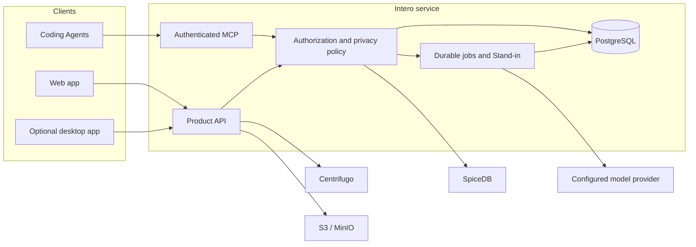

# Intero

[](https://github.com/WatsonHS/intero/actions/workflows/ci.yml)

Intero is a coordination layer for software teams working with Coding Agents.
It turns structured Agent checkpoints into durable, privacy-aware team context:
current work, blockers, decisions, review state, and the next coordination
action.

Intero is not a transcript collector or a general autonomous Agent. It is
designed to preserve human authority, provenance, and project boundaries while
making Agent-assisted work legible to the rest of the team.

> **Project status:** Intero is under active, pre-1.0 development. The current
> repository supports pilot deployments, but APIs, migrations, and operational
> procedures may still change.

## What Intero provides

- **Structured Agent reporting** through an authenticated MCP endpoint for
  Codex, Claude Code, OpenCode, and compatible clients.
- **Private Work State** that records progress, evidence, blockers, decisions,
  and validation without ingesting raw prompts, diffs, files, or terminal logs.
- **Team Pulse** for a concise view of what teammates are working on and where
  coordination is needed.
- **Action Inbox** for review requests, blockers, commitments, and other
  human-owned decisions.
- **Project work and Spec Review** with immutable revisions, comments,
  confirmations, provenance, and reversible Agent-authored changes.
- **Realtime conversations** across direct messages, team chat, project
  coordination, and personal Stand-in interactions.
- **Bounded Stand-in automation** that may summarize authorized work or propose
  reversible coordination steps, but cannot change membership, ownership,
  access, or make final human commitments.
- **Invite-only access** with organization and team administration, password
  authentication, Passkeys, and revocable Agent bindings.

## Design principles

1. **Private by default.** Uploading or processing information does not make it
   visible to a team.
2. **Structured signals over surveillance.** Intero accepts semantic
   checkpoints, not ambient capture of developer activity.
3. **Provenance is part of the data model.** Shared state retains its actor,
   source, timestamp, confidence, and revision history.
4. **Human authority stays explicit.** Agents cannot silently expand scope,
   alter access, or make irreversible decisions.
5. **Authorization is enforced at every adapter boundary.** Organization,
   Team, Project, and private-user scopes are not inferred from UI state.

The complete trust model and technical boundaries are documented in
[docs/ARCHITECTURE.md](docs/ARCHITECTURE.md).

## Architecture



PostgreSQL is the authoritative store. SpiceDB enforces relationship-based
authorization, Centrifugo provides realtime delivery, and Graphile Worker plus
a transactional outbox run durable background work. Object storage is
S3-compatible and disabled at the product layer unless explicitly configured.

## Repository layout

| Path                          | Purpose                                                          |
| ----------------------------- | ---------------------------------------------------------------- |
| `apps/web`                    | Primary React web client                                         |
| `apps/desktop`                | Optional Electron desktop client                                 |
| `apps/server-api`             | HTTP, authentication, MCP, and product API                       |
| `apps/server-worker`          | Durable jobs, outbox processing, and Stand-in work               |
| `apps/mcp-stdio`              | Local stdio bridge for compatible Coding Agents                  |
| `packages/domain`             | Core identities, events, policies, and domain contracts          |
| `packages/stand-in-core`      | Stand-in reasoning and policy logic                              |
| `packages/project-management` | Project work and Spec Review domain logic                        |
| `packages/api-contracts`      | Generated and source API contracts                               |
| `packages/config`             | Runtime configuration and validation                             |
| `packages/integrations`       | Coding Agent integration adapters                                |
| `infra`                       | Local infrastructure configuration                               |
| `docs`                        | Architecture records, operations, plans, and validation evidence |

The repository is a pnpm workspace orchestrated with Turborepo.

## Prerequisites

- Node.js 24 or newer
- pnpm 10.33.2 through Corepack
- Docker with Docker Compose
- [just](https://github.com/casey/just)
- [Gitleaks](https://github.com/gitleaks/gitleaks) for optional local secret scans

## Quick start

Install dependencies and start the local development stack:

```bash
corepack enable
just setup
just up
```

`just up` starts PostgreSQL, SpiceDB, Centrifugo, and MinIO, applies the
required migrations, and launches the Web, API, and worker development
processes.

The default local endpoints are:

| Service         | URL                     |
| --------------- | ----------------------- |
| Web application | `http://localhost:5173` |
| API             | `http://localhost:4310` |
| Centrifugo API  | `http://localhost:8000` |
| MinIO API       | `http://localhost:9000` |

Stop the infrastructure services with:

```bash
just down
```

The included credentials and tokens are development-only defaults. Never reuse
them for a shared or production deployment.

## Configuration

Intero reads runtime configuration from environment variables. The supported
development settings and safe placeholders are documented in
[.env.example](.env.example).

To customize the local stack:

```bash
cp .env.example .env
```

Important configuration groups include:

- canonical deployment URL and trusted origins;
- PostgreSQL application, migration, and worker connections;
- provider-secret encryption and authentication secrets;
- SpiceDB, Centrifugo, and optional object storage;
- model provider endpoint, API key, and default model configured through the
  administrator UI.

Server-side secrets are never returned through member-facing APIs. Production
deployments must use unique random credentials, HTTPS, persistent volumes,
backups, and environment-specific secret management. See
[docs/OPERATIONS.md](docs/OPERATIONS.md) for the operational baseline.

## Development

Common commands:

```bash
just dev-deps       # start infrastructure only
just dev            # start Web, API, and worker processes
pnpm dev:desktop    # start the optional desktop client
pnpm generate       # regenerate API contracts
pnpm lint           # TypeScript validation
pnpm test           # unit and integration-capable test suite
pnpm build          # production builds
just check          # generate, lint, test, and build
```

Some integration tests require the Docker services started by `just dev-deps`.
Environment-gated tests skip when their external dependency is unavailable.

Demo fixtures are opt-in and must never be run against a production database.
See [docs/DEMO_DATA.md](docs/DEMO_DATA.md) for the safety checks and commands.

## Security and privacy

Intero handles private engineering context and should be treated as a
security-sensitive service.

- Do not commit `.env` files, database snapshots, credentials, or raw browser
  test output.
- Do not expose a development deployment to an untrusted network.
- Keep model-provider keys server-side and rotate them after suspected
  disclosure.
- Run the repository secret scan before publishing history:

  ```bash
  gitleaks git --config .gitleaks.toml
  ```

- Review [docs/ARCHITECTURE.md](docs/ARCHITECTURE.md) for the data and trust
  boundaries before changing authentication, authorization, publication, or
  Agent capabilities.

Please do not report suspected vulnerabilities in a public issue until a
dedicated security policy and private reporting channel are published.

## Documentation

- [Technical architecture](docs/ARCHITECTURE.md)
- [Operations](docs/OPERATIONS.md)
- [Pilot runbook](docs/PILOT_RUNBOOK.md)
- [Demo-data safety](docs/DEMO_DATA.md)
- [Architecture decision records](docs/adr/README.md)
- [Product requirements](docs/brainstorms/2026-07-24-intero-product-requirements.md)

## Contributing

Intero is still stabilizing its core contracts. Keep changes scoped, include
tests for behavior changes, preserve privacy and authorization boundaries, and
run `just check` before submitting a pull request.

A dedicated contribution guide will be added as the public development process
is finalized.

## License

Intero is licensed under the
[Apache License 2.0](LICENSE).
