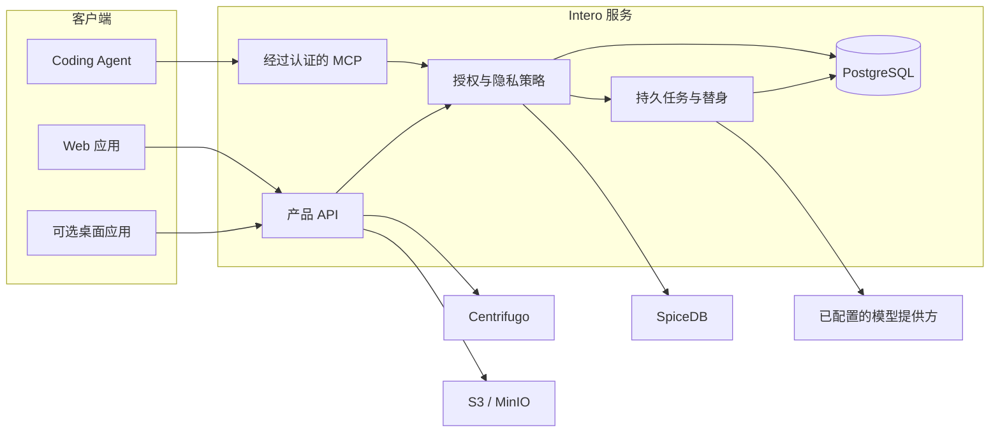

# Intero

[English](README.md) · 简体中文

## 愿景

Intero 是一项持续进行的实践探索：在 AI 原生时代，协作软件与软件工程应该变成什么样子？

### 名字的含义

`Intero` 来自 _interoception_，意为一个生命体对自身内部状态的感知。这个名字对应着项目最初的想法：让团队知道自己内部正在发生什么。当人与 Agent 越来越独立地工作时，Intero 希望探索团队如何持续感知自身的工作、变化、冲突、决策和产品能力。

### 发生了什么变化

上一代软件工程建立在个体能力有限、专业分工相对稳定的基础上。前端、后端、产品、设计、运维和架构工作由不同的人承担，许多协作方式也围绕这些工作交接逐渐形成。

AI 改变了这个前提。一个人与 Coding Agent 协作时，可以在一次工作会话中跨越多个边界。每个人都能更加独立地探索和实现；过去需要多位专业人员配合的工作，现在可能由一个人和他的 Agents 完成。

### 我们实际遇到的问题

1. **自主性越高，自然发生的信息同步反而越少。** 开发前端功能的人可能发现一个后端缺陷，并直接修复，而不是将它交给另一位专业人员。后端维护者可能根本不知道行为已经改变；修复可能违反了作者并不知道的假设；另一个 Agent 也可能继续基于原有契约工作。
2. **交付增长速度超过了团队对产品现实的理解速度。** 一些重要能力源于想法或实验，而不是正式的 Feature、Spec 或工单。传统跟踪工具可以记录已声明的工作，却未必能够描述产品实际上已经变成什么、有哪些证据支持某项能力，或者后续修改是否让它面临风险。每一个局部任务看起来都已完成，过去正常工作的行为却可能已经悄然回归。
3. **AI 产出速度超过了人的评审和决策能力。** AI 可以在人还没有充分理解陌生领域之前，就生成计划、Spec、备选方案和完整实现。此时，人可能无法识别错误假设、不必要的抽象、迂回设计或更简单的方案。AI 还会在一天内产生远多于以往的决策；在持续的决策疲劳中，人最难发现的恰恰是那些最需要判断的问题。

这些问题具有同一个模式：执行速度已经超过了团队维持共享理解、可靠验证和集中使用人的注意力的能力。

我们不认为答案是恢复僵化的职责边界、要求人类批准每一项修改，或者在团队之上放置另一个不受约束的自主 Agent。我们希望探索一些更困难的问题：

- 如何让个人能力保持流动，同时继续明确共享契约和系统不变量的责任？
- 团队如何区分安全的跨边界修复，以及确实需要协调、评审或重新验证的修改？
- 协作系统如何在不收集原始私人活动、不形成监控系统的前提下，在回归发生前发现彼此不兼容的工作？
- 如何让正确的人进入一个临时且边界明确的讨论，同时只向其他人提供安静而有用的摘要？
- 如何把人的注意力留给真正需要判断的决策，而不是让每一个 Agent 动作都变成新的审批？
- 当许多人和 Agent 并行修改产品时，团队如何知道产品仍然一致且可用？
- 即使事前不存在 Feature、Spec 或工单，非正式探索中发现的能力如何持续可见并可被验证？

我们当前的工作假设是：执行可以高度分散，但协调、验证和责任必须保持连续。人与 Agent 应该能够独立工作，同时由一个协作层维护经过授权的共享 Work State、发现潜在冲突、路由注意力、保留证据与不确定性，并将人类确认的结果带回工作上下文。

Intero 更大的意义不在于某种技术栈、模型或 AI 功能列表，而在于让这些问题变得足够具体，从而能够围绕它们进行构建、测试、证伪和修正。当前产品只是这些问题的一种实验性答案，并不意味着 Intero 应该拥有每一个任务、测试、Spec、决策或 Agent 工作流。我们会用一个标准评价这项探索：团队能否在保持自主和高速的同时，不失去共同且可信的现实。

## 当前产品方向

Intero 是面向使用 Coding Agent 的软件团队的协调层。它将结构化的 Agent 检查点转化为持久、注重隐私的团队上下文：当前工作、阻塞、决策、评审状态，以及下一项协调动作。

Intero 不是会话记录收集器，也不是通用自主 Agent。它旨在保留人的权力、来源信息和项目边界，同时让团队其他成员能够理解 Agent 辅助的工作。

> **项目状态：** Intero 正处于活跃的 1.0 前开发阶段。当前仓库支持试点部署，但 API、数据库迁移和运维流程仍可能发生变化。

## Intero 提供什么

- **结构化 Agent 汇报：** 通过经过认证的 MCP 端点支持 Codex、Claude Code、OpenCode 及兼容客户端。
- **私有 Work State：** 在不摄取原始提示词、Diff、文件或终端日志的前提下，记录进度、证据、阻塞、决策和验证。
- **Team Pulse：** 简洁呈现团队成员正在做什么，以及哪里需要协调。
- **Action Inbox：** 承载评审请求、阻塞、承诺以及其他由人负责的决策。
- **项目工作与 Spec Review：** 支持不可变修订、评论、确认、来源信息，以及可撤销的 Agent 修改。
- **实时会话：** 覆盖私聊、团队聊天、项目协调和个人替身交互。
- **有边界的替身自动化：** 可以总结经过授权的工作或提出可撤销的协调步骤，但不能修改成员关系、所有权或访问权限，也不能代替人作出最终承诺。
- **仅限邀请的访问：** 提供组织与团队管理、密码认证、Passkey，以及可撤销的 Agent 绑定。

## 设计原则

1. **默认私有。** 上传或处理信息并不意味着团队可以看到它。
2. **使用结构化信号，而不是监控。** Intero 接收语义检查点，而不是持续采集开发者活动。
3. **来源信息是数据模型的一部分。** 共享状态保留行为主体、来源、时间戳、置信度和修订历史。
4. **人的权力必须明确。** Agent 不能静默扩大范围、改变访问权限或作出不可逆决策。
5. **每个适配器边界都必须执行授权。** 组织、团队、项目和用户私有范围不能从 UI 状态中推断。

完整的信任模型与技术边界记录在 [docs/ARCHITECTURE.md](docs/ARCHITECTURE.md) 中。

## 架构



PostgreSQL 是权威数据存储。SpiceDB 执行基于关系的授权，Centrifugo 提供实时交付，Graphile Worker 与事务性 Outbox 负责持久后台工作。对象存储兼容 S3；除非明确配置，否则产品层默认禁用。

## 仓库结构

| 路径                          | 用途                                    |
| ----------------------------- | --------------------------------------- |
| `apps/web`                    | 主要 React Web 客户端                   |
| `apps/desktop`                | 可选 Electron 桌面客户端                |
| `apps/server-api`             | HTTP、认证、MCP 与产品 API              |
| `apps/server-worker`          | 持久任务、Outbox 处理和替身工作         |
| `apps/mcp-stdio`              | 面向兼容 Coding Agent 的本地 stdio 桥接 |
| `packages/domain`             | 核心身份、事件、策略与领域契约          |
| `packages/stand-in-core`      | 替身推理与策略逻辑                      |
| `packages/project-management` | 项目工作与 Spec Review 领域逻辑         |
| `packages/api-contracts`      | 生成的 API 契约及其源定义               |
| `packages/config`             | 运行时配置与验证                        |
| `packages/integrations`       | Coding Agent 集成适配器                 |
| `infra`                       | 本地基础设施配置                        |
| `docs`                        | 架构记录、运维文档、计划与验证证据      |

该仓库是一个由 Turborepo 编排的 pnpm Workspace。

## 前置条件

- Node.js 24 或更高版本
- 通过 Corepack 使用 pnpm 10.33.2
- 带有 Docker Compose 的 Docker
- [just](https://github.com/casey/just)
- 用于可选本地密钥扫描的 [Gitleaks](https://github.com/gitleaks/gitleaks)

## 快速开始

安装依赖并启动本地开发环境：

```bash
corepack enable
just setup
just up
```

`just up` 会启动 PostgreSQL、SpiceDB、Centrifugo 和 MinIO，应用所需的数据库迁移，并启动 Web、API 和 Worker 开发进程。

默认本地端点如下：

| 服务           | URL                     |
| -------------- | ----------------------- |
| Web 应用       | `http://localhost:5173` |
| API            | `http://localhost:4310` |
| Centrifugo API | `http://localhost:8000` |
| MinIO API      | `http://localhost:9000` |

使用以下命令停止基础设施服务：

```bash
just down
```

仓库中包含的凭据和 Token 仅为开发环境默认值，绝不能在共享或生产部署中复用。

## 配置

Intero 从环境变量读取运行时配置。支持的开发设置和安全占位值记录在 [.env.example](.env.example) 中。

自定义本地环境：

```bash
cp .env.example .env
```

重要配置分组包括：

- 规范部署 URL 与可信 Origin；
- PostgreSQL 应用、迁移和 Worker 连接；
- 模型提供方密钥加密与认证密钥；
- SpiceDB、Centrifugo 与可选对象存储；
- 通过管理员 UI 配置的模型提供方端点、API Key 和默认模型。

服务端密钥绝不会通过面向普通成员的 API 返回。生产部署必须使用唯一的随机凭据、HTTPS、持久卷、备份以及针对具体环境的密钥管理。运维基线请参阅 [docs/OPERATIONS.md](docs/OPERATIONS.md)。

## 开发

常用命令：

```bash
just dev-deps       # 仅启动基础设施
just dev            # 启动 Web、API 和 Worker 进程
pnpm dev:desktop    # 启动可选桌面客户端
pnpm generate       # 重新生成 API 契约
pnpm lint           # TypeScript 验证
pnpm test           # 单元测试及可运行的集成测试套件
pnpm build          # 生产构建
just check          # 生成、Lint、测试并构建
```

部分集成测试需要先通过 `just dev-deps` 启动 Docker 服务。如果外部依赖不可用，受环境控制的测试会跳过。

Demo Fixture 必须显式启用，且绝不能对生产数据库运行。安全检查与命令请参阅 [docs/DEMO_DATA.md](docs/DEMO_DATA.md)。

## 安全与隐私

Intero 会处理私有工程上下文，应当被视为安全敏感服务。

- 不要提交 `.env` 文件、数据库快照、凭据或原始浏览器测试输出。
- 不要将开发部署暴露给不可信网络。
- 将模型提供方密钥保留在服务端；如果怀疑发生泄露，应立即轮换。
- 在发布 Git 历史前运行仓库密钥扫描：

  ```bash
  gitleaks git --config .gitleaks.toml
  ```

- 在修改认证、授权、发布行为或 Agent 能力之前，先阅读 [docs/ARCHITECTURE.md](docs/ARCHITECTURE.md) 中的数据与信任边界。

在建立专用安全策略和私有报告渠道之前，请不要在公开 Issue 中报告疑似安全漏洞。

## 文档

- [技术架构](docs/ARCHITECTURE.md)
- [运维](docs/OPERATIONS.md)
- [试点运行手册](docs/PILOT_RUNBOOK.md)
- [Demo 数据安全](docs/DEMO_DATA.md)
- [架构决策记录](docs/adr/README.md)
- [产品需求](docs/brainstorms/2026-07-24-intero-product-requirements.md)
- [由对话驱动的协作探索](docs/plans/2026-07-29-002-conversation-driven-collaboration-todo.md)
- [Product Capability Health 下一阶段研究](docs/plans/2026-07-29-003-product-capability-health-roadmap.md)

## 贡献

Intero 仍在稳定核心契约。请保持修改范围明确，为行为变化提供测试，保留隐私和授权边界，并在提交 Pull Request 前运行 `just check`。

随着公开开发流程最终确定，我们会补充专门的贡献指南。

## 许可证

Intero 使用 [Apache License 2.0](LICENSE)。
