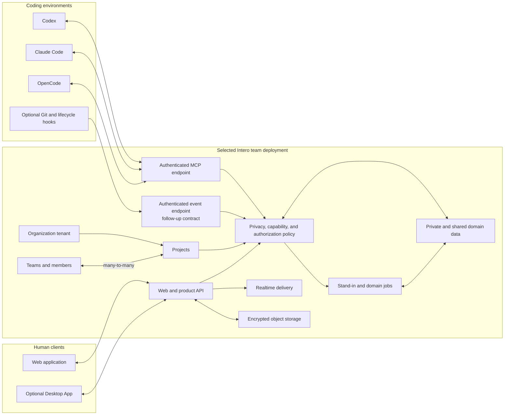

# Intero Technical Architecture

Status: implemented through Phase 5 on `main`; production deployment validation
remains environment-specific

Date: 2026-07-25

## 1. Architectural intent

Canonical product/domain terminology is **Stand-in** in English and **替身** in
Chinese. Contract identifiers use `stand_in`; paths and slugs use `stand-in`.
The active application, domain, MCP, schema, tests, and configuration implement
the renamed contract. Superseded runtime experiments remain in Git history, not
in the active source or architecture record.

Intero separates technical execution from team coordination.

- Coding Agents execute work and decide when a technical branch needs team
  context.
- One cloud-deployed Stand-in maintains Claims and Work State,
  communicates, and coordinates within bounded authority.
- The Web application is the primary human client.
- The Desktop App is optional context-enhancement infrastructure, not a product
  runtime dependency.
- The cloud service owns durable private and shared state, messaging,
  authorization, realtime delivery, review, audit, and Stand-in jobs.

Intero is not an event-sourced Agent transcript platform. Normal domain tables
hold current state, while immutable Activity Events record meaningful changes
and their provenance.

The architecture follows
[ADR-0006](adr/0006-cloud-first-web-first-runtime-and-private-by-default-data.md).

### 1.1 Thin vertical slice with durable ports

The pilot is intentionally thin, not throwaway. Canonical Agent event and Work
State contracts are transport-independent behind explicit ports:

| Stable port / contract  | Implemented adapter                                           | Current product boundary         |
| ----------------------- | ------------------------------------------------------------- | -------------------------------- |
| `ModelGateway`          | Vercel AI SDK calling the administrator-configured model      | Additional providers may adapt   |
| `AuthorizationPort`     | SpiceDB-backed authorization plus tenant-safe membership data | Contract-tested and replaceable  |
| `RealtimePort`          | Centrifugo fanout with polling/cursor repair                  | PostgreSQL remains authoritative |
| `ObjectStorePort`       | MinIO/S3-compatible storage with DB-authoritative metadata    | Upload product surface disabled  |
| `JobRunnerPort`         | Graphile Worker jobs plus transactional outbox and reconciler | Durable, idempotent processing   |
| `CoordinationTransport` | Bounded Project-internal protocol                             | General A2A remains deferred     |

The minimal model loop reads only policy-allowed structured Work State through
`ModelGateway` and produces safe Stand-in summaries and bounded
coordination suggestions. It cannot use raw content without explicit
authorization, cross Organization/Workspace boundaries, auto-commit, perform
external actions, or become a general autonomous Agent.

These ports are not decorative empty interfaces. Each implemented adapter has
contract tests over domain-visible behavior, and a replacement must pass the
same tests before adoption. Canonical Agent events, Work State, and domain
policy import no adapter-specific types. MinIO-backed object storage remains
disabled by product policy because Phases 1–6 add no attachment/raw-capture
surface. Temporal and general A2A infrastructure remain out of scope.

## 2. System overview



Coding Agents connect directly to the selected Intero team deployment while it
is online. No daemon, sidecar, desktop process, local socket, or Electron
launcher sits on the MCP runtime path.

### 2.1 Deployment origin and bootstrap

Intero assumes an already-running deployment. A team administrator enters its
base URL in Web `/setup`, validates connectivity, and only then creates the
Organization/team context and first Project.

Normal onboarding uses **Team Settings → Member Management**. An Organization
administrator enters one recipient's display name and exact email; Intero
creates a one-time, expiring, revocable, email-bound account-activation link with
`pending`, `accepted`, `expired`, or `revoked` lifecycle. V1 exposes copy,
regenerate, and revoke without requiring SMTP. The recipient uses the short
**Accept Invitation** surface and the exact invited email to bootstrap first
credential setup. The activation link is never a normal login credential.
Passkey is the primary normal login; email plus password is the fallback.
Product Magic Link login is absent. The joined member inherits the
administrator-approved Intero endpoint, team, Web experience, credentials, and
Agent/MCP instructions without entering the URL. Explicit Workspace and Project
binding remains separate. Reusable Pilot join links are historical and are not
the current onboarding path. Bulk email or CSV invitations, SCIM provisioning,
and domain-based automatic join remain outside implemented Phases 1–6.

Password recovery is not implemented. A future recovery capability requires
either an administrator/manual recovery link or optional SMTP delivery; neither
is part of normal login or the V1 activation dependency.

Productized self-deployment is outside the pilot: no package, Docker/install
wizard, infrastructure provisioning workflow, DNS/TLS guidance, tenant
provisioning automation, or end-user self-hosting documentation is required.
Connectivity failure, invalid endpoint, and unavailable deployment remain
actionable Setup states; wire-level checks are not specified here.

### 2.2 Cloud AI provider setup

Cloud AI provider configuration is distinct from Intero deployment endpoint
setup and Agent registration. In one **AI Provider** section, a team
administrator configures the provider endpoint, secret API key, and default
model for the pilot. The provider endpoint is neither the administrator-entered
Intero deployment base URL nor an Agent/MCP connection endpoint.

The provider key is accepted and stored only on the server using encryption and
secret handling. It is never returned through browser or member-facing APIs.
Administrators can test the connection, rotate or replace the key, or disable
the provider. Detailed secret-management mechanics and multi-provider routing
remain outside the pilot contract.

When no provider is configured or the provider is unavailable, identity,
team/project membership, invitations, and basic human collaboration and chat
remain available. AI Stand-in execution, automated summaries, Agent Work
State projection, automated Team Pulse, Agent binding, and other AI-derived
coordination features remain disabled.

Setup exposes two distinct readiness states: `basic_collaboration_ready` and
`stand_in_configuration_needed`. Missing, invalid, disabled, and
unavailable provider states include actionable administrator guidance and never
fail silently. Provider configuration gates AI activation, not the Workspace,
membership, invitations, or basic human chat.

## 3. Data and trust boundaries

### 3.0 V1 Organization, Team, and Project model

Organization is the tenant boundary and owns Projects. First Setup creates one
implicitly or with a simple name, but it is not a prominent daily UI or
permission-management surface. Teams contain members. `Team ↔ Project` is
many-to-many: a Project may designate one primary/display Team and zero or more
additional participating Teams.

V1 membership in any associated Team grants Project view and participation.
Individual Project roles, ACLs, and restricted Project visibility are
post-pilot. Deployment endpoint and AI-provider settings may belong to
Organization; per-recipient email-bound invitations belong to Team.

AgentConnection, Claim/WorkState, TeamPulseProjection, CollaborationPosture, and
ProjectConversation carry Project identity independently of Team. A cross-Team
Project aggregates context from participating Teams. DirectMessage instead
relates two authenticated members of the same Team. These shared-scope rules do
not authorize raw-content upload, Stand-in reuse, or publication beyond
their independent policies.

Multi-Organization switching, advanced Organization administration, billing,
enterprise identity, and advanced cross-Team governance are outside the pilot.

### 3.1 Independent policy axes

Intero does not infer visibility from storage location. Each object or Claim has
independent policy state for:

1. ingestion and durable storage;
2. model processing;
3. Stand-in retrieval or reuse;
4. disclosure to a person, Thread, team, project, or organization.

These axes are enforcement and audit semantics, not four everyday user toggles.
The normal UX is a project posture with silent defaults.

An object may therefore be stored and processed in Intero cloud while remaining
private to one user. Private cloud model processing is permitted for already
uploaded material. Upload and processing never authorize Stand-in reuse
or publication.

Model processing is bounded to the user's authorized Workspace purpose. User
data is never used to train public or general models and is never reused across
customers or Workspaces. These controls are independent of publication
visibility.

### 3.2 User-private cloud scope

Personal spaces and unbound work are **Private Work** by default. Newly ingested
work data and sensitive content remain user-private.
User-private scope may contain:

- structured semantic Coding Agent checkpoints;
- private Claims and resolved Work State;
- private Stand-in conversations and memory;
- explicitly uploaded artifacts or context;
- private draft Specs and Decisions;
- optional Desktop-enhanced summaries or context.

Tenant isolation, object authorization, and policy evaluation apply to every
read and model-context assembly operation. Organization membership alone does
not grant access to user-private data.

### 3.3 Shared scopes and publication

Team, project, organization, and Thread scopes contain authorized shared
information. Joining or explicitly binding a Workspace to a team project enables
**Collaborate with Project** by default. That enrollment permits quiet
publication of safe summaries, status, dependencies, blockers, and coordination
signals to the bound team/project scope without per-event prompts.

A publication or reuse transition requires:

```text
authenticated project enrollment, binding, or user posture change
∩ user and organization authority
∩ source-object visibility and reuse policy
∩ destination authorization
∩ Capability Grant when a Stand-in acts
```

The posture and each publication record their actor, source, destination, policy
version, provenance, and time. Tightening policy stops future use and marks a published
object withdrawn where possible; it cannot claim to erase copies already
viewed or exported.

Collaboration publication is restricted to safe structured summaries, status,
dependencies, blockers, and coordination signals. Raw prompts, files, diffs,
terminal output, and tool input or output never become team-visible because
collaboration is enabled. General rule-based automatic publication beyond the
project-binding posture is deferred and must be attributable, auditable, and
revocable if added later.

### 3.4 Client-local data

Clients may keep device-local preferences, caches, drafts, and the bounded
delivery outbox. Such state is not authoritative Work State. A general
non-uploaded/client-only work mode is outside the MVP and is not promised.

### 3.5 Data lifecycle

- Structured private Work State and Claims retain for 180 days.
- Explicitly authorized raw uploaded content retains for 30 days by default.
- Published project summaries retain for the life of the project and remain
  withdrawable.
- Users may delete their own private data at any time.
- Withdrawal or revocation stops future authorized visibility and use but cannot
  erase external copies already exported by authorized recipients.

Backup-deletion timing, legal-hold behavior, regional storage, precise support
role mapping and legal process, and subprocessor selection/contracts require
pre-pilot implementation or governance decisions without weakening the
no-training or no-cross-customer/Workspace-reuse boundary.

### 3.6 Post-Pilot project domain

Phases 1–6 are implemented on `main`, including onboarding/admin, Project work
management, Spec Review, Action Inbox, in-app notification preferences, and
search. Phase 7 bounded Stand-in and Agent automation is the active
implementation target, not a claim of current implementation. External
notification channels remain future scope.

Organization owns Projects. A Project has one primary Team and may associate
additional Teams. Team roles are `member` and `leader`; Organization admins and
the primary Team's Leaders govern Project review policy and PI/Sprint settings.
The last Organization admin cannot be removed or demoted without a replacement.
Registration is invite-only, and an account has one active Organization.

Post-Pilot invitations are created in **Team Settings → Member Management**
from an admin-specified display name and exact email. The expiring/revocable
link is bound to that email and has `pending`, `accepted`, `expired`, or
`revoked` lifecycle. Copy-link is the V1 delivery mechanism; resend regenerates
the link, and SMTP is not required.

Acceptance is a recipient-only surface, not administrator Setup. It displays
Organization, Team, pre-set name, invited email, and an explicit Accept action;
authentication must use the matching email. Completion shows the joined Team
and accessible Projects, direct Project/Team Pulse entry, and a skippable
Connect Coding Agent entry. The surface cannot return deployment endpoints,
model secrets, governance, invitation controls, or administrator Settings.
Personal Settings may later edit the pre-set display name.

The optional work graph is:

```text
Epic 0..1 <- Feature 0..* <- Work Item 0..*
```

Epic is roadmap-only. Feature may be directly human-owned and Agent-executed
without Work Items and has stage `planned`, `in_development`, or `released`.
Work Item has one human owner or is unassigned; Agents are provenance actors,
not assignees.

Each Project has one Board with separate Backlog and current Sprint views.
Backlog is scheduling state, not a Work Item status. Statuses are exactly
`todo`, `in_progress`, `ready_for_test`, and `done`. Sprint-end carryover
preserves `in_progress`, source Sprint, and a carryover marker instead of
silently rescheduling. Work Items store priority `P0`–`P3`,
optional numeric Points, optional Spec, typed relations, Coordination Threads,
comments/replies, and explicit PR/Commit/branch associations.

PI and Sprint are Project-level planning containers. PI creation takes start
date, Sprint count, and Sprint duration in weeks; the domain generates `PI N`,
`Sprint 1..N`, dates, and timezone-derived `planned`/`active`/`ended` status.
Features and Work Items may be unplanned, PI-only, or Sprint-assigned; Sprint
implies PI.

Spec belongs to exactly one Project and has immutable versions. Review is
explicitly requested, comments bind to one full-version snapshot, and
confirmation is version-specific. `list_confirmed` and
`get_confirmed(specId)` expose confirmed Specs to Agents without making an
unconfirmed version current. Project review policy stores required
confirmations, whether another member's Agent counts, and whether author-self
confirmation is allowed.

## 4. Web and optional Desktop clients

### 4.1 Web application

The Web application is the complete primary client for:

- Team Pulse and Action Inbox;
- Stand-in conversations;
- Project Rooms and Coordination Threads;
- Spec Review and Decisions;
- Project Backlog, current Sprint Board, Epic/Feature overview, and Work Item
  detail;
- privacy, visibility, and integration settings;
- provenance, freshness, and authority inspection.

The existing Intero visual system remains canonical. Work Item detail places
activity and coordination in the center timeline, facts/context/relations/code
in the right rail, and comment composition at the bottom. Administration enters
Settings rather than a separate dashboard visual system. Team-visible Specs
appear in one Team-level Spec Review page with a Project filter; Project pages
deep-link with that filter applied.

Member Management and Accept Invitation reuse the same visual system but remain
distinct authority surfaces. Recipient acceptance never routes through
administrator/Test Setup.

Team Pulse projects one column per person. A column header contains:

- a Stand-in-generated natural-language summary derived from authorized active
  work items, blockers, recent outcomes, and freshness;
- concurrently active and blocked counts.

The summary is plain non-interactive text with no citations, links,
click-through, or state mutation. Peer active-work cards follow in a
presentation order that conveys no rank. A derived **N more** control compacts
rendering only. The Pulse contract has no primary/main/secondary/subordinate/
focus field and does not map card order or compaction into task/Workstream
hierarchy.

The Web client uses authenticated product APIs and realtime delivery. It must
not require the Desktop App to connect, interpret Work State, or coordinate.

### 4.2 Optional Desktop App

While open and after explicit opt-in, the Desktop App may
provide:

- an optional local Git-awareness enhancement for user-selected repositories;
- future native/external notifications after the in-app Phase 6 scope;
- a native rendering of the same collaboration surfaces.

Desktop absence, shutdown, or update failure must not interrupt the Web product,
cloud Stand-in, collection, management, access, or direct cloud MCP path.
The Git enhancement listens to Git metadata events (`HEAD`, index, packed refs,
and the active branch ref), debounces event bursts, and then reads one bounded
snapshot containing only repository name, branch, short commit, and whether the
staging index changed. It never polls the worktree, reads file names or diffs,
or stores Work State. Checkpoints use the selected connected Coding Agent and
the existing direct-cloud MCP outbox. The watcher exists only inside the
Desktop App process.

### 4.3 Client security

Web and Desktop renderers receive only authorized API view models. They never
receive unrestricted service credentials, cross-tenant data, or generic policy
bypass primitives. Client-local storage must be treated as convenience state,
not as the only enforcement point for cloud privacy.

## 5. Coding Agent integrations

### 5.1 Common cloud MCP surface

All Coding Agent adapters expose the same tools:

```text
stand_in.lookup_team_context
stand_in.current_context
stand_in.request_coordination
stand_in.request_spec_review
stand_in.lookup_decision
stand_in.check_scope
stand_in.report_checkpoint
```

Codex, Claude Code, and OpenCode connect directly to the authenticated HTTPS MCP
endpoint inherited from the member's selected team deployment. From a bound
project page, the user copies a one-time **Connect Agent** prompt tailored to the
selected Agent and pastes it there. The Agent performs its own MCP configuration
and project binding, then reports connection success to Intero.

The prompt carries team-derived endpoint context and a short-lived, single-use,
project-scoped connection ticket. The ticket bootstraps a least-privilege,
revocable connection but is never surfaced as a user-managed API key. The
project UI shows connection status and supports disconnect/reconnect; revocation
invalidates Intero access without blocking local coding. Generic MCP clients are
outside the pilot.

The optional Desktop App may perform one-click MCP configuration for the same
three clients using the same endpoint and ticket. It writes the relevant client
configuration and reports success, failure, and disconnect status. This is an
acceleration path only: Web prompts remain universal for the supported clients,
and no Desktop process or daemon joins the runtime path.

MCP and event-ingress permissions are separate scopes. Public MCP schemas do not
expose internal Workspace or Workstream UUIDs. The service minimizes remote and
repository metadata and does not require, collect, or expose absolute local
paths by default.

### 5.2 Active checkpoint reporting

`report_checkpoint` accepts exactly ten frozen pilot semantics:

| Semantic                 | Meaning and primary effect                                      |
| ------------------------ | --------------------------------------------------------------- |
| `work_started`           | Bounded work began; activates Project Work State.               |
| `work_progressed`        | Material progress, phase, scope, or plan changed.               |
| `decision_recorded`      | Sourced technical decision or candidate recorded.               |
| `dependency_declared`    | Another owner/output is required; may coordinate.               |
| `blocker_raised`         | Progress is blocked; may coordinate and raise attention.        |
| `review_requested`       | Bounded review is needed; may coordinate reviewers.             |
| `work_completed`         | Agent claims completion; updates status and safe Team Pulse.    |
| `coordination_requested` | Coordination/conflict resolution is needed; may open a Thread.  |
| `artifact_produced`      | Safe artifact reference/summary; updates status and Team Pulse. |
| `validation_completed`   | Bounded validation result; updates status and Team Pulse.       |

Every event contains a bounded safe summary plus stable client-generated
event/idempotency ID, Project identity, authenticated Agent identity,
source/provenance, occurred-at time, and schema version. Direct cloud MCP accepts
narrative schema v2 only: `currentFocus`, `completedOutcome`, bounded
`evidence`, `nextStep`, and explicit `collaboration` need/target. Summary-only
v1 checkpoints are rejected. Plans and plan changes belong only in
`work_progressed`.

The cloud Stand-in stores the report as a sourced
`coding_agent_report` Claim, applies private-by-default visibility, and
reconciles it with authorized lifecycle, Git, validation, project, and human
evidence.

Default ingress accepts structured semantic checkpoints only. Prompts,
responses, chain-of-thought, files, diffs, complete tool arguments or results,
terminal output, and credentials require explicit per-project authorization
before upload. Once uploaded, private cloud model processing is permitted;
Stand-in reuse and publication remain separate controls.
Raw prompts/files/diffs/terminal/tool logs and low-level file/resource touch
events are not canonical checkpoint semantics.

### 5.3 Optional content-safe event ingress

Git and Coding Agent lifecycle hooks may send compact, content-safe events to a
separate authenticated cloud event endpoint. This endpoint is not MCP and may
not grant Stand-in coordination tools.

The optional Desktop Git-awareness enhancement is one such client. When
packaged, it is limited to explicitly selected repositories and schema-permitted
branch, commit, and staged-state signals; it is never a required relay for cloud
MCP.

The target event set may include session lifecycle, repository identity changes,
Git state changes, validation state, and artifact metadata. Hook credentials use
a separate least-privilege scope from MCP. Closed schemas, size limits,
installation, and transport mechanics remain follow-up implementation details.

MCP ingress failures return a visible, non-blocking failure. The MCP client, Hook
client, or explicit CLI may place an already-permitted payload in a lightweight
client-owned outbox. The per-user limit is 10,000 events or 50 MiB, whichever is
reached first; maximum age is seven days. Only schema-permitted payloads are
retained, and raw content requires the project's explicit raw-upload
authorization.

Payloads are encrypted at rest using an OS-provided credential or key store.
Keys and queued payloads never synchronize to Intero cloud. Missing/reset keys,
revoked authorization, or now-disallowed payloads cause secure discard with no
recovery or export promise. The client later emits only a non-sensitive
delivery-gap or freshness marker where possible.

Each event has a stable client-generated ID and per-project ordering metadata;
cloud ingestion is idempotent. The next MCP invocation, Hook invocation, or
explicit CLI flush attempts FIFO delivery with at most three short in-process
retries using bounded exponential backoff. Later invocations resume. There is no
persistent retry daemon.

Capacity and TTL eviction removes oldest non-terminal events first, preserves
`work_completed`, `blocker_raised`, and `decision_recorded` events where
possible, and records a
non-sensitive gap marker. Expired or revoked credentials stop delivery and
require re-authentication; there is no automatic credential recovery. Delivery
is best-effort and never blocks coding or Git commits. The outbox never runs
continuously, observes system activity, or depends on Desktop.

### 5.4 Phase 5 Agent content contracts

With Phase 4 access foundations, a connected Agent with Project access uses
MCP content contracts to create or update Features, Work Items, Spec versions,
comments, review state, and explicit code associations. Manual editing remains
available but is not the default content path.

These mutations are separate from canonical semantic checkpoints. Every content
mutation enforces Project authorization and records actor, time, provenance,
immutable history, and revert information. Agents cannot change Organization or
Team membership, roles, Project-Team associations, or visibility. Disconnect or
revocation terminates future Project access without blocking local coding.

Spec MCP includes `list_confirmed`, `get_confirmed(specId)`, and explicit
`request_review`. An Agent may attach PR, Commit, or branch references only
through an explicit report; no branch-name inference occurs. Initial code
associations are stored references, not live provider synchronization.

A later GitHub/GitHub Enterprise adapter may use an Organization-installed
GitHub App, selected repositories, read-only permissions, and webhook sync. The
port does not accept personal access tokens and exposes no merge or GitHub
comment-write operation.

## 6. Stand-in runtime

### 6.1 One cloud Stand-in

One logical Stand-in identity operates across private and shared scopes.
The cloud runtime contains:

- an event-driven Agent loop;
- Context Builder;
- Claim Resolver and Work State reducers;
- publication and reuse policy evaluation;
- prompt compiler;
- capability-policy types;
- runtime ports and contract tests.

“Private” and “shared” describe authorization, permitted processing, reuse, and
disclosure. They are not separate Local and Public Stand-in processes.

### 6.2 Event-driven execution

- Direct messages and `blocker_raised`, `coordination_requested`,
  `work_progressed` scope changes, or `review_requested` checkpoints wake a run
  immediately.
- Ordinary authorized events are grouped by Workstream using a short debounce
  window.
- Deterministic reducers update state before any model call.
- One Workstream processes state changes in order.
- Different Workstreams may run concurrently.
- A missing, invalid, disabled, or unavailable provider disables Stand-in
  execution, Agent Work State projection, automated Team Pulse, Agent binding,
  and other AI-derived coordination while basic human collaboration remains
  available with explicit readiness status.
- Cloud unavailability is disclosed as unavailable.

Model execution uses explicit stop conditions, tool and token budgets, and
idempotent output commands.

### 6.3 Context assembly

Every run builds an authorized, bounded Context Package:

1. product, organization, and user policy;
2. Stand-in identity and Capability Grants;
3. triggering event;
4. permitted messages from the relevant Thread;
5. permitted Work State and unresolved Claims;
6. relevant Decisions and current Spec revision;
7. authorized shared Work State;
8. prior phase summary;
9. permitted tools.

Storage eligibility does not imply context eligibility. Every object must pass
model-processing and Stand-in-reuse policy before entering a Context
Package. Current confirmed Decisions and structured state outrank historical
summaries.

### 6.4 Prompt and preference layers

Prompt compilation order:

```text
Product Policy
→ Organization Policy
→ Stand-in Identity
→ User Preferences
→ Capability Grants
→ Processing and Visibility Policy
→ Current Context
```

Product safety rules cannot be overridden. Organization policy can narrow
behavior. Users can configure tone, language, summary detail, notification,
normal Workstream scope, escalation, processing, reuse, and publication
preferences within their authority.

Every Stand-in message and action records the prompt, policy, model, and
tool-schema versions used for the run.

### 6.5 Automatic bounded coordination

Explicit structured blocker, dependency, review, conflict, or coordination
signals may automatically create a Project-scoped coordination Thread/request
for relevant Stand-ins. It carries only safe structured summary/context
and candidate next steps; the initiating Stand-in may collect responses
and drive clarification within the Thread.

Policy rejects cross-Project scope, raw disclosure, external actions, priority
changes, irreversible commitments, and final human/business decision claims.
Outcomes remain visible and auditable, and commitments require confirmation from
the responsible participant. This internal behavior is distinct from the
deferred general A2A Gateway/federation.

### 6.6 Phase 7 bounded automation target

Phase 7 extends the existing runtime without creating a second autonomy system:

1. deterministic detectors evaluate authorized structured blocker, dependency,
   stale or pending review, conflict, and coordination signals;
2. an idempotent durable job creates or reuses one Project-scoped Coordination
   Thread for the condition, containing only safe context, affected
   participants, candidate next steps, and any required human decision;
3. the Stand-in or an authorized Agent may derive Features, Work Items,
   relations, comments, and Spec links from a confirmed Spec version and
   directly create or update that execution work;
4. summary jobs derive progress, risk, and decision summaries across only the
   Projects visible to the requesting scope.

Spec-derived mutations record the confirmed source version, actor, time,
policy/authorization decision, stable operation ID, before/after state, and an
immutable Activity Event. They are idempotent and revertible. An unconfirmed
Spec cannot drive execution mutation. New work remains unassigned unless an
authorized human assigns it, and automation cannot change existing priority or
ownership without an authorized human action.

Cross-Project summaries distinguish source facts from model interpretation,
carry freshness, and never mutate source Projects. All Phase 7 work runs through
the durable `JobRunnerPort` and transactional outbox. Retriable failures resume
idempotently; terminal failure is visible in the source object's activity and,
when a person must act, a deduplicated Action Inbox item and in-app notification.
Revert is an audited compensating domain mutation, not history deletion.

Results extend Project activity, Coordination Threads, Action Inbox, in-app
notifications, search, and Stand-in conversations. There is no new automation
dashboard. Phase 7 cannot change membership, access, Team associations, Project
visibility, priority, or ownership; invoke external providers or GitHub
actions; cross Project authorization boundaries; disclose raw content; or make
an irreversible business decision or final human commitment.

## 7. Work State, Claims, and memory

### 7.1 Claims

A Claim contains:

- subject, predicate, and value;
- source type and source reference;
- observed time and optional validity;
- confidence and freshness;
- storage, processing, reuse, and visibility policy;
- supporting evidence reference.

Source types include human statement, authorized observation, Coding Agent
report, project-system state, and Stand-in inference.

Resolution is not last-write-wins. Human corrections and direct observations
normally outrank inference, but conflicting Claims remain visible when the
system cannot safely reconcile them. A private Claim may influence private Work
State without becoming visible to teammates.

### 7.2 Durable memory

Structured objects remain authoritative:

```text
Workstream
Claim
Resolved Work State
Decision
Spec Revision
Artifact
Blocker
Dependency
Ownership
Coordination Thread
Person and Stand-in
```

Typed relations express `depends_on`, `blocks`, `owned_by`, `affects`,
`implements`, `supersedes`, `decided_by`, `reviewed_by`, `produced_by`, and
`related_to`.

Every relation and derived object inherits or narrows the source visibility and
reuse constraints. Derivation never silently widens disclosure.

### 7.3 Search

Private and shared search may use structured lookup, PostgreSQL full-text
search, trigram search, and optional vector retrieval. Search candidates pass
authorization, processing, and visibility checks before retrieval. Search
indexes are replaceable and never become the authorization source of truth.

Embedding use, detailed provider secret management, and multi-provider routing
remain follow-up implementation decisions. They may not weaken Workspace-scoped
processing, accepted lifecycle defaults, no public/general-model training, or
no cross-customer/Workspace reuse.

## 8. Communication model

### 8.1 Conversation types

- Basic persistent same-team 1:1 direct messages.
- Stand-in Thread for a person and their Stand-in.
- Project Rooms.
- Coordination Threads.
- Spec Review Threads.
- Decision and task-linked Threads.

Stand-in Threads are server-readable and multi-device synchronized. They
are visible only to authorized participants and are not automatically
team-visible.

Direct messages are visible only to their two participants by default. The pilot
does not promise group DMs, attachments, reactions, DM search, read receipts,
rich Threads, federation, or end-to-end encryption. Explicitly adding a
Stand-in changes that same logical conversation:

- subsequent messages are Agent-readable and server-readable;
- a visible system event records the transition;
- earlier history is not disclosed by default;
- sharing relevant earlier context or full history is a separate explicit
  action.

Agent readability grants access to the Stand-in for the Thread purpose.
It does not grant team, project, or organization publication.

### 8.2 Availability and freshness

The user sees one cloud Stand-in identity. When Intero cloud is online,
it answers from the private and shared context authorized for that request. When
the service or a required dependency is unavailable, clients show an explicit
unavailable or stale state. No desktop or daemon fallback is assumed.

MCP failure and delayed delivery follow the bounded outbox contract in §5.3; no
offline Stand-in or continuous local processing is implied.

### 8.3 Coordination actions

Every Stand-in coordination contains:

1. a human-readable message;
2. a typed Action Envelope;
3. actor, authority grant, and policy version;
4. related Workstream, scope, Claims, evidence, and requested actions.

Messages are rendered for humans. Action Envelopes update state reliably.
Corrections and withdrawals are append-only events.

## 9. Authentication, authorization, and policy

### 9.1 Authentication

Intero owns stable principals independent of authentication-provider
identifiers. The Web application, optional Desktop App, MCP clients, and event
senders use separate credential classes and least-privilege scopes.

Passkey is the primary normal Web login. Email plus password is the fallback.
The one-time invitation activation link only bootstraps first credential setup;
it is not accepted for later login. Product Magic Link authentication is
removed. Password recovery is not implemented and remains a future
administrator/manual recovery-link or optional SMTP-backed flow.

Exact MCP and Hook issuance/transport mechanics remain a follow-up security
decision, but both use revocable personal/device identity and separate
least-privilege scopes with no automatic credential recovery.

The first post-Pilot release remains invite-only with one active Organization
per account and no Organization switcher.

An invitation authorizes only the exact normalized invited email and Team. A
different authenticated email is denied. Expiry, acceptance, regeneration, and
revocation are auditable state transitions. Link regeneration invalidates the
prior pending link. SMTP may be added later as an optional delivery adapter; it
is not an authentication or V1 deployment dependency.

### 9.2 Authorization layers

- Ingestion policy controls which data classes may enter Intero cloud.
- Processing policy controls model-provider and deterministic processing.
- Stand-in reuse policy controls which stored objects may enter context.
- Capability Policy controls Stand-in business authority.
- Tenant and resource authorization control private, Thread, team, project, and
  organization reads and mutations.
- Publication policy controls visibility transitions and destination scope.

All reads, model-context assembly, reuse, and mutations pass through explicit
authorization ports. Cloud storage presence is never used as an access check.

Team membership role is `member` or `leader`; zero or more Leaders may exist.
Organization admins are the fallback Project governors. Organization admins
and Leaders of the Project's primary Team may edit review and PI/Sprint policy.
The last Organization admin is protected from removal or demotion. Agents never
receive membership, role, Team-association, or visibility-administration
authority.

### 9.3 Capability Grants

Capability Grants constrain:

- principal and action;
- organization, project, Workstream, and resource scope;
- permitted source visibility;
- human-confirmation requirement;
- expiry;
- policy version.

The effective permission is the intersection of product, organization, user,
Workstream, runtime, privacy, tenant, resource, and publication policy.

## 10. Cloud server architecture

### 10.1 Application shape

The target remains a TypeScript modular monolith unless a later ADR changes it:

- authenticated Web and product API;
- authenticated MCP endpoint;
- separately authenticated event ingress;
- event-driven Stand-in and domain jobs;
- shared relational database;
- realtime delivery;
- encrypted object storage;
- module boundaries enforced in code rather than premature network services.

Initial modules include identity, organizations, authorization, projects,
workstreams, claims, conversations, coordination, specs, decisions, artifacts,
Stand-ins, search, in-app notification preferences, privacy policy, publication,
and audit. External notification delivery remains a future adapter boundary.

### 10.2 Domain transactions and jobs

A durable mutation transaction writes current domain state, an immutable
Activity Event, and an outbox entry. Job handlers are idempotent and keyed by a
stable domain operation ID.

Phase 7 signal detection, coordination creation, confirmed-Spec derivation, and
cross-Project summarization use these jobs and the same outbox. Detection and
delivery retries cannot duplicate a Coordination Thread, mutation, Inbox item,
or notification.

Visibility or reuse transitions are domain mutations. They cannot be implemented
as best-effort UI flags or implicit side effects of upload.

### 10.3 Stand-in concurrency

- One Conversation Thread is processed in sequence.
- One Workstream's state changes are processed in sequence.
- Different Workstreams may run concurrently.
- Shared profile writes use versioned transactions and optimistic concurrency.
- Model calls do not hold database locks.

## 11. Realtime, storage, and API contracts

### 11.1 Realtime

The realtime layer owns client connections, subscriptions, presence, and
fanout. The relational store remains authoritative. Clients receive event IDs
and sequence information and use cursor-based API reads to repair gaps.

Subscription authorization follows object visibility. Realtime fanout cannot
widen disclosure.

### 11.2 Identifiers and ordering

- Clients may generate UUIDv7 identifiers.
- The server assigns organization and Thread sequence values.
- Optimistic mutations carry a base version.
- Domain-specific conflict handling is used; there is no global CRDT.

### 11.3 Object storage

Encrypted object storage holds attachments and large artifacts.

- metadata, processing permission, reuse permission, and visibility live in the
  authoritative domain store;
- uploads may use presigned URLs;
- checksums and scanning gate availability;
- upload completion does not publish an object;
- Pilot direct messages do not accept attachments;
- Agent-readable objects remain participant-scoped unless separately published.

### 11.4 API contracts

Web, product, MCP, and event-ingress contracts remain distinct. Generated
contracts must not leak database types or cross-scope fields.

The Team Pulse read model returns person columns with identity, plain
`summaryText`, `activeCount`, `blockedCount`, peer active-work cards, and enough
display metadata to derive **N more**. It contains no summary citations or
targets, interactive summary action, rank, focus, primary/secondary,
parent/child, or state-setting field. Display ordering is not persisted as work
importance.

The event-ingress protocol is intentionally unspecified until its follow-up ADR
settles authentication, repository binding, schemas, retry, and idempotency.

## 12. Database and migrations

The relational database stores both user-private and shared domain data with
explicit scope and policy metadata. Tenant and object authorization must fail
closed. Production migrations are reviewed and support rolling deployment.

Derived rows, search indexes, caches, job payloads, backups, and audit records
must preserve or narrow source visibility and the 180-day, 30-day, project-life,
withdrawal, and user-deletion semantics. Backup-deletion timing and legal holds
require dedicated pre-pilot policy and verification.

## 13. Observability, security, and failure behavior

### 13.1 Observability and security

Telemetry uses a strict allowlist and excludes messages, prompts, file contents,
tool input/output, Spec bodies, credentials, and private Claims by default.
Routine diagnostics are content-minimized and automatic.

Opening or escalating a support case that requests developer intervention is
contextual authorization for designated support/developer staff to inspect only
the private data necessary for the stated issue. The access is ticket-scoped,
affected-Workspace/project-scoped, time-limited, auditable, continuously visible
to the user, and revoked when the case is closed or withdrawn. Team admins do
not receive private user-data access merely by being admins. Exact staff role
mapping and legal process remain governance details.

Security verification covers:

- MCP and event-sender authentication;
- token expiry, rotation, and revocation;
- tenant and object isolation;
- private-to-shared visibility transitions;
- project-posture publication authority, audit, opt-out, and withdrawal;
- support-case scope, visibility, expiry, revocation, and audit;
- prompt injection into Stand-in actions;
- model-provider and subprocessor enforcement of Workspace-scoped processing,
  no public/general-model training, and no cross-customer/Workspace reuse;
- 180-day structured-private retention, 30-day raw retention, project-life
  summary retention, withdrawal, and user-private deletion;
- backup-deletion timing and legal-hold behavior before pilot.

### 13.2 Failure behavior

- API and Stand-in jobs retry idempotently where safe.
- stale state is visible rather than silently reused;
- protected reads and mutations fail closed when authorization is unavailable;
- realtime failure falls back to cursor polling;
- scanning failure keeps an upload unavailable;
- MCP unavailability is explicit and does not block Coding Agent work;
- optional hook delivery retries in process for a bounded period, then fails open
  without blocking Git or Coding Agent work;
- permitted event payloads may enter the bounded encrypted outbox with stable IDs
  and flush FIFO on a later client or CLI invocation;
- capacity, TTL, unavailable keys, revoked authorization, and now-disallowed
  payloads use the defined eviction/discard and gap-marker behavior;
- outbox delivery is best-effort and does not imply offline Work State
  processing.

## 14. A2A boundary

The MVP uses the internal Intero Coordination Protocol. A later A2A Gateway may
map Agent Cards, Messages, Tasks, contexts, Artifacts, and extensions to Intero
objects.

External Agents map to Intero principals and remain subject to Capability,
privacy, reuse, and publication policy. Agent discovery never implies
authorization. Direct cloud MCP for supported Coding Agents is part of the
product and is not the deferred A2A Gateway.

Automatic bounded Stand-in coordination inside one Project is part of the
internal protocol and does not expand this external A2A boundary.

## 15. Proposed target repository layout

```text
apps/
  web/
  optional-desktop/
  server-api/
  server-worker/

packages/
  api-contracts/
  mcp-contracts/
  stand-in-core/
  domain/
  privacy-policy/
  project-management/
  ui/
  config/
  test-support/

docs/
  adr/
  brainstorms/
  plans/
```

This tree is the active cloud/Web implementation; superseded runtime
experiments are available in Git history.

## 16. Verification strategy

- Contract tests for Web, product API, and cloud MCP.
- Administrator `/setup` tests for Intero base-URL entry and connectivity
  validation, plus per-recipient invitation tests for exact-email binding,
  single-use activation, expiry, copy/regenerate/revoke, endpoint inheritance,
  and subsequent explicit Workspace/Project binding.
- Authentication tests proving activation only bootstraps first credentials,
  cannot perform normal login, Passkey is primary, email/password fallback
  works, product Magic Link is absent, and password recovery is not falsely
  offered.
- Provider configuration tests for server-only secret handling, connection
  test, rotation/replacement, disable, explicit no-provider/unavailable states,
  basic-collaboration readiness, and AI/Agent-binding gating.
- Two isolated browser/client contexts for distinct team users against the same
  approved Intero deployment endpoint. Browser-visible evidence must prove
  admin-created invitation, matching-email recipient acceptance, human
  conversation/collaboration between A and B, safe shared Team Pulse visibility
  with AI configured, and privacy/pause/withdrawal propagation to the other
  client. API-only and single-client evidence do not pass.
- Real Codex, Claude Code, and OpenCode Connect Agent prompts, MCP
  authentication, project binding, success reporting, disconnect, reconnect,
  and revocation.
- Optional Desktop one-click configuration acceptance for all three clients,
  using the same endpoint/ticket and proving Web setup and team operation remain
  complete with Desktop absent.
- Content-safe fixtures for any optional event adapters.
- Tenant-isolation and object-visibility tests.
- Tests proving upload, model processing, reuse, and publication are independent.
- Private personal/unbound posture, team-project collaboration default,
  opt-out/refinement, audit, withdrawal, and raw-content non-disclosure tests.
- Claim resolution fixtures preserving provenance, freshness, and contradiction.
- Stand-in Capability Grant and human-confirmation tests.
- Browser end-to-end paths for Team Pulse, Action Inbox, conversations, and Spec
  Review without a Desktop App.
- Team Pulse tests proving one column per person, authorized summary inputs,
  plain non-interactive header text, active/blocked counts, peer cards, visual
  **N more** compaction, and absence of hierarchy/rank/focus semantics.
- Post-Pilot contract and browser tests for invite-only registration; role and
  last-admin invariants; exact-email matching;
  pending/accepted/expired/revoked transitions; copy/regenerate/revoke;
  recipient-only disclosure; Agent create/update/revoke/provenance/revert;
  optional Epic/Feature/Work Item hierarchy; Board transitions and visible
  Sprint carryover; PI generation/timezone status; immutable Spec versions,
  version-bound comments, explicit review, confirmation policy, and confirmed
  version lookup.
- Two-user review tests proving nonexclusive review, targeted reviewer
  nomination, Team Pulse pending counts, and targeted Action Inbox behavior.
- Explicit PR/Commit/branch association tests proving no branch-name inference.
- Phase 7 tests proving authorized signal detection; idempotent Project-scoped
  coordination; safe context; confirmed-Spec-only execution derivation;
  provenance, immutable history, audited revert, and revocation behavior;
  authorized cross-Project progress/risk/decision summaries with freshness; and
  durable retry without duplicate Threads, mutations, Inbox items, or in-app
  notifications.
- Phase 7 authority tests proving no membership/access/visibility mutation, no
  priority or ownership change without authorized human action, no raw-content
  disclosure, no external provider/GitHub action, and no irreversible business
  decision or final human commitment. Browser evidence must use the existing
  Project activity, Coordination, Action Inbox, search, notification, and
  Stand-in surfaces rather than a new dashboard.
- Optional Desktop tests proving its absence does not break core product paths.
- Service-unavailable, stale-state, non-blocking ingress, 10,000-event/50-MiB
  capacity, seven-day TTL, encryption boundary, secure discard, gap marker,
  stable-ID idempotency, FIFO three-retry flush, and realtime-gap tests.

All active acceptance uses the cloud API/MCP and canonical renderer/browser
path. Desktop Git-awareness tests cover explicit authorization, metadata-event
debouncing, bounded snapshots, direct-cloud delivery, and shutdown cleanup.

## 17. Decision records

- [ADR-0004: Conversation privacy and Agent-readable boundaries](adr/0004-conversation-privacy-boundaries.md)
- [ADR-0005: Internal coordination protocol before A2A](adr/0005-internal-coordination-protocol-before-a2a.md)
- [ADR-0006: Cloud-first, Web-first runtime with private-by-default cloud data](adr/0006-cloud-first-web-first-runtime-and-private-by-default-data.md)
- [ADR-0007: Post-Pilot product model and delivery sequence](adr/0007-post-pilot-product-model-and-delivery-sequence.md)
- [ADR-0008: Phase 7 bounded Stand-in and Agent automation](adr/0008-phase-7-bounded-stand-in-and-agent-automation.md)

ADR-0001, ADR-0002, and ADR-0003 are retained as superseded historical
implementation decisions.
