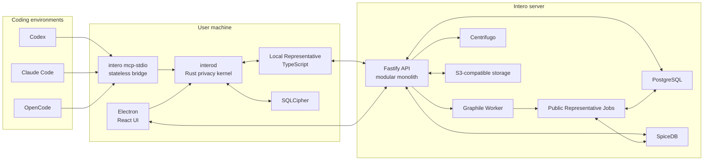

# Intero Technical Architecture

Status: proposed baseline for MVP planning

Date: 2026-07-24

## 1. Architectural intent

Intero separates technical execution from team coordination.

- Coding Agents execute work and decide when a technical branch needs team
  context.
- A Local Representative independently maintains private Work State.
- A Public Representative communicates and coordinates from synchronized state.
- A Rust privacy daemon owns local trust, storage, credentials, and privileged
  workspace access.
- The server owns shared state, messaging, authorization, realtime delivery,
  review, audit, and always-available Representative jobs.

The system is deliberately not an event-sourced Agent transcript platform.
Normal domain tables hold current state, while immutable Activity Events record
what changed and why.

## 2. System overview



## 3. Trust planes

### 3.1 Local private plane

The local plane is authoritative for:

- Workspace enrollment and path rules.
- Private Claims and private Work State.
- Hook and MCP ingress.
- Credential access.
- Read-only workspace operations.
- Local model-egress policy.
- Offline queues and synchronization cursors.
- Human-only E2EE key material.

Two processes share this plane:

1. `interod` is the Rust privacy kernel and the only process allowed to own
   the encrypted local database or access OS credentials.
2. The Local Representative is a TypeScript/Node sidecar supervised by
   `interod`. It runs the Agent loop but must call privacy-kernel ports for
   workspace, storage, credential, and synchronization access.

Electron Main is not a Representative runtime and does not own private data.

### 3.2 Public plane

The public plane is authoritative for:

- Organizations, projects, principals, and shared authorization.
- Public Work Projections.
- Chat, Coordination Threads, Spec Reviews, Decisions, and Action Inbox items.
- Public Representative jobs and public memory.
- Realtime fanout, object metadata, audit, and search.

Public Representative work runs as short-lived jobs. Its logical identity and
memory are durable in PostgreSQL; no per-user server process needs to stay
resident.

### 3.3 Projection boundary

Private Work State never synchronizes wholesale. The Local Representative
creates a projection diff, and `interod` verifies:

```text
Workspace eligibility
∩ privacy level
∩ model-egress policy
∩ Capability Grant
∩ destination authorization
```

Only phase, blocker, dependency, ownership, important decision, meaningful
artifact, pause, and completion changes are public by default.

## 4. Desktop and local runtime

### 4.1 Electron application

The desktop application uses:

- Electron.
- React and TypeScript.
- `electron-vite`.
- `electron-builder` and `electron-updater`.
- shadcn/ui generated components, Base UI primitives, and Tailwind CSS v4.
- TanStack Router.
- TanStack Query for server and daemon state.
- Zustand only for transient UI state.
- TanStack Form and Zod for forms.
- CodeMirror 6 for Markdown Spec editing.

The renderer is sandboxed. It communicates through narrow preload APIs and does
not receive OS credentials, database keys, or unrestricted filesystem handles.

The app package contains compatible versions of:

- Electron application.
- `interod`.
- Local Representative sidecar.
- MCP stdio bridge.
- supported Coding Agent integration assets.

They update atomically as one desktop release.

### 4.2 Local IPC

Electron, the Local Representative, and the MCP bridge communicate with
`interod` through JSON-RPC 2.0 using length-prefixed framing:

- Unix Domain Socket on macOS and Linux.
- Windows Named Pipe on Windows.

The protocol is identical across operating systems; only the transport adapter
differs. Each connection is authenticated with a daemon-managed local token and
bound to the current OS user.

### 4.3 Local encrypted storage

`interod` owns a SQLCipher database through `rusqlite`.

- A random 256-bit database key is stored in the OS credential store.
- Database work runs on a dedicated blocking thread.
- Other processes access state only through daemon methods.
- Local migrations are versioned and applied before dependent processes start.
- Private source-code content is not eagerly embedded for MVP.

### 4.4 Workspace tools

The Local Representative receives bounded tools:

```text
workspace.list_files
workspace.read_file
workspace.search_text
workspace.lookup_symbol
git.status
git.diff_summary
git.log
git.show_metadata
workstate.query
memory.search
```

All tools:

- operate only within registered Workspaces;
- deny default sensitive paths such as secrets and credential files;
- are read-only;
- produce local audit entries;
- pass results through model-egress policy before model use.

No arbitrary shell or file-write tool is available to the Representative.

## 5. Coding Agent integrations

### 5.1 Common MCP surface

All Coding Agent adapters expose the same tools:

```text
representative.lookup_team_context
representative.request_coordination
representative.request_spec_review
representative.lookup_decision
representative.check_scope
representative.report_checkpoint
```

`intero mcp-stdio` is a stateless transport bridge, not an Agent. A Coding
Agent launches it as an ordinary stdio MCP subprocess; the bridge forwards to
`interod` over the local IPC transport and exits with the Coding Agent
session.

### 5.2 Active checkpoint reporting

`report_checkpoint` is an enhancement, not the only source of truth. Coding
Agents are instructed to call it only at semantic milestones:

- intent or plan materially changes;
- a decision or assumption becomes important;
- a blocker or dependency appears;
- scope expands or begins affecting another team;
- a meaningful artifact or validation state is produced;
- work pauses or completes.

The Local Representative stores the report as a `coding_agent_report` Claim and
reconciles it with hooks, Git, validation, and human corrections.

### 5.3 Adapter-specific observation

Adapters normalize to Canonical Work Events:

```text
SessionStarted
SessionPaused
SessionStopped
WorkspaceChanged
ResourceTouched
GitStateChanged
PlanChanged
ValidationChanged
ArtifactDetected
CoordinationRequested
CheckpointReported
```

Default events never contain prompts, assistant responses, chain-of-thought,
complete tool arguments, complete tool results, terminal output, or file
contents.

Initial adapters:

- Codex: MCP, user-level Intero instructions, and supported lifecycle hooks.
- Claude Code: MCP, user-level Intero instructions, and supported hooks.
- OpenCode: MCP, a user-level instruction file, and a managed global plugin
  using session, file, todo, validation, and tool lifecycle hooks.

Integration installation must preserve user configuration, update only a
Intero-managed block or file, and be fully reversible.

## 6. Representative runtime

### 6.1 Shared core

Local and Public Representatives share `representative-core`, a pure TypeScript
package containing:

- event-driven Agent loop;
- Context Builder;
- Claim Resolver;
- Work-State reducers;
- public-projection logic;
- prompt compiler;
- capability-policy types;
- runtime ports and contract tests.

The package cannot directly access a database, filesystem, network, or
credential store. Each runtime injects different ports and tools.

### 6.2 Event-driven execution

Representative execution is event driven.

- Direct messages, blockers, coordination requests, scope changes, and review
  requests wake a run immediately.
- Ordinary file, Git, plan, and validation events are grouped by Workstream
  using a short debounce window.
- Deterministic reducers update state before any model call.
- One Workstream processes state changes in order.
- Different Workstreams may run concurrently.
- Offline or model-disabled operation continues deterministic reduction and
  queues semantic work for later.

The model loop uses Vercel AI SDK with explicit stop conditions, tool and token
budgets, and idempotent output commands.

### 6.3 Context assembly

Every run builds a bounded Context Package:

1. product, organization, and user policy;
2. Representative identity and runtime capabilities;
3. triggering event;
4. recent messages from the relevant Thread;
5. resolved Work State and unresolved Claims;
6. relevant Decisions and current Spec revision;
7. related public Work Projections;
8. prior phase summary;
9. permitted tools.

Current structured state and confirmed Decisions outrank historical summaries.
No hidden model session is treated as durable memory.

### 6.4 Prompt and preference layers

Prompt compilation order:

```text
Product Policy
→ Organization Policy
→ Representative Identity
→ User Preferences
→ Runtime Capabilities
→ Current Context
```

Product safety rules cannot be overridden. Organization policy can narrow
behavior. Users can configure tone, language, summary detail, notification
preference, normal Workstream scope, and escalation preference.

Every Representative message and action records the prompt, policy, and tool
schema versions used for the run.

## 7. Work State, Claims, and memory

### 7.1 Claims

A Claim is an assertion with:

- subject, predicate, and value;
- source type and source reference;
- observed time and optional validity;
- confidence;
- privacy level;
- supporting evidence reference.

Source types include human statement, direct observation, Coding Agent report,
project-system state, and Representative inference.

Resolution is not last-write-wins. Human corrections and direct observations
normally outrank inference, but conflicting Claims remain visible when the
system cannot safely reconcile them.

### 7.2 Durable memory

The source of truth is a set of structured objects:

```text
Workstream
Claim
Resolved Work State
Decision
Spec Revision
Artifact
Blocker
Dependency
Ownership
Coordination Thread
Person and Representative
```

Typed relations express `depends_on`, `blocks`, `owned_by`, `affects`,
`implements`, `supersedes`, `decided_by`, `reviewed_by`, `produced_by`, and
`related_to`.

SQLite and PostgreSQL store these relations using ordinary relational tables.
A dedicated graph database is not required for MVP.

### 7.3 Search

Local private search:

- structured lookup;
- SQLite FTS5 over Representative memory;
- exact Git, path, and symbol lookup;
- on-demand read-only workspace search.

Public search:

- PostgreSQL full-text search;
- `pg_trgm`;
- `pgvector` when organization model-egress policy permits Embeddings;
- bounded SpiceDB bulk authorization over candidates.

Search indexes are replaceable behind a Search port and never become the
authorization source of truth.

## 8. Communication model

### 8.1 Conversation types

- Human-only direct and group Threads.
- Representative Thread for a person and their Representative.
- Project Rooms.
- Coordination Threads.
- Spec Review Threads.
- Decision and Task-linked Threads.

Representative Threads are server-readable and multi-device synchronized.
They are not automatically team-visible.

Human-only Threads use OpenMLS. Each device is an MLS member. Explicitly adding
a Representative ends the Human-only mode for that same logical Thread:

- subsequent messages are Agent-readable and server-readable;
- a visible system event records the access transition;
- earlier MLS ciphertext is not disclosed by default;
- sharing relevant earlier context or full history is a separate explicit
  action.

The Thread therefore has an auditable encryption-mode boundary rather than a
silent or retroactive downgrade.

### 8.2 Runtime routing

The user sees one Representative identity.

- private-work questions route to the Local Representative;
- team-public questions route to the Public Representative;
- mixed questions are composed locally;
- when local is offline, Public answers from public state, shows freshness, and
  queues private-context work.

### 8.3 Coordination actions

Every Representative coordination contains:

1. a human-readable message;
2. a typed Action Envelope;
3. actor, authority grant, and policy version;
4. related Workstream, scope, Claims, evidence, and requested actions.

Messages are rendered for humans. Action Envelopes update state reliably.
Corrections and withdrawals are append-only events.

## 9. Authorization and identity

### 9.1 Authentication

Better Auth handles account authentication, linking, and sessions:

- email magic link bootstraps an account;
- passkey is the primary returning credential;
- GitHub is optional;
- Electron uses the system browser and a device authorization flow.

Intero owns a stable `principal_id`; authentication-provider identifiers never
become domain identity.

### 9.2 Authorization layers

- Local Rust policy controls device observation and egress.
- TypeScript Capability Policy controls Representative business authority.
- PostgreSQL RLS enforces organization and tenant boundaries.
- SpiceDB enforces shared ReBAC over projects, Rooms, Threads, Specs, and
  Artifacts.

All shared authorization calls go through an Authorization port. Mutations use
safe two-phase authorization changes, and reads may carry SpiceDB ZedTokens for
consistency.

### 9.3 Capability Grants

Capability Grants constrain:

- principal and action;
- organization, project, Workstream, and resource scope;
- human-confirmation requirement;
- expiry;
- policy version.

The effective permission is the intersection of product, organization, user,
Workstream, runtime, privacy, RLS, and SpiceDB policy.

## 10. Server architecture

### 10.1 Application shape

The server is a TypeScript modular monolith:

- Node.js 24 LTS.
- Fastify API process.
- Graphile Worker process from the same codebase.
- shared PostgreSQL database.
- module boundaries enforced in code rather than network hops.

Initial modules:

```text
identity
organizations
authorization
projects
workstreams
claims
conversations
coordination
specs
decisions
artifacts
representatives
search
notifications
audit
```

### 10.2 Domain transactions and jobs

A durable mutation transaction writes:

1. current domain state;
2. an immutable Activity Event;
3. an outbox entry.

Graphile Worker consumes outbox-derived jobs with at-least-once semantics.
Every handler is idempotent and keyed by a stable domain operation ID.
Graphile-specific identifiers do not leak beyond a Queue port, allowing later
migration to BullMQ, NATS, or Temporal if the workload requires it.

### 10.3 Public Representative concurrency

- One Conversation Thread is processed in sequence.
- One Workstream's state changes are processed in sequence.
- Different Workstreams may run concurrently.
- Shared profile writes use versioned transactions and optimistic concurrency.
- Model calls do not hold database locks.

## 11. Realtime, storage, and API contracts

### 11.1 Realtime

Centrifugo owns client connections, subscriptions, presence, and fanout.
PostgreSQL remains authoritative.

MVP uses Centrifugo's single-node in-memory engine. Clients receive event IDs
and sequence information over realtime delivery and use cursor-based API reads
to repair gaps.

### 11.2 Offline identifiers and ordering

- Clients generate UUIDv7 identifiers.
- The server assigns organization and Thread sequence values.
- Optimistic mutations carry a base version.
- Domain-specific conflict handling is used; there is no global CRDT.

### 11.3 Object storage

S3-compatible storage holds attachments and large artifacts.

- metadata and authorization live in PostgreSQL;
- uploads use presigned URLs;
- checksums and scanning gate publication;
- Human-only attachments are client-side ciphertext;
- Agent-readable attachments use server-side envelope encryption.

### 11.4 API contracts

Zod 4 is the only handwritten HTTP contract.

- `fastify-type-provider-zod` binds schemas to routes.
- `@fastify/swagger` produces OpenAPI 3.0.3.
- generated OpenAPI is checked in and drift-checked in CI.
- TypeScript clients are generated through `openapi-typescript`,
  `openapi-fetch`, and `openapi-react-query`.
- the Rust daemon client is generated with Progenitor and wrapped by a
  handwritten `ServerApi` trait.

Drizzle and database types never leak into API contracts.

## 12. Database and migrations

PostgreSQL access uses Drizzle with `node-postgres`.

- Drizzle defines schema and generates reviewed migrations.
- Production never uses `drizzle-kit push`.
- Raw parameterized SQL is allowed for complex search, RLS, and locking.
- repositories keep storage types behind module boundaries.
- migration compatibility supports rolling API and Worker deployment.

## 13. Observability and security

### 13.1 Observability

- OpenTelemetry-first traces and metrics.
- Pino structured logs in TypeScript.
- `tracing` in Rust.
- OTLP Collector for vendor-neutral export.
- optional Sentry for Electron crashes and unhandled exceptions.

Telemetry uses a strict allowlist and excludes messages, prompts, file contents,
tool input/output, Spec bodies, access tokens, API keys, and private Claims.
Local diagnostic bundles stay local until the user explicitly exports them.

### 13.2 Failure behavior

- local event queues persist across process restarts;
- model-disabled and offline modes continue deterministic work;
- public jobs retry idempotently;
- stale state is visible rather than silently reused;
- unavailable SpiceDB fails closed for protected mutations;
- realtime failure falls back to cursor polling;
- object scanning failure keeps an upload unavailable.

## 14. A2A boundary

MVP uses the internal Intero Coordination Protocol.

A later A2A 1.0 Gateway maps:

| A2A | Intero |
|---|---|
| Agent Card | External Agent registration and capabilities |
| Message | Conversation message |
| Task | External coordination task |
| `contextId` | Coordination Thread |
| Artifact | Artifact reference |
| Extension | Intero Action Envelope |

External Agents can reach only the Public Representative. They map to Intero
principals and remain subject to Capability Policy, SpiceDB, and privacy
projection. Agent discovery never implies authorization.

## 15. Proposed repository layout

```text
apps/
  desktop/
  local-representative/
  server-api/
  server-worker/

packages/
  api-contracts/
  representative-core/
  domain/
  project-management/
  ui/
  config/
  test-support/

crates/
  interod/
  server-api-client/

docs/
  adr/
  brainstorms/
  plans/
```

The TypeScript workspace uses pnpm and Turborepo. Rust crates use a Cargo
Workspace. A root Justfile exposes cross-language build, generation, test, and
development commands.

## 16. Verification strategy

- Vitest for TypeScript unit and contract tests.
- Playwright for Web and Electron end-to-end paths.
- Rust `cargo test` locally and `cargo-nextest` in CI.
- Testcontainers for PostgreSQL, SpiceDB, and Centrifugo integration tests.
- generated-contract drift tests.
- adapter conformance fixtures for Codex, Claude Code, and OpenCode.
- privacy tests proving unregistered directories and excluded payload fields do
  not cross the daemon boundary.
- failure tests for local offline, model disabled, Worker retry, stale public
  state, and realtime gap repair.

## 17. Decision records

- [ADR-0001: Separate local private and public planes](adr/0001-separate-local-private-and-public-planes.md)
- [ADR-0002: Shared Representative core with event-driven runtimes](adr/0002-shared-representative-core-and-event-driven-runtimes.md)
- [ADR-0003: TypeScript modular monolith with a Rust privacy daemon](adr/0003-typescript-modular-monolith-and-rust-privacy-daemon.md)
- [ADR-0004: Conversation privacy and Agent-readable boundaries](adr/0004-conversation-privacy-boundaries.md)
- [ADR-0005: Internal coordination protocol before A2A](adr/0005-internal-coordination-protocol-before-a2a.md)
