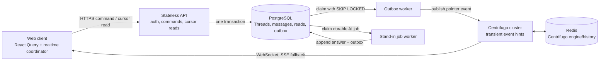

# ADR-0009: Durable, authorized realtime conversations

Status: proposed implementation target

Date: 2026-07-28

Builds on: ADR-0004, ADR-0005, ADR-0006

## Context

Intero currently has the beginnings of the right infrastructure but not a
production conversation system:

- `CommunicationsView` refreshes the canonical Thread list, Pilot direct
  messages, and Stand-in exchanges every ten seconds. Each refresh reads whole
  conversation payloads rather than an incremental cursor.
- PostgreSQL, a transactional outbox, a worker, and Centrifugo publishing
  already exist. The Web client does not subscribe to those publications.
- canonical Threads and Pilot direct messages are separate persistence and API
  models. They differ in authorization, unread state, event emission, and
  lifecycle.
- canonical message writes do not emit the durable realtime outbox event that
  Pilot mutations emit.
- realtime publications without a `projectId` are currently routed to an
  Organization channel. That is not a valid audience for a private direct
  message.
- the checked-in Centrifugo configuration is intentionally insecure local
  development configuration. It permits client-selected subscriptions and
  cannot be exposed as production configuration.
- some canonical Thread routes accept client-supplied actor/sender identity.
  Production routes must derive the actor from the authenticated session and
  authorize the exact Thread operation.
- a Stand-in question can hold an HTTP request open while the model answers.
  Model latency and failure must not be part of the durable message write path.

Connecting the existing Web page directly to the existing Organization channel
would improve latency while widening disclosure. Replacing polling with an
in-process WebSocket implementation would remove useful infrastructure while
recreating authentication, recovery, backpressure, and fanout behavior.

## Decision

Intero will use one canonical conversation model and a hybrid delivery
protocol:

1. authenticated HTTPS commands commit conversation state to PostgreSQL;
2. the same database transaction appends a minimal durable outbox event;
3. the worker publishes that event to an authorized Centrifugo channel;
4. the browser treats the publication as a change hint and reads the
   authoritative delta by Thread sequence;
5. reconnect recovery uses Centrifugo's short history when possible and the
   PostgreSQL cursor API in every case where continuity cannot be proven.

WebSocket is the normal transport. Centrifugo's bidirectional SSE transport is
the fallback for environments that block WebSocket. Cursor polling remains a
degraded-mode repair path, not the normal chat transport.

This decision makes text conversations production-ready. It preserves the
privacy transition defined by ADR-0004 but does not newly claim end-to-end
encryption, offline-first sending, attachments, voice, video, federation, or
multi-region active-active writes. Attachments must later use the authorized
object-storage lifecycle; they must not be embedded in realtime publications.
Each Thread has one PostgreSQL write region. A future multi-region design may
home different Threads in different regions without changing their sequence
contract.

### Architectural invariants

- A successful message response means the message and outbox event committed
  atomically to PostgreSQL.
- Realtime delivery is never required for a successful message commit.
- PostgreSQL is the only authoritative message history.
- Every Thread has one server-assigned, gap-free, monotonically increasing
  message sequence.
- The authenticated server principal is the sender. A request body cannot
  choose an actor.
- A client retry with the same `clientMessageId` has one domain effect and
  returns the original committed message.
- A realtime publication contains no message body, encrypted body, prompt,
  attachment content, or display name.
- A client may subscribe only to its personal channel and Threads it can
  currently view.
- A realtime gap, duplicate, out-of-order publication, expired token, worker
  restart, or Centrifugo restart cannot lose or duplicate a committed message
  in the rendered conversation.
- Removing access fails closed at the HTTP read boundary immediately and
  revokes realtime access as quickly as the control plane permits.

## Logical topology



Commands do not travel over the realtime connection. This keeps CSRF,
authentication, rate limiting, validation, idempotency, and request tracing on
the existing HTTP boundary.

## Canonical model

The existing `threads`, `thread_participants`, `messages`, and `thread_reads`
tables become the only conversation store. Pilot DM and Stand-in routes become
compatibility adapters over this store and are then retired.

Required model changes:

- `threads`
  - retain the authoritative `sequence`;
  - add an `access_version` incremented on every participant or visibility
    change;
  - retain scope (`organization_id`, optional Team/Project ownership) and
    conversation kind;
  - assign a stable Thread UUID to every logical conversation instead of
    reusing a Project ID as the synthetic Thread ID;
  - enforce a kind-specific logical key, including sorted human participants
    for a direct message and `(project, viewer, standInOwner)` for a private
    personal Stand-in conversation;
  - add `latest_message_at` for summary-list ordering without loading messages.
- `thread_participants`
  - record role and `visible_from_sequence`;
  - support active/revoked timestamps so access changes are auditable;
  - keep a unique `(thread_id, principal_id)` constraint.
- `messages`
  - use the message UUID as `clientMessageId`, or store a separate
    `client_message_id`;
  - enforce unique `(thread_id, sequence)` and
    `(thread_id, sender_id, client_message_id)`;
  - keep content and encryption boundary fields only in PostgreSQL.
- `thread_reads`
  - retain monotonic `last_read_sequence`;
  - validate that the cursor never exceeds the Thread head.
- `outbox`
  - store a versioned conversation event with explicit audience metadata;
  - keep business transaction state separate from delivery attempts;
  - expire or archive completed rows according to an operations policy.
- `outbox_publications`
  - materialize one delivery per event and authorized channel;
  - enforce unique `(operation_id, channel)`;
  - track claim, retry, and completion independently so a partial personal
    fanout does not replay every audience indefinitely.

The current `accessMode` overloads two different policies and is replaced or
made derived:

- content readability says whether a message stores server-readable content or
  participant-held ciphertext;
- participant visibility says which human, Stand-in, or Agent may read which
  sequence range.

Adding a Stand-in therefore creates or updates a participant boundary with
`visible_from_sequence = current sequence + 1`; it does not relabel earlier
server-readable human messages as Agent-readable. An explicit audited history
grant is required to move that boundary backwards. This preserves ADR-0004
without making a new E2EE claim.

Message sequence allocation uses a row lock or atomic
`UPDATE ... SET sequence = sequence + 1 RETURNING sequence` inside the same
transaction as the message and outbox inserts. The current Pilot snapshot-wide
Organization advisory lock is not used for conversation writes.

### Realtime event contract

The event is a pointer to authoritative state:

```json
{
  "schemaVersion": 1,
  "eventId": "uuidv7",
  "type": "conversation.changed",
  "threadId": "uuid",
  "headSequence": 42,
  "accessVersion": 7,
  "reason": "message_appended",
  "occurredAt": "2026-07-28T12:00:00.000Z"
}
```

Allowed `reason` values initially are:

- `thread_created`;
- `message_appended`;
- `read_cursor_changed`;
- `access_changed`;
- `thread_concluded`.

`message_appended` deliberately omits the message body. An authorized client
fetches `afterSequence` from the API. This avoids creating a second
content-retention surface in Centrifugo history or Redis and ensures a late
authorization change is applied before content is returned.

### Channels and audiences

- `intero:user:<principalId>` carries personal conversation-list, unread, and
  access-change hints. A connection is server-subscribed to only its own user
  channel.
- `intero:thread:<threadId>` carries active Thread change hints. Subscription
  requires current `thread:view` permission.
- Project and Organization channels remain separate namespaces for non-private
  product projections. Conversation events are never routed to a general
  Organization channel merely because they lack a Project ID.

For a message, the outbox dispatcher publishes once to the Thread channel and
publishes content-free list/unread hints to the personal channels of active
human participants, including the sender so their other devices converge.
Fanout is retryable and idempotent by `eventId + audience`. Initial production
rooms have a bounded participant count; increasing it requires revalidating
transaction size and personal fanout capacity.

## Authentication and subscription authorization

The API adds:

- `POST /v1/realtime/session` — derives the current principal from the session
  and returns transport endpoints plus a short-lived Centrifugo connection
  token. The token `sub` is the principal ID and server-subscribes only the
  matching personal channel.
- `POST /v1/realtime/subscriptions` with `{ "threadId": "..." }` — performs a
  fully consistent Thread authorization check and returns a short-lived
  channel subscription token whose `sub` and `channel` are exact.

Connection and subscription tokens have short expirations and are refreshed by
the SDK. They contain no session cookie, provider secret, or chat content.
Subscription authorization uses the same canonical Thread participant source
and SpiceDB permission as HTTP reads; it is not a parallel ACL system.
Cookie-authenticated token and conversation mutations enforce the deployment's
CSRF and allowed-Origin policy in addition to `SameSite` session-cookie
settings.

On participant removal, the transaction increments `access_version`, emits an
`access_changed` event, and schedules a Centrifugo unsubscribe/disconnect
control action for the removed principal and Thread. Token expiry is a bounded
backstop. Every subsequent cursor read and subscription refresh denies access
immediately, even if the control action is delayed.

Production Centrifugo configuration must:

- disable insecure client and HTTP API modes;
- disallow client publish and arbitrary client subscribe;
- validate signed connection and subscription tokens;
- restrict origins to deployed Intero origins;
- keep the publish API on a private network with a rotated secret;
- enable recoverable history only for content-free event namespaces;
- use Redis or another supported distributed engine when more than one
  Centrifugo node is deployed;
- expose WebSocket and bidirectional SSE/emulation through the same TLS edge.

The checked-in insecure configuration remains explicitly local-development
only. A separate production template and configuration validation are required.

## HTTP conversation protocol

### Send

```http
POST /v1/threads/{threadId}/messages

{
  "clientMessageId": "uuidv7",
  "body": "..."
}
```

The request has one canonical `clientMessageId`. A transport retry reuses the
same request body and therefore settles the same durable message.

The server:

1. authenticates the session and derives `senderId`;
2. authorizes `thread:post` and current access mode;
3. validates size, kind, rate limit, and content/encryption shape;
4. returns the existing message when the idempotency key already committed;
5. otherwise assigns the next sequence and atomically inserts the message,
   Thread head update, Activity Event where required, and outbox event;
6. returns the committed message without waiting for the realtime worker.

### Read and repair

```http
GET /v1/threads/{threadId}/messages?afterSequence=42&limit=100
```

The response includes:

```json
{
  "items": [],
  "headSequence": 42,
  "accessVersion": 7,
  "hasMore": false
}
```

Pagination is strictly by sequence, not timestamp. Initial Thread reads load
the newest bounded page through an explicit `tail` query and page older history
with `beforeSequence`. Repair reads only move forward with `afterSequence`. The
conversation list returns summaries and unread counts; it does not embed every
message from every Thread.

Read state uses:

```http
POST /v1/threads/{threadId}/read

{ "sequence": 42 }
```

The server derives the principal and moves the marker forward only. The client
debounces cursor updates and flushes on visibility loss where practical.

## Client synchronization state machine

The Web client owns one realtime coordinator above view components. Individual
screens do not create timers or sockets.

Connection states are `connecting`, `live`, `degraded`, and `offline`:

- `live`: WebSocket or SSE is connected; fixed chat polling is disabled.
- `degraded`: realtime is unavailable; active Thread cursor repair polls with
  exponential backoff and jitter, while the conversation summary refreshes at
  a lower frequency.
- `offline`: sends remain visibly pending/failed; no response is represented as
  committed.

For an active Thread:

1. subscribe and start buffering change hints;
2. fetch an authorized snapshot/delta;
3. merge by message ID and server sequence;
4. process buffered hints;
5. on any hint with a head above the local cursor, coalesce one cursor read;
6. on an `accessVersion` mismatch, reload authorized Thread metadata before
   reading more content;
7. if Centrifugo reports attempted but unsuccessful recovery, invalidate the
   summary and run cursor repair;
8. ignore duplicate or older message hints.

This removes the snapshot/subscription race. Publication ordering is not trusted
for correctness. The personal conversation summary follows the same
subscribe-buffer-snapshot rule; list, unread, read-cursor, and access reasons
refresh the bounded summary even when the Thread head did not advance.

Sending is optimistic:

- create one stable `clientMessageId`;
- render `sending`;
- retry transport failures with the same ID;
- replace the optimistic item with the committed server sequence;
- render `failed` with explicit retry when the request is definitively
  rejected.

A publication that arrives before the send response is harmless because both
paths merge on the same message ID.

## Stand-in behavior

A human question to a Stand-in is committed as a normal message first. The same
transaction enqueues an idempotent Stand-in job keyed by the question message
ID. The API returns immediately.

The worker:

1. loads authorized context without holding a database lock during the model
   call;
2. records bounded processing state;
3. appends the answer as another canonical message with the normal sequence and
   outbox transaction;
4. records a visible terminal failure message/state after bounded retries.

Typing and presence are optional ephemeral features. If added, they use a
separate authorized namespace with no durable history and never affect message
correctness.

## Failure behavior

- PostgreSQL unavailable: sends fail; no message is acknowledged or held only
  in memory.
- outbox worker unavailable: sends succeed, backlog grows, clients repair from
  PostgreSQL; readiness is degraded and alerts fire.
- Centrifugo unavailable: sends and reads succeed; clients enter degraded
  cursor polling with jitter.
- publication duplicated or reordered: clients coalesce and repair by Thread
  sequence.
- history expired or Centrifugo epoch changed: the SDK reports recovery failure
  and the client reads from its durable cursor.
- authorization service unavailable: protected reads, writes, token issuance,
  and token refresh fail closed.
- model provider unavailable: the human question remains durable and the
  Stand-in job retries without blocking normal human chat.

## Capacity and operability

The minimum highly available production shape is at least two stateless API
instances, two workers using database claims, and two Centrifugo nodes behind a
draining load balancer with a highly available distributed engine. PostgreSQL
uses multi-zone high availability, point-in-time recovery, encrypted backups,
and regularly tested restore. Redis/Centrifugo history may be discarded without
data loss. Region-disaster RPO/RTO must be explicitly selected before launch;
the initial architecture does not claim multi-region active-active continuity.

The initial production gate is 10,000 concurrent realtime connections, 200
committed messages per second, and 1,000 content-free publications per second
per deployment. This is a sizing target, not a product limit; load tests must
use the expected tenant and room-size distribution and at least twice forecast
peak before launch.

Initial service objectives:

- monthly conversation API availability: 99.9%;
- committed message durability: no acknowledged message loss;
- message commit latency: p95 below 300 ms and p99 below 750 ms, excluding
  attachment upload and model generation;
- connected remote visibility: p95 below 1 second and p99 below 3 seconds;
- reconnect repair after network recovery: p95 below 5 seconds;
- normal outbox oldest-pending age: below 10 seconds.

Metrics use bounded labels and never contain Organization, Project, Thread,
principal, message, or prompt content:

- active connections and reconnect rate by transport;
- realtime session/subscription token success and denial counts;
- message command latency/error/idempotent-replay counts;
- cursor delta size, gap repair, and recovery-failure counts;
- outbox depth, oldest age, attempts, dead letters, and publish latency;
- Stand-in queue age and terminal failure counts;
- degraded-mode duration.

Operational alerts are based on SLO burn rate, outbox oldest age, durable job
age, authorization failures, and reconnect storms. Completed outbox retention,
PostgreSQL backup/restore, Redis loss behavior, rolling deploy, secret rotation,
and token-key rotation require runbook tests.

## Migration

The migration is additive and reversible until the final cleanup:

1. close actor-spoofing and object-authorization gaps on existing HTTP routes;
2. add canonical constraints, `access_version`, summary fields, cursor reads,
   idempotent send, and transactionally emitted conversation outbox events;
3. make Pilot DM and Stand-in APIs compatibility adapters over canonical
   Threads for all new writes;
4. backfill historical `pilot_dm_threads`, `pilot_dm_messages`, and
   `pilot_stand_in_exchanges` idempotently, preserving IDs, participants,
   visibility boundaries, timestamps, and sequences; allocate stable Stand-in
   Thread UUIDs rather than continuing the synthetic Project-ID mapping;
5. compare counts, heads, participant sets, and sampled content hashes; switch
   Pilot reads to canonical Threads;
6. deploy authenticated realtime token routes and content-free channel routing;
7. add the client coordinator in shadow mode, then enable realtime while
   retaining degraded cursor polling;
8. move Stand-in answers to durable asynchronous jobs;
9. remove ten-second normal-mode polling and whole-history list payloads after
   recovery and failure tests pass;
10. stop old-table writes, retain rollback reads for one release, then archive
    or remove obsolete Pilot chat tables in a separately reviewed migration.

No phase dual-publishes message bodies. Rollback disables the realtime feature
flag and returns clients to cursor polling without reverting committed data.

## Acceptance

1. Two authenticated participants see a committed message in under the realtime
   SLO without fixed-interval polling.
2. A non-participant cannot list, read, post, obtain a subscription token for,
   or receive a publication for a Thread.
3. Client-supplied sender/actor fields are ignored or rejected.
4. Retrying the same `clientMessageId` before, during, and after a timeout
   creates one message and one sequence.
5. Concurrent writers receive unique contiguous server sequences.
6. Reordered and duplicated publications render one correctly ordered history.
7. Disconnect beyond Centrifugo history TTL repairs every missing message from
   PostgreSQL.
8. The initial snapshot/subscription race loses no message.
9. Centrifugo and the outbox worker may each be stopped and restarted without
   losing acknowledged messages; clients visibly enter and leave degraded mode.
10. Participant removal immediately blocks HTTP content reads and token refresh,
    and triggers realtime unsubscribe/disconnect.
11. Realtime and Redis contain no message bodies or encrypted bodies.
12. A Stand-in provider timeout does not block human chat; the durable question
    and visible job state survive restart.
13. Existing Pilot DM and Stand-in exchange history migrates with matching
    message IDs, sequences, participants, visibility boundaries, timestamps,
    and unread semantics.
14. Multi-node, rolling-restart, reconnect-storm, slow-consumer, rate-limit,
    and backup/restore tests pass at the launch capacity gate.

## Consequences

- Normal chat becomes low latency without making the realtime tier
  authoritative.
- Correctness remains understandable: one database transaction, one Thread
  cursor, idempotent merge.
- Private chat no longer depends on Organization-wide fanout.
- The browser and API have more explicit synchronization contracts than a
  blanket query invalidation approach.
- Remote messages add one authorized delta request after a content-free
  publication. This is an intentional privacy and operability tradeoff.
- Pilot-specific chat persistence and its Organization-wide snapshot lock are
  removed from the hot path.
- Redis is required only when horizontally scaling Centrifugo, not for durable
  message storage.

## Rejected alternatives

- **Keep short polling as the primary path.** It has avoidable latency and read
  amplification and still needs cursors and idempotency for correctness.
- **Publish existing private events to an Organization channel.** Subscription
  convenience does not justify widening the audience.
- **Send chat commands through WebSocket.** It duplicates the mature HTTP
  command boundary and couples durable writes to connection state.
- **Put full message bodies in realtime history.** It creates another content
  retention and authorization surface for little product benefit.
- **Use Centrifugo history as durable catch-up.** Its history is a bounded
  reconnect optimization, not the system of record.
- **Build a custom WebSocket gateway now.** The existing Centrifugo investment
  already provides connection lifecycle, transport fallback, fanout, and
  recoverable short history.
- **Make every outbox event strictly FIFO.** Sequence-based repair makes
  out-of-order hints safe and avoids head-of-line blocking across Threads.

## External grounding

- Centrifugo recommends database reload when stream recovery cannot prove a
  complete gap repair:
  <https://centrifugal.dev/docs/server/history_and_recovery>
- Centrifugo supports signed per-channel subscription tokens:
  <https://centrifugal.dev/docs/server/channel_token_auth>
- The JavaScript SDK supports WebSocket with bidirectional SSE fallback:
  <https://centrifugal.dev/docs/transports/sse>
- Multi-node deployments require a distributed engine rather than relying on
  one node's memory:
  <https://centrifugal.dev/docs/server/configuration>
