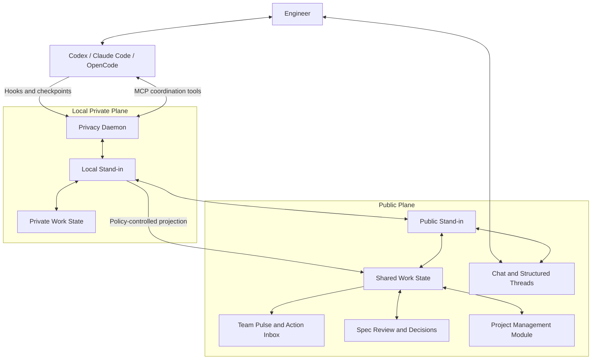

# Intero Product Requirements

## Summary

Intero will give every engineer an independent Digital Stand-in that
turns explicitly authorized Coding Agent work into trustworthy Work State,
transparent coordination, reviewable architecture Specs, durable decisions,
and a low-noise shared view of the team.

---

## Problem Frame

AI Coding has shortened the path from intent to implementation. An engineer can
now discuss a large feature with a Coding Agent, settle on an architecture, and
begin changing shared interfaces before the rest of the team knows that the
work exists. Individual execution accelerates while team synchronization still
depends on stand-ups, chat, manually updated tickets, meetings, and direct
interruptions.

The missing information is not raw activity. Teams already have agent
transcripts, commits, pull requests, messages, and tickets. What they lack is a
current, evidence-backed representation of who owns which intent, what phase
each effort is in, which decisions are confirmed, where work is blocked, and
when one engineer's implementation depends on another's.

Centralizing complete Coding Agent sessions would create a surveillance system
without producing reliable work semantics. Making Coding Agents responsible
for continuously maintaining team state would also mix execution with
coordination. The product therefore needs a separate agent whose durable
responsibility is representing work rather than performing it.

---

## Product Model

The Digital Stand-in is one logical identity with two runtimes. The Local
Stand-in has access to authorized private context through a privacy
daemon. The Public Stand-in remains available when the user's machine is
offline and communicates using the latest synchronized information. Neither
runtime is the Coding Agent.

---

## Actors

- A1. Engineer: Authorizes Workspaces, works with Coding Agents, supervises and
  corrects their Stand-in, and retains authority over consequential
  commitments.
- A2. Coding Agent: Plans and executes technical work, voluntarily reports
  semantic checkpoints, and decides when a technical branch or blocker needs
  team context.
- A3. Local Privacy Runtime: Accepts hooks and MCP calls, enforces Workspace and
  model-egress policy, stores private state, and exposes bounded local tools.
- A4. Local Stand-in: Independently interprets private work signals,
  maintains Claims and Work State, answers private-scope questions, and prepares
  public projections.
- A5. Public Stand-in: Remains continuously available, communicates
  transparently, answers from shared state, and coordinates inside delegated
  authority.
- A6. Teammate or Teammate Stand-in: Queries state, contributes context,
  and participates in conversations, coordination, and review.
- A7. Reviewer or Technical Lead: Reviews Specs and makes human decisions that
  must not be delegated to a Stand-in.
- A8. Project Management Module: Supplies optional project, task, cycle,
  dependency, and roadmap views without owning Intero's live Work State.

---

## Key Flows

- F1. Authorized work observation and publication
  - **Trigger:** A supported Coding Agent begins work inside a local directory.
  - **Actors:** A1, A2, A3, A4, A5
  - **Steps:** The privacy runtime checks the Workspace registry. Supported hooks
    produce minimum technical metadata, while the Coding Agent may voluntarily
    report an intent, decision, blocker, dependency, validation result, or
    completion checkpoint. The Local Stand-in groups signals into a
    Workstream, resolves Claims, and publishes only organizationally meaningful
    changes allowed by policy.
  - **Outcome:** Team Pulse reflects useful current state without receiving a
    raw Coding Agent transcript or a stream of tool calls.
  - **Covered by:** R1, R2, R3, R4, R6, R7, R12

- F2. Coding-time coordination
  - **Trigger:** A Coding Agent decides that a decision branch, dependency,
    blocker, ownership question, or shared boundary needs team context.
  - **Actors:** A1, A2, A3, A4, A5, A6
  - **Steps:** The Coding Agent calls its Stand-in through MCP. The Local
    Stand-in combines private Work State with public team state. When
    another person or Stand-in must participate, the Stand-in
    creates a visible Coordination Thread containing both a human-readable
    exchange and structured actions. The Coding Agent receives a bounded
    coordination result and chooses whether to continue, narrow, or wait.
  - **Outcome:** The Coding Agent becomes organization-aware without being
    forced into a centralized execution workflow.
  - **Covered by:** R2, R5, R8, R10, R11, R18

- F3. One Stand-in conversation with two runtimes
  - **Trigger:** An Engineer sends a message in their Stand-in Thread.
  - **Actors:** A1, A4, A5
  - **Steps:** Private-work questions route to the Local Stand-in,
    team-state questions route to the Public Stand-in, and mixed questions
    are combined locally. The user sees one Stand-in identity with a
    subtle runtime and freshness indicator. If the local runtime is offline,
    the Public Stand-in answers from existing synchronized state,
    discloses its freshness, and queues requests requiring current private
    context.
  - **Outcome:** The conversation remains continuous across devices and offline
    periods without implying that stale public state is fresh private context.
  - **Covered by:** R5, R8, R9, R12

- F4. Architecture Spec review
  - **Trigger:** A Coding Agent and Engineer form a plan that changes shared
    architecture, public interfaces, schemas, permissions, or multiple
    Workstreams.
  - **Actors:** A1, A2, A4, A5, A6, A7
  - **Steps:** The Coding Agent requests review through MCP. The Stand-in
    turns the candidate into a versioned Spec Review, identifies affected
    Workstreams and reviewers, publishes a review request, collects
    Stand-in impact analyses and human responses, and binds every review
    state to a specific revision. Human-confirmed conclusions become Decision
    Records.
  - **Outcome:** AI-assisted implementation regains a visible team review gate
    without making the Stand-in the architecture approver.
  - **Covered by:** R11, R14, R15, R18

- F5. Conflicting evidence
  - **Trigger:** Hooks, Git, a Coding Agent report, project state, or a human
    statement disagree about current work.
  - **Actors:** A1, A2, A4, A5
  - **Steps:** The Stand-in preserves each assertion as a sourced Claim,
    weighs direct observation and human correction above inference, and derives
    a resolved state without discarding the contradiction. Only high-impact
    unresolved conflicts enter the Action Inbox.
  - **Outcome:** Team state exposes material uncertainty instead of treating the
    latest message as truth.
  - **Covered by:** R6, R7, R17

---

## Requirements

**Stand-in and Coding Agent integration**

- R1. Every Engineer must have an independently identifiable Digital
  Stand-in whose durable responsibilities are Work-State maintenance,
  summarization, coordination, communication, review support, memory, and
  escalation. It must remain distinct from every Coding Agent.
- R2. Intero must provide first-class adapters for Codex, Claude Code, and
  OpenCode:
  - Each adapter must expose the same canonical coordination tools through MCP.
  - Hooks or plugins must provide minimum lifecycle, Workspace, resource, Git,
    validation, artifact, and session-state signals where the Coding Agent
    supports them.
  - A user-level Intero instruction package must encourage the Coding Agent to
    report semantic checkpoints without modifying repository instruction files.
  - Missing or changed hooks must degrade to other available observations rather
    than breaking the Stand-in.
- R3. Coding Agents may voluntarily report semantic checkpoints such as intent
  changes, decisions, blockers, dependencies, scope changes, artifacts,
  validations, pauses, and completion. The Stand-in must treat a report
  as a sourced Claim and independently reconcile it with other evidence.
  Prompts, assistant responses, chain-of-thought, complete tool arguments,
  complete tool results, terminal logs, and file contents are not collected as
  work events by default.

**Workspace, local access, and Work State**

- R4. The local runtime must enforce an explicit Workspace registry:
  - Unregistered directories produce no collection and only a local,
    non-blocking enrollment suggestion.
  - Worktrees of an authorized repository are included automatically.
  - Users may add, remove, widen, or narrow directory rules without repeated
    confirmation during normal work.
  - Multiple directories may map to one logical project, while local absolute
    paths remain outside public state.
- R5. The Local Stand-in may perform bounded, read-only access inside an
  authorized Workspace through the privacy runtime. It may list and read files,
  search code, inspect symbols, and query read-only Git metadata, but it must not
  edit files, execute arbitrary shell commands, or bypass excluded sensitive
  paths.
- R6. A Stand-in must maintain multiple concurrent Workstreams per person.
  Each Workstream groups intent, phase, scope, ownership, blockers,
  dependencies, decisions, artifacts, freshness, confidence, and evidence
  across relevant Coding Agent sessions and project tasks. Users can correct,
  pin, rename, merge, split, pause, or complete Workstreams; explicit correction
  has priority over later inference.
- R7. Work State must be derived from sourced Claims rather than simple
  last-write-wins updates:
  - Claims distinguish direct observation, Coding Agent report, Stand-in
    inference, project-system state, and human statement.
  - Material provenance, confidence, freshness, and contradiction remain
    inspectable.
  - Only phase, blocker, dependency, ownership, important decision, meaningful
    artifact, pause, and completion changes automatically update the public
    projection.
  - File churn, repeated tool calls, and intermediate validations remain private
    activity unless they change organizational state.

**Stand-in conversation and coordination**

- R8. Intero must own a built-in messaging experience:
  - Team Pulse, not a Discord-style channel tree, is the default product entry.
  - Direct and small-group communication feels like ordinary IM; persistent
    project discussion uses Rooms; important work uses first-class structured
    Threads.
  - People and Stand-ins retain visibly separate identities.
  - Stand-ins are silent by default in ordinary Rooms and participate
    when addressed or explicitly included in a structured work context.
- R9. A person's ongoing conversation with their Stand-in must remain one
  discoverable Stand-in Thread:
  - Messages in this Thread are server-readable, synchronized across devices,
    and visible only to authorized participants rather than the whole team.
  - Local and Public runtimes share one Stand-in identity while exposing
    a subtle runtime and freshness indicator.
  - A local outage allows the Public Stand-in to answer only from the
    latest public information and to queue work that requires fresh local state.
  - Human-only Threads remain end-to-end encrypted until a participant
    explicitly adds a Stand-in. Adding the Stand-in changes the
    same Thread to Agent-readable from that point forward and creates a visible
    access-change event. Earlier history remains inaccessible to the
    Stand-in unless a participant separately grants relevant context or
    the full history.
- R10. Stand-in communication with people or other Stand-ins must
  be transparent, attributable, auditable, and open to human correction:
  - Every coordination action carries both a structured Action Envelope and a
    human-readable message.
  - Full exchanges stay in the related Thread; Rooms receive only creation,
    material change, required-human-action, and conclusion checkpoints.
  - Corrections and withdrawals are new visible events rather than hidden
    edits to earlier structured actions.
- R11. Stand-in authority must be enforced through structured Capability
  Grants evaluated by code, not by Prompt alone. Grants constrain action,
  organization, project, Workstream, resource scope, confirmation requirement,
  and expiry. A Stand-in may answer from known facts, declare ownership
  inside existing scope, register blockers and dependencies, arrange review,
  and publish authorized state. It may not independently promise deadlines,
  change priority, accept unrelated work, approve architecture, or perform
  irreversible actions.

**Privacy, model use, and memory**

- R12. Local private state and public shared state must remain separate:
  - The Local Stand-in continues deterministic state reduction and
    retrieval while offline.
  - The Public Stand-in is implemented independently of the user's
    machine and uses only synchronized information during an outage.
  - Model egress is an independent policy with managed API, user-provided API,
    and disabled modes; a local model is never required.
  - Private MVP retrieval uses structured queries and local full-text search,
    not mandatory local or cloud Embeddings.
- R13. Intero must provide low-friction privacy defaults:
  - A Workspace allowlist determines what may be observed.
  - P0 Local Only, P1 Stand-in Private, P2 Coordination, P3 Project, and
    P4 Organization determine permitted disclosure.
  - Conversation type supplies normal defaults, so creating a Room or Thread
    does not require repeatedly selecting a privacy level.
  - Users and organizations may narrow or widen defaults within their authority.
  - Tightening a policy stops future use and marks synchronized information
    withdrawn; it must not claim to erase information already viewed or copied.
- R14. Long-term memory must be built from structured Workstreams, Claims,
  Decisions, Spec revisions, Artifacts, Blockers, Dependencies, Ownership, and
  typed relationships. Conversation summaries, full-text search, and vector
  search are retrieval aids rather than the source of truth.

**Spec review, attention, and project management**

- R15. Specs and reviews must be first-class, versioned objects:
  - Coding Agents and Engineers create or update Spec candidates.
  - The Coding Agent requests review through MCP; the Stand-in publishes
    the review, identifies affected Workstreams, proposes reviewers, and tracks
    responses.
  - Stand-in impact analysis, human acknowledgement, approval,
    conditional approval, and requested changes are distinct states.
  - Reviews and inline comments bind to a specific revision. Material changes
    invalidate only affected confirmations.
  - Confirmed conclusions form durable, supersedable Decision Records.
- R16. Team Pulse and Action Inbox must prioritize understandable state over
  Agent activity:
  - Team Pulse shows attention items and each member's concurrent Workstreams,
    with project as a filter.
  - Progress uses phase, verified progress, remaining conditions, freshness,
    confidence, and evidence rather than invented percentages.
  - Normal progress changes Team Pulse; explicit decisions or actions enter the
    Action Inbox; system notifications are reserved for imminent blockage or
    risk.
- R17. Project management must be a module rather than the platform foundation:
  - Intero Core must function without tasks, cycles, or roadmaps.
  - A Workstream may exist without a task, relate to several tasks, or represent
    one person's part of a shared task.
  - The initial project-management module is implemented natively against the
    Intero domain model.
  - `team-presence` may inform product behavior and migration compatibility, but
    its raw session collector, frontend, and codebase are not reused as the
    foundation.

**Execution and interoperability boundaries**

- R18. Intero must not control Coding Agent execution. Coding Agents decide
  when coordination is needed, call the Stand-in through MCP, and choose
  whether to continue, narrow, or wait. The Stand-in may return context
  to an active Agent or queue it for a later session, but it must not launch
  Coding Agent subagents or silently take over technical work.
- R19. Intero must use its own strongly typed Coordination Protocol for
  internal work semantics. A2A interoperability is deferred until after the
  internal protocol and core experience stabilize; the internal model must
  preserve a clean future mapping to A2A Agent Cards, Messages, Tasks,
  Artifacts, and extensions.

---

## Acceptance Examples

- AE1. **Covers R2, R3, R4.** Given OpenCode, Codex, or Claude Code starts inside
  an unregistered directory, when its hooks fire, Intero collects nothing and
  shows only a local enrollment suggestion.
- AE2. **Covers R2, R3, R6.** Given a Coding Agent changes its implementation
  plan and calls the checkpoint tool, when the Local Stand-in processes
  the report, it stores a Coding-Agent Claim, reconciles it with Git and hook
  evidence, and updates the Workstream without uploading the raw session.
- AE3. **Covers R5, R12, R13.** Given a Local Stand-in reads an authorized
  source file to resolve scope, when model egress is disabled, the content stays
  local and deterministic retrieval continues without a model call.
- AE4. **Covers R6, R16.** Given an Engineer has three primary efforts and
  several inactive experiments, when Team Pulse renders that member, the three
  efforts remain distinct Workstreams while stale experiments are collapsed.
- AE5. **Covers R7, R16.** Given a Coding Agent reports completion while
  validation still fails and Git contains uncommitted changes, when the
  Stand-in resolves state, Team Pulse shows completion reported with
  conflicting evidence rather than Done.
- AE6. **Covers R7, R16.** Given a Coding Agent repeatedly edits files and runs
  tests without changing phase, blocker, dependency, ownership, decision, or
  artifact state, when events are processed, no new public progress message is
  created.
- AE7. **Covers R9, R12.** Given the Local Stand-in is offline, when the
  Engineer asks their Stand-in for team-visible ownership, the Public
  Stand-in answers from synchronized state, displays its timestamp, and
  queues any request requiring fresh local context.
- AE8. **Covers R9.** Given a Human-only E2EE group wants Stand-in help,
  when a participant adds a Stand-in, the existing Thread becomes
  Agent-readable for subsequent messages, shows a visible access-change event,
  and withholds earlier history until it is separately granted.
- AE9. **Covers R10, R11.** Given another Stand-in asks who will handle an
  API already inside Wilson's authorized Workstream, when Wilson's
  Stand-in answers, users see the explanation while the system records a
  scoped ownership action without a delivery-date commitment.
- AE10. **Covers R10, R18.** Given a Coding Agent requests coordination at a
  technical branch point, when Stand-ins exchange context, the Coding
  Agent receives a bounded structured result and Intero neither injects the
  complete transcript nor launches another Agent.
- AE11. **Covers R11.** Given a request expands beyond the Stand-in's
  Capability Grant, when it attempts to accept ownership, the action is rejected
  by policy and the Engineer receives a specific Action Inbox item.
- AE12. **Covers R15.** Given a reviewed Spec changes a public interface while
  leaving its security boundary unchanged, when the new revision is published,
  affected platform reviewers must reconfirm while unaffected security review
  remains valid.
- AE13. **Covers R17.** Given the project-management module is disabled, when a
  user opens Intero, Stand-in identity, Work State, chat, Team Pulse,
  Coordination, Specs, Decisions, and memory continue functioning.
- AE14. **Covers R19.** Given the MVP ships without an A2A Gateway, when internal
  Stand-ins coordinate, they use the Intero protocol without
  A2A-specific metadata leaking into the product domain.

---

## Success Criteria

- Team members can understand who is working on what, which work is stale or
  blocked, and what needs review without asking for a manual status report.
- Engineers can run multiple Coding Agents and concurrent Workstreams without
  turning the product into an Agent-session feed.
- Coding Agents can obtain current ownership, dependency, decision, and scope
  context at technical branch points through a stable MCP surface.
- Stand-in communication is fully visible to affected people while
  machine-readable coordination updates state reliably.
- High-impact AI-assisted architecture reaches affected reviewers as a
  versioned Spec before implementation silently becomes the team default.
- Unregistered directories and excluded sensitive paths are not observed.
- The system never requires a local model and continues useful deterministic
  work while the local runtime is offline or model access is disabled.
- Stand-in authority is bounded by enforceable grants, and users are
  prompted only when a request expands scope or creates a consequential
  commitment.
- Planning does not need to invent the product's actor boundaries, privacy
  defaults, primary flows, Workstream semantics, Stand-in authority, or
  MVP interoperability boundary.

---

## Scope Boundaries

### Deferred for later

- Full A2A Client/Server Gateway, Agent Card publication, and external-agent
  federation.
- Additional project-management providers and deep Jira or Linear parity.
- Local Embedding models and private semantic vector indexes.
- Mature mobile clients and offline-first human chat.
- Voice, video, screen sharing, and huddles.
- Advanced proactive overlap prediction independent of an explicit Coding Agent
  or human coordination request.
- Rich organization analytics, staffing recommendations, and delivery
  forecasting.

### Outside this product's identity

- A Coding Agent, IDE, or general-purpose Agent execution framework.
- Employee surveillance, productivity scoring, or centralized raw Coding Agent
  session collection.
- A chronological Agent activity feed as the primary collaboration surface.
- A hidden Agent mesh whose coordination or commitments are invisible to
  affected people.
- A system that starts Coding Agent subagents or enforces how technical
  execution proceeds.
- A Stand-in that impersonates a person or makes deadlines,
  architectural approvals, or unrelated commitments without authority.
- A monolithic replacement for every engineering tool.

---

## Key Decisions

- Product center: Team Pulse and Action Inbox organize attention; chat remains a
  communication surface rather than the team's source of state.
- Agent boundary: Coding Agents execute; an independent Stand-in observes,
  interprets, coordinates, remembers, and communicates.
- Runtime topology: one Stand-in identity spans a private local runtime
  and an always-available public runtime.
- Integration: Codex, Claude Code, and OpenCode are first-class; MCP provides
  portable coordination tools, while platform hooks and a user-level instruction
  package improve observation and checkpoint reporting.
- Work model: concurrent Workstreams, not Coding Agent sessions or project
  tasks, are the unit of a person's visible work.
- Truth model: sourced Claims resolve into Work State; observation, report,
  inference, contradiction, freshness, and human correction remain distinct.
- Publication: only changes with organizational value reach the public plane.
- Conversation: a Stand-in Thread is server-readable and synchronized;
  Human-only Threads retain E2EE until a Stand-in is explicitly added,
  after which the same Thread becomes Agent-readable for subsequent messages
  while prior history stays private by default.
- Authority: structured Capability Grants and code-enforced policies bound
  Stand-in action.
- Review: Coding Agents request review; Stand-ins publish and organize it;
  humans retain approval.
- Memory: structured domain objects and typed relations are authoritative;
  search and summaries are indexes.
- Project management: a native module extends Intero but does not define its
  coordination core; `team-presence` is reference material, not a base.
- Interoperability: the internal Coordination Protocol is authoritative; an A2A
  Gateway is a post-MVP boundary.

---

## Dependencies / Assumptions

- Codex, Claude Code, and OpenCode retain sufficient MCP and lifecycle-extension
  surfaces to provide a useful common adapter with graceful degradation.
- Teams accept server-readable Stand-in conversations in exchange for
  multi-device continuity and always-available public fallback.
- A bounded read-only Workspace interface gives the Local Stand-in enough
  evidence without granting it Coding Agent powers.
- Public Work Projection remains useful when private collection is partial or a
  user's local runtime is offline.
- Structured Work State and full-text retrieval are sufficient for MVP personal
  memory without local Embeddings.
- Teams are willing to let an explicitly labeled Stand-in declare
  ownership inside an existing scope under visible, auditable policy.

---

## Outstanding Questions

### Deferred to Planning

- [Technical] Validate the exact current hook and installation surfaces for each
  supported Coding Agent and define adapter conformance tests.
- [Technical] Define Workspace identity across worktrees, clones, symlinks, and
  temporary Agent directories.
- [Technical] Set concrete event batching, model-call, retry, and per-user cost
  limits for Local and Public Stand-in runs.
- [Technical] Define the first pilot's deployment, backup, disaster recovery,
  and operational ownership.
- [Product validation] Identify the smallest real engineering team and feature
  whose coordination pain can validate Team Pulse, Coding Agent lookup, and Spec
  Review end to end.
