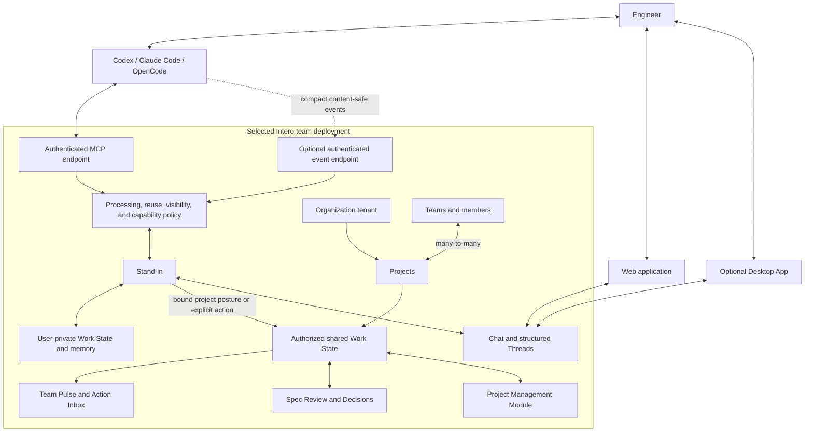

# Intero Product Requirements

## Summary

Canonical product/domain terminology is **Stand-in** in English and **替身** in
Chinese. Documented contract identifiers use `stand_in`; paths/slugs use
`stand-in`. Superseded ADRs may retain literal historical terminology. This
requirements baseline matches the canonical identifiers implemented on `main`.

Intero gives every engineer a cloud-deployed Stand-in that turns
explicitly authorized Coding Agent work into trustworthy Work State,
transparent coordination, reviewable architecture Specs, durable Decisions, and
a low-noise shared view of the team.

Intero is cloud-first and Web-first. Coding Agents connect directly to an
authenticated cloud MCP endpoint. Cloud storage and model processing do not
imply disclosure. Personal spaces and unbound work remain private; binding an
authorized team project silently enables safe structured collaboration
summaries while raw content stays private.

Cloud models may process data within the user's authorized Workspace purpose,
but user data is never used to train public/general models or reused across
customers or Workspaces.

## Problem Frame

AI Coding has shortened the path from intent to implementation. An engineer can
settle on an architecture and begin changing shared interfaces before the rest
of the team knows the work exists. Individual execution accelerates while team
synchronization still depends on stand-ups, chat, manually updated tickets,
meetings, and direct interruptions.

Teams do not need a centralized stream of raw Agent activity. They need a
current, evidence-backed representation of who owns which intent, what phase
each effort is in, which decisions are confirmed, where work is blocked, and
when one engineer's implementation depends on another's.

Centralizing complete Coding Agent sessions by default would create a
surveillance system without producing reliable work semantics. Making Coding
Agents continuously maintain team state would mix execution with coordination.
Intero therefore provides a separate Stand-in whose durable
responsibility is representing work rather than performing it.

## Product Model

Organization is the structural tenant boundary and owns Projects. First Setup
creates one implicitly or with a simple name. Teams contain members, while Team
and Project are many-to-many. A Project may have one primary/display Team plus
additional participating Teams; membership in any associated Team grants V1
Project participation. Agent connections, Claims/Work State, Team Pulse,
collaboration posture, and project conversation use Project identity
independently of Team. Cross-Team Projects aggregate participating-Team context.
Direct messages remain same-Team relationships. Individual Project roles/ACLs
and restricted visibility are post-pilot; private raw-data policy is separate.

Deployment endpoint and AI Provider settings may be Organization-scoped.
Per-recipient email-bound invitations are Team-scoped. Historical reusable Pilot
join links are not the current onboarding contract.

The Stand-in is one cloud identity operating across private and
shared authorization scopes. Private data may be stored and processed in Intero
cloud without being visible to teammates. The Web application is the primary
client. The optional Desktop App may improve context collection or summaries
only while open in the foreground after opt-in; it never observes silently or
becomes required MCP or Stand-in infrastructure.

## Actors

- A1. Engineer: Connects Coding Agents, supervises and corrects their
  Stand-in, controls private-data use within policy, and retains authority
  over consequential commitments.
- A2. Coding Agent: Plans and executes technical work, voluntarily reports
  semantic checkpoints through cloud MCP, and requests team context at technical
  branch points.
- A3. Intero Cloud Service: Authenticates clients, stores private and shared
  domain data, enforces Workspace-scoped processing and visibility policy, and
  runs durable jobs.
- A4. Stand-in: Maintains Claims and Work State, answers from
  authorized context, prepares or performs authorized publication, and
  coordinates within Capability Grants.
- A5. Organization or Team Administrator: Opens Web `/setup`, enters and
  validates the Intero deployment base URL, creates or joins the team context,
  creates the first project and invitation capability, configures the separate
  AI Provider section, manages post-Pilot invitations in Team Settings, and
  defines organization rules within the product's privacy guarantees.
- A6. Teammate or Teammate Stand-in: Queries authorized shared state,
  contributes context, and participates in conversations, coordination, and
  review.
- A7. Reviewer or Technical Lead: Reviews Specs and retains authority over
  consequential human/business decisions that cannot be delegated.
- A8. Project Management Module: Supplies optional hierarchy, PI/Sprint,
  dependency, execution Board, and roadmap views without owning Intero's live
  Work State.

## Key Flows

- F0. Team deployment bootstrap and member association
  - **Trigger:** An already-running Intero deployment exists.
  - **Actors:** A1, A3, A5
  - **Steps:** The team administrator enters the Intero deployment base URL in
    `/setup` and validates connectivity before
    creating or joining the team context, creating the first project, and
    enabling per-recipient invitations. A separate AI Provider section collects
    the cloud model endpoint, secret key, and default model. The administrator
    enters a recipient's display name and exact email, copies the expiring,
    revocable invitation, and shares it outside Intero. The matching-email
    recipient accepts and inherits the approved Intero endpoint and team context
    before explicitly selecting the Workspace and Project binding.
  - **Outcome:** Members reach the correct team deployment without typing a
    server URL, while repository/project authorization remains explicit.
    Invitations and basic human collaboration remain available without the
    provider; AI and Agent features show administrator configuration status.
  - **Covered by:** R2, R4

- F0.1. Recipient invitation
  - **Trigger:** An admin selects **Team Settings → Member Management**.
  - **Actors:** A1, A3, A5
  - **Steps:** Admin enters display name and exact email, copies the generated
    expiring/revocable link, and shares it outside Intero. Recipient confirms
    Organization/Team/name/email, explicitly accepts with the matching email,
    and uses the one-time activation link to bootstrap first credential setup.
  - **Outcome:** Recipient joins the Team with the pre-set editable name, sees
    accessible Projects, and may enter Project/Team Pulse or skip optional Agent
    connection. Admin configuration is never disclosed.
  - **Covered by:** R20, R20.1

- F1. Private work reporting and authorized publication
  - **Trigger:** A supported Coding Agent starts work and can reach Intero cloud.
  - **Actors:** A1, A2, A3, A4
  - **Steps:** The Agent authenticates to MCP and reports a semantic checkpoint.
    Intero resolves its bounded user and repository/project context, stores the
    report as a user-private Claim, and updates private Work State. Personal or
    unbound work remains private. For a bound team project, the
    **Collaborate with Project** posture quietly publishes safe summaries,
    status, dependencies, blockers, and coordination signals.
  - **Outcome:** Team Pulse receives safe project state without per-event prompts
    or raw prompts, files, diffs, terminal output, or tool payloads.
  - **Covered by:** R1, R2, R3, R4, R6, R7, R12, R13

- F2. Coding-time coordination
  - **Trigger:** A Coding Agent reaches a decision branch, dependency, blocker,
    ownership question, or shared boundary.
  - **Actors:** A1, A2, A3, A4, A6
  - **Steps:** The Coding Agent calls its Stand-in through authenticated
    cloud MCP. The Stand-in assembles only authorized private and shared
    context. When another participant is needed, it creates a visible
    Coordination Thread containing a human-readable exchange and structured
    actions. The Agent receives a bounded result and chooses whether to continue,
    narrow, or wait.
  - **Outcome:** The Coding Agent becomes organization-aware without moving
    execution into Intero.
  - **Covered by:** R2, R5, R8, R10, R11, R18

- F3. One Stand-in across private and shared scopes
  - **Trigger:** An Engineer sends a message in their Stand-in Thread.
  - **Actors:** A1, A3, A4
  - **Steps:** Intero builds context from data whose processing and
    Stand-in-reuse policy allows this request. User-private facts remain
    participant-scoped; shared facts retain their destination scope. If the
    service is unavailable or a source is stale, the client displays that state
    instead of implying a hidden local fallback.
  - **Outcome:** The conversation remains continuous across Web and optional
    Desktop clients without confusing cloud storage with team visibility.
  - **Covered by:** R5, R8, R9, R12, R13

- F4. Architecture Spec review
  - **Trigger:** A Coding Agent and Engineer form a plan that changes shared
    architecture, interfaces, schemas, permissions, or multiple Workstreams.
  - **Actors:** A1, A2, A4, A6, A7
  - **Steps:** The Coding Agent requests review through MCP. The Stand-in
    prepares a versioned Spec Review from authorized context, identifies affected
    Workstreams and reviewers, and requests explicit publication if needed.
    Human responses bind to a specific revision. Confirmed conclusions become
    Decision Records.
  - **Outcome:** AI-assisted implementation regains a visible team review gate
    without making the Stand-in the architecture approver.
  - **Covered by:** R11, R14, R15, R18

- F5. Conflicting evidence
  - **Trigger:** Coding Agent reports, authorized events, project state, or human
    statements disagree about current work.
  - **Actors:** A1, A2, A3, A4
  - **Steps:** The Stand-in preserves each assertion as a sourced Claim,
    weighs direct observation and human correction above inference, and derives
    state without discarding contradiction. Private contradictions remain
    private unless publication policy permits a shared attention item.
  - **Outcome:** Work State exposes material uncertainty without leaking private
    evidence.
  - **Covered by:** R6, R7, R13, R16

## Requirements

**Stand-in and Coding Agent integration**

- R1. Every Engineer must have an independently identifiable Digital
  Stand-in whose durable responsibilities are Work State, summarization,
  coordination, communication, review support, memory, and escalation. It
  remains distinct from every Coding Agent.
- R2. Intero must provide first-class pilot integration for Codex, Claude Code,
  and OpenCode:
  - Each Agent connects directly to the authenticated cloud MCP endpoint of the
    member's selected team deployment and sees the same canonical coordination
    tools.
  - A team administrator enters the Intero deployment base URL in `/setup`,
    validates connectivity, and then creates or joins the team context, creates
    the first project, and enables invitations. A deployment operator, if
    present, owns only infrastructure outside product Setup.
  - In **Team Settings → Member Management**, the administrator creates one
    one-time, expiring, revocable email-bound account-activation link for a
    recipient's display name and exact email, then copies, regenerates, or
    revokes it.
  - The recipient accepts with the matching email through the short
    recipient-only surface and bootstraps first credential setup, automatically
    inheriting the approved Intero endpoint, Team, Web, credentials, and
    connection instructions. The activation link is not normal login. V1
    requires no SMTP.
  - Passkey is primary normal login; email plus password is fallback. Product
    Magic Link login is removed.
  - Password recovery is not implemented. A future administrator/manual
    recovery link or optional SMTP-backed path requires separate delivery.
  - Bulk email/CSV invitations, SCIM, and domain auto-join are outside Phase
    1–5.
  - Ordinary member Setup has no arbitrary server URL field. A developer
    endpoint override is non-product development configuration.
  - From a bound project page, **Connect Agent** provides a copy-ready one-time
    prompt tailored to Codex, Claude Code, or OpenCode. The user pastes it into
    the Agent; the Agent configures MCP and binds the project, then reports
    success.
  - Direct cloud MCP accepts narrative schema v2 only: `currentFocus`,
    `completedOutcome`, bounded `evidence`, `nextStep`, and explicit
    `collaboration` need/target. Summary-only v1 checkpoints are rejected.
  - The prompt uses the administrator-approved Intero endpoint inherited from
    team context and a short-lived, single-use, project-scoped connection ticket.
    Users do not manually generate, copy, or manage a personal API key.
  - The project UI shows connection status and offers disconnect/reconnect.
    Revocation invalidates Intero access without blocking local coding.
  - The optional Desktop App may perform one-click MCP configuration for those
    same three clients using the same endpoint and ticket, with visible
    success/failure/disconnect status. Web prompts remain the universal
    Desktop-independent path and no daemon/runtime dependency is introduced.
  - Generic MCP client onboarding is outside the pilot.
  - In a separate AI Provider section, the team administrator configures one
    cloud model provider endpoint, server-only secret API key, and default model
    together. The provider endpoint is distinct from the Intero deployment URL
    and Agent/MCP endpoints.
  - The key is never returned to browsers or members. The administrator can test
    the connection, rotate or replace the key, or disable the provider.
  - Without a valid provider, identity, membership, invitations, and basic human
    collaboration/chat remain usable. Stand-in, automated summaries,
    Agent Work State projection, automated Team Pulse, Agent binding, and other
    AI-derived coordination remain disabled with actionable setup status.
  - No daemon, Desktop App, local socket, or Electron launcher is required.
  - A user-level Intero instruction package encourages semantic checkpoints
    without modifying repository-owned instruction files.
  - Optional Git or lifecycle hooks may use a separate authenticated cloud event
    endpoint with a separately scoped credential.
  - Missing hooks degrade to MCP-only operation rather than breaking the
    Stand-in.
  - MCP and Hook clients may use the bounded encrypted outbox defined by
    ADR-0006; no daemon or persistent observer is introduced.
- R3. Coding Agents report exactly ten canonical pilot checkpoint semantics:
  `work_started` (bounded work began), `work_progressed` (material progress,
  phase, scope, or plan changed), `decision_recorded` (sourced decision or
  candidate), `dependency_declared` (another owner/output is required),
  `blocker_raised` (progress is blocked), `review_requested` (bounded review is
  needed), `work_completed` (bounded work is claimed complete),
  `coordination_requested` (coordination or conflict resolution is needed),
  `artifact_produced` (safe artifact reference/summary), and
  `validation_completed` (bounded validation result).
  - Every event has a bounded safe summary plus stable client-generated
    event/idempotency ID, Project identity, authenticated Agent identity,
    source/provenance, occurred-at time, and schema version.
  - Plan changes belong only in `work_progressed`.
  - Dependency/blocker/review/coordination-conflict signals may feed bounded
    coordination. Artifact/validation/completion feed status and safe Team Pulse.
  - Raw prompts/files/diffs/terminal/tool logs and low-level file/resource touch
    events are not canonical checkpoints.
    Prompts, files, diffs, terminal output, tool input/output, and credentials
    require explicit per-project upload authorization.
  - On unavailable ingress, MCP, Hook, or explicit CLI clients may queue only
    permitted payloads in a client-owned encrypted outbox: maximum 10,000 events
    or 50 MiB per user, maximum age seven days.
  - Payloads use an OS-provided credential/key store and never sync locally held
    keys or queued content to Intero cloud.
  - Stable client event IDs and per-project order metadata make cloud ingestion
    idempotent. Each later invocation attempts FIFO delivery with at most three
    short bounded-exponential-backoff retries; no retry daemon runs.
  - Capacity or TTL eviction removes oldest non-terminal events first, preserves
    `work_completed`, `blocker_raised`, and `decision_recorded` events where
    possible, and records a
    non-sensitive gap marker.
  - Missing/reset keys, revoked authorization, or disallowed payloads cause
    secure discard without recovery/export. Expired or revoked credentials
    require re-authentication.
  - Delivery is best-effort and never blocks coding or Git commits.

**Context binding and Work State**

- R4. Intero must bind MCP and optional event reports to an authenticated user
  and bounded repository, project, and Workstream context:
  - Invite or login first associates the authenticated principal with one
    selected team deployment origin.
  - Internal Intero UUIDs are not exposed to the Agent.
  - The user explicitly selects the Workspace and project binding.
  - Organization owns Projects. Team and Project are many-to-many; a Project may
    have one primary/display Team and additional participating Teams.
  - Membership in any Team associated with a Project grants V1 view and
    participation; no individual Project role or ACL check is added.
  - Project-bound Agent/Work State/Team Pulse/conversation uses Project identity
    independently of Team and aggregates participating-Team context.
  - Agent connections, Claims/Work State, Team Pulse, collaboration posture, and
    project conversation bind to one Project. Direct messages bind Team members,
    not Projects.
  - Personal and unbound work remains private; binding an authorized team project
    enables the default collaboration posture for that scope.
  - Absolute local paths are neither required nor exposed by default. Remote and
    repository metadata are minimized.
- R5. The Stand-in may use only context whose ingestion, processing, and
  reuse policy permits the current purpose. It does not receive ambient
  filesystem or shell access. Additional files, diffs, symbols, or Git evidence
  require an explicitly authorized integration or upload path and remain private
  by default.
- R6. A Stand-in must maintain multiple concurrent Workstreams per person.
  Each Workstream groups intent, phase, scope, ownership, blockers,
  dependencies, Decisions, Artifacts, freshness, confidence, and evidence.
  Users can correct, pin, rename, merge, split, pause, or complete Workstreams;
  explicit correction has priority over later inference.
- R7. Work State must be derived from sourced Claims rather than
  last-write-wins:
  - Claims distinguish authorized observation, Coding Agent report,
    Stand-in inference, project-system state, and human statement.
  - Provenance, confidence, freshness, contradiction, and visibility remain
    inspectable.
  - A bound team project's collaboration posture permits only safe structured
    summaries, status, dependencies, blockers, and coordination signals.
  - Raw prompts, files, diffs, terminal output, and tool payloads never become
    team-visible solely because collaboration is enabled.

**Stand-in conversation and coordination**

- R8. Intero must own a built-in Web-first messaging experience:
  - Team Pulse, not a Discord-style channel tree, is the default entry.
  - Authenticated same-team members can create, read, and send basic persistent
    1:1 direct messages, visible only to the two participants by default.
  - People and Stand-ins retain visibly separate identities.
  - Stand-ins are silent by default in ordinary Rooms and participate
    when addressed or explicitly included.
  - The full experience works without the optional Desktop App.
- R9. A person's ongoing Stand-in conversation remains one discoverable
  Thread:
  - Messages are server-readable, synchronized, and visible only to authorized
    participants rather than the whole team.
  - Cloud-stored and Agent-readable do not imply team-visible.
  - Adding a Stand-in to a 1:1 DM makes that same conversation
    Agent-readable only for subsequent messages; earlier history requires a
    separate grant.
  - Group DMs, attachments, reactions, DM search, read receipts, rich Threads,
    federation, and E2EE promises are outside the pilot.
  - Service or dependency unavailability is shown explicitly; no local
    Stand-in fallback is implied.
- R10. Stand-in communication must be transparent, attributable,
  auditable, and open to human correction:
  - Every coordination action carries a structured Action Envelope and a
    human-readable message.
  - Full exchanges stay in the related Thread; broader surfaces receive only
    separately authorized checkpoints.
  - Corrections and withdrawals are visible events rather than hidden edits.
  - Explicit structured blocker, dependency, review, conflict, or coordination
    signals may automatically open a Project-scoped coordination Thread/request
    with safe summary/context and candidate next steps.
  - The Stand-in may collect responses and drive clarification in that
    Thread. It cannot cross Project scope, disclose raw data, act externally,
    change priorities, make irreversible commitments, or finalize a
    human/business decision. Commitments require responsible-participant
    confirmation.
- R11. Stand-in authority must be enforced through structured Capability
  Grants evaluated by code. Grants constrain action, organization, project,
  Workstream, resource, source visibility, confirmation requirement, and expiry.
  A Stand-in may answer from permitted facts, declare ownership inside
  existing scope, register blockers and dependencies, arrange review, and
  publish authorized state. It may not independently promise deadlines, change
  priority, accept unrelated work, approve architecture, or perform irreversible
  actions.

**Privacy, processing, publication, and memory**

- R12. Intero must keep four policy decisions independently enforceable and
  auditable:
  - whether data may be ingested and stored;
  - whether deterministic or model processing may use it;
  - whether the Stand-in may retrieve or reuse it for a purpose;
  - whether it may be disclosed to a person, Thread, team, project, or
    organization.
    Already uploaded private material may be model processed; upload and
    processing do not independently authorize publication.
  - These axes are not presented as four everyday toggles. Project posture
    supplies low-friction defaults while advanced policy remains possible.
  - Model use is limited to the authorized Workspace purpose. User data is not
    used to train public/general models or reused across customers or Workspaces.
    This remains distinct from publication.
- R13. Intero must provide posture-based privacy defaults:
  - Personal spaces and unbound work use **Private Work**: structured
    checkpoints upload, private processing and Stand-in reuse build the
    private summary, and nothing is published.
  - Joining or binding an authorized team project enables **Collaborate with
    Project** by default and quietly publishes only safe structured summaries,
    status, dependencies, blockers, and coordination signals.
  - Users may opt out, narrow the scope, or pause collaboration through project
    settings without per-event prompts.
  - Current posture and visibility are concise and inspectable; publication is
    audited and may be withdrawn.
  - Raw upload remains an explicit per-project control and raw content never
    becomes team-visible through the collaboration posture.
  - Structured private Work State and Claims retain for 180 days; explicitly
    authorized raw uploads retain for 30 days by default; published project
    summaries retain for the life of the project and remain withdrawable.
  - Users may delete their own private data at any time.
  - Routine diagnostics are content-minimized and automatic.
  - Opening or escalating a support case that requests developer intervention
    authorizes designated support/developer staff to inspect only the private
    data necessary for that ticket and affected Workspace/project, without an
    extra consent prompt.
  - Support access is time-limited, auditable, continuously visible, and revoked
    when the case is closed or withdrawn. Team-admin status alone grants no
    private user-data access.
  - Tightening policy stops future use and marks synchronized information
    withdrawn where possible without claiming to erase copies already viewed.
  - A true non-uploaded/client-only mode is outside the MVP and is not promised.
- R14. Long-term memory is built from structured Workstreams, Claims, Decisions,
  Spec revisions, Artifacts, Blockers, Dependencies, Ownership, and typed
  relationships. Derived memory inherits or narrows source processing, reuse,
  and visibility constraints. Conversation summaries, full-text search, and
  vector search are retrieval aids, not sources of truth.

**Spec review, attention, and project management**

- R15. Specs and reviews must be first-class, versioned objects:
  - A Spec belongs to exactly one Project; a Project may have multiple Specs.
  - Every create or update produces a new immutable version.
  - Review starts only through explicit `request_review`, never automatically
    after create or update.
  - Inline/line comments are required and bind to that version only. Review
    shows the full version snapshot; V1 has no re-anchoring or diff UI.
  - Any authorized Team member or their Agent may comment, reply, resolve, or
    reopen with recorded provenance.
  - Agents receive unresolved comments on their next MCP connection and may
    respond or create a new version; review does not force a content change.
  - MCP exposes `list_confirmed` and `get_confirmed(specId)`.
    `get_confirmed` returns the most recently confirmed version until a newer
    version is confirmed.
  - A post-confirmation change creates a new version and notifies reviewers.
    There is no branch/freeze UI.
  - A Team-level Spec Review page shows every accessible Project Spec with a
    Project filter. Project pages deep-link with that filter applied.
  - An unassigned pending review contributes a compact Team Pulse count, not an
    Action Inbox item. Optional nonexclusive reviewer nominations create
    targeted Action Inbox notifications; anyone authorized may review.
  - Project review policy selects `1`, `2`, or `3` confirmations, whether
    another member's Agent counts, and whether author-self-confirmation is
    allowed. Default: one non-author confirmation and another member's Agent
    counts.
  - A creator or most recent modifying Agent cannot confirm its own version
    unless author-self-confirmation is enabled. Confirmation is
    version-specific.
- R16. Team Pulse and Action Inbox prioritize understandable authorized state:
  - Team Pulse is a person-per-column view of peers' current active work items.
  - Each column header contains a Stand-in-generated natural-language summary
    based on authorized active work, blockers, recent outcomes, and freshness,
    plus concurrently active and blocked counts.
  - The header summary is plain non-interactive text. It has no citations,
    links, click-through, or state-setting behavior.
  - Cards below are peer work items ordered for reading. An **N more**
    disclosure is visual compaction only.
  - Pulse has no primary, main, secondary, subordinate, or focus task/work-item/
    Workstream field, does not infer rank, and does not treat order or
    compaction as hierarchy.
  - Progress uses phase, verified progress, remaining conditions, freshness,
    confidence, and evidence rather than invented percentages.
  - Ordinary authorized progress changes Team Pulse; explicit decisions or
    actions enter Action Inbox; Phase 6 in-app notifications are reserved for
    user-selected attention categories. External channels are future.
- R17. Project management is a module rather than the platform foundation:
  - The Phase 3 infrastructure remains valid without the post-Pilot work module.
  - A Workstream may exist without a task, relate to several tasks, or represent
    one person's part of a shared task.
  - Phase 5 implements the Intero Project work model defined in R21-R22.
  - `team-presence` is reference material, not a reused foundation.

**Execution and interoperability boundaries**

- R17.1. The pilot must remain a thin vertical slice behind durable,
  transport-independent contracts:
  - `ModelGateway`: Vercel AI SDK with the administrator-configured provider.
  - `AuthorizationPort`: SpiceDB-backed authorization with tenant-safe
    Organization/Team/Project data.
  - `RealtimePort`: Centrifugo fanout with polling/cursor repair.
  - `ObjectStorePort`: MinIO/S3-compatible storage with DB-authoritative
    metadata; product upload surfaces remain disabled.
  - `JobRunnerPort`: Graphile Worker, transactional outbox, reconciler, retries,
    and heartbeat.
  - `CoordinationTransport`: bounded Project-internal protocol; general A2A
    gateway/federation remains deferred.
  - Ports are working boundaries, not decorative interfaces. Implemented
    adapters pass shared contract tests; canonical Agent events, Work State, and
    domain policy remain adapter-independent.
  - The model loop may generate safe Stand-in summaries and bounded
    coordination suggestions from authorized structured Work State. It cannot
    use unauthorized raw content, cross Organization/Workspace, auto-commit, or
    become a general autonomous Agent.
- R18. Intero does not control Coding Agent execution. Agents decide when
  coordination is needed, call the Stand-in through MCP, and choose
  whether to continue, narrow, or wait. Intero does not launch Coding Agent
  subagents or silently take over technical work.
- R19. Intero uses its own strongly typed Coordination Protocol. A2A
  interoperability is deferred; direct cloud MCP for supported Coding Agents is
  not the deferred A2A Gateway.

**Post-Pilot functional phases and governance**

- R20. Delivery sequence and registration:
  - Phases 1–3 infrastructure are implemented.
  - Phase 4 invite-only registration, onboarding/admin foundations, and
    Settings are implemented.
  - Phase 5 Project work management and Spec Review are implemented.
  - Phase 6 Action Inbox, in-app notification preferences, and search are
    implemented.
  - Phase 7 bounded Stand-in and Agent automation is the active implementation
    target and is not yet claimed implemented. External notification channels
    remain future product scope.
  - The first release has no open signup. Each account has one active
    Organization and no Organization switcher.
  - Admin creates an invitation from **Team Settings → Member Management** by
    entering display name and exact email. Intero creates an expiring,
    revocable, one-time email-bound account-activation link.
  - Invitation state is `pending`, `accepted`, `expired`, or `revoked`. Admin
    can copy, regenerate ("resend"), or revoke it.
  - V1 requires no SMTP/email service. Admin copies and shares the link through
    their own channel; SMTP is optional later configuration.
  - Recipient uses a distinct short **Accept Invitation** surface: confirm
    Organization/Team/name/email and Accept; use the matching email to bootstrap
    first credential setup; then see the joined Team and accessible Projects
    with Project/Team Pulse entry and a skippable Connect Coding Agent entry.
    The activation link is not normal login.
  - Passkey is primary normal login; email plus password is fallback. Product
    Magic Link login is absent.
  - Password recovery is future work through an administrator/manual recovery
    link or optional SMTP-backed path and is not claimed implemented.
  - Email mismatch is denied. Recipient never sees deployment endpoint, model
    keys, governance, invitation controls, or admin Settings. The pre-set name
    becomes the initial display name and is editable later in Personal Settings.
- R20.1. Membership and governance:
  - Organization owns Projects. Each Project has a primary Team and may have
    additional participating Teams.
  - Team role is `member` or `leader`; zero or more Leaders may exist.
  - Organization admins are the fallback. The last Organization admin cannot be
    removed or demoted until another Organization admin exists.
  - Organization admins and Leaders of a Project's primary Team may edit review
    policy and PI/Sprint governance.
  - Agents cannot change membership, roles, Team associations, or visibility.
- R21. Work hierarchy and Board:
  - Epic → Feature → Work Item is optional rather than forced.
  - Epic is Project roadmap/overview only and never appears on the execution
    Board.
  - Feature belongs to at most one Epic, may have no Work Items, and may be
    directly human-owned and Agent-executed. Stage is `planned`,
    `in_development`, or `released`.
  - A Project has one Board; there is no Team-wide Board initially.
  - Backlog and current Sprint are two views of one Project work surface.
    Backlog is scheduling state, not a Work Item status.
  - Work Item status is exactly `todo`, `in_progress`, `ready_for_test`, or
    `done`.
  - Any authorized participant or Agent may move `ready_for_test` to `done`.
    Evidence is optional; actor and time are mandatory.
  - Unfinished Sprint work remains `in_progress` with source-Sprint/carryover
    context and is never silently rescheduled.
- R21.1. Work Item data:
  - Required: title, description, and status.
  - Human owner or unassigned; Agents are provenance/execution tools and never
    assignees.
  - Optional linked Spec, priority `P0`-`P3`, and optional free numeric Points.
  - Typed relations are `blocks`/`blocked-by`, `related`, and
    `duplicate`/`duplicated-by`.
  - Associated Coordination Threads, human/Agent comments, and replies are
    supported. Comment links reserve future code/Spec/coordination references.
  - PR, Commit, and branch are first-class explicit associations. Agent MCP may
    attach an explicitly reported association; Intero never infers one from a
    branch name. Authorized humans may adjust it.
- R22. PI and Sprint:
  - PI and Sprint are Project-level terms. Product planning does not use Cycle,
    Iteration, or Release as container names.
  - Organization admins or primary Team Leaders manage them.
  - PI creation accepts start date, number of Sprints, and Sprint duration in
    weeks. Intero generates `PI N`, `Sprint 1..N`, and dates; there are no free
    names.
  - Project timezone derives `planned`, `active`, and `ended` automatically.
    Authorized administrators/Leaders may end early.
  - Features and Work Items may stay in Backlog, use PI-only assignment, or use
    Sprint assignment. Sprint implies PI.
- R23. Agent-first Project content:
  - A connected Agent with Project access may create or update authorized
    project-management and Spec content through MCP.
  - Manual editing remains available but is not the default workflow.
  - Human and Agent mutations record actor, time, provenance, immutable history,
    and revert support.
  - Users may disconnect or revoke Agent Project access without blocking local
    coding.
- R24. Initial code-provider boundary:
  - Initial code associations are explicit Agent/human references only.
  - Live GitHub and GitHub Enterprise sync is deferred.
  - A later enterprise GitHub App is Organization-installed,
    selected-repository, read-only, and webhook-synchronized. It uses no personal
    access token and performs no merge or comment write.
- R25. Canonical UX:
  - New features use the existing Intero visual system and established detail
    structures.
  - Work Item detail places activity/coordination in the center timeline,
    facts/context/code in the right rail, and comment composition at the bottom.
  - Administration remains within Settings rather than creating a separate
    dashboard visual system.
- R26. Phase 7 bounded automation:
  - Deterministic policy-aware detectors consume authorized structured blocker,
    dependency, stale or pending review, conflict, and coordination signals.
  - A qualifying signal creates or reuses one Project-scoped Coordination
    Thread containing safe context, affected participants, candidate next steps,
    and any required human decision. Duplicate delivery cannot duplicate the
    Thread or its attention item.
  - A Stand-in or authorized Agent may derive and directly create or update
    Features, Work Items, relations, comments, and Spec links from a confirmed
    Spec version. An unconfirmed Spec cannot drive execution mutation.
  - Derived mutations record confirmed source version, actor, time, provenance,
    authorization/policy result, stable operation ID, immutable history, and
    audited revert. New work is unassigned unless a human assigns it.
  - Authorized cross-Project summaries may synthesize progress, risks, and
    decisions from only Projects visible to the requesting scope. They preserve
    source facts, model interpretation, and freshness and do not mutate source
    Projects.
  - Detection, mutation, summary generation, and notification use durable jobs
    and a transactional outbox. Retriable failures resume idempotently;
    terminal failures are visible in source activity, with a deduplicated Action
    Inbox item and in-app notification only when human action is required.
  - Results use existing Project activity, Coordination, Action Inbox, in-app
    notification, search, and Stand-in surfaces. No automation dashboard is
    introduced.
  - Automation cannot change membership, access, Team associations, Project
    visibility, priority, or ownership without authorized human action; invoke
    external provider or GitHub actions; disclose raw content; or make an
    irreversible business decision or final human commitment.

## Acceptance Examples

- AE0. **Covers R2, R4.** Given self-hosted infrastructure exists, the team
  administrator enters and validates the Intero deployment base URL in `/setup`
  before creating or joining the Team and creating its first Project. An
  one-time exact-email-bound activation invitation then associates an Engineer
  with the approved endpoint/Team without asking for a server URL;
  matching-email activation bootstraps first credential setup, and the member
  explicitly binds a Workspace/Project. The link cannot perform normal login.
  Copy, regenerate, expiry, acceptance, and revoke take effect without SMTP.
- AE0.1. **Covers R2.** Without a valid provider, invited members can use basic
  human collaboration and chat, while Setup shows **Basic collaboration ready**
  and **Stand-in needs administrator model configuration**. Stand-in,
  Agent binding, Agent Work State projection, automated summaries, and automated
  Team Pulse remain unavailable.
- AE0.2. **Covers R2, R4, R9, R12, R13, R16.** Two isolated browser/client
  contexts for distinct users A and B use the same approved Intero deployment
  endpoint. Browser-visible evidence proves admin-created invitation and
  matching-email acceptance, human conversation/collaboration between A and B,
  safe shared Team Pulse visibility with AI configured, and
  privacy/pause/withdrawal propagation to the other context. API-only or
  single-client evidence is rejected.
- AE0.3. **Covers R4, R8, R12.** Team users A and B can both open the Team's
  Project without separate Project enrollment. Project-bound Agent/Work State
  stays in that Project, their 1:1 DM remains a Team-member conversation, and
  private raw data remains unavailable unless separately authorized.
- AE1. **Covers R2-R4, R12-R13.** Given an authenticated Agent reports from a
  bound team project, the checkpoint updates private Work State and the default
  collaboration posture publishes only a safe structured summary to that
  project's Team Pulse. The same report in personal or unbound work remains
  private.
- AE2. **Covers R2, R3, R6.** Given a Coding Agent changes its plan and calls
  `report_checkpoint` with `work_progressed`, Intero stores a sourced Claim,
  updates private Work State, and does not require a separate plan event, daemon,
  Desktop App, or internal UUID.
- AE2.1. **Covers R3, R10, R16.** Contracts accept all and only the ten canonical
  semantics with required common metadata and idempotency. Raw, legacy, and
  low-level touch events are rejected; coordination/status effects follow the
  canonical mapping.
- AE3. **Covers R5, R12-R14.** Given a user explicitly uploads a source excerpt
  for private model processing, it remains unavailable to teammates even when
  the project collaboration posture is enabled, defaults to 30-day retention,
  can be deleted by that user earlier, and is not used for public/general-model
  training or another customer/Workspace.
- AE4. **Covers R6, R16.** Given an Engineer has several authorized active work
  items and several private experiments, Team Pulse shows one person column
  containing only authorized peer cards, a plain non-interactive summary,
  concurrently active/blocked counts, and a visual **N more** disclosure. No
  card is marked primary/secondary/focus, and order conveys no rank.
- AE5. **Covers R7, R16.** Given a Coding Agent reports completion while
  authorized validation evidence still fails, Work State preserves the
  contradiction instead of showing Done.
- AE6. **Covers R7, R13, R16.** Repeated private activity that changes no
  organizational state creates no new shared progress item.
- AE7. **Covers R2, R3, R9, R12.** When cloud ingress is unavailable, MCP returns
  a visible non-blocking failure and the client may queue the permitted payload.
  Coding and Git remain unblocked; a later invocation flushes FIFO with stable
  IDs, at most three short retries, and gap markers for discarded data. No
  daemon or offline Stand-in is implied.
- AE8. **Covers R9.** Adding a Stand-in to a Human-only Thread makes only
  subsequent messages Agent-readable, records the access change, and withholds
  earlier history until separately granted.
- AE8.1. **Covers R8, R9.** In two isolated sessions, same-team users A and B
  exchange persistent 1:1 messages visible in both browsers and not to another
  member. Adding a Stand-in preserves earlier-history denial.
- AE9. **Covers R10, R11.** A Stand-in may declare ownership inside an
  existing grant; users see the explanation and no delivery date is invented.
- AE10. **Covers R2, R10, R18.** A Coding Agent requests coordination directly
  through cloud MCP, receives a bounded result, and Intero neither returns the
  complete private context nor launches another Agent.
- AE11. **Covers R11.** A request beyond a Capability Grant is rejected and
  creates a specific Action Inbox item.
- AE12. **Covers R15.** A material Spec revision invalidates only affected human
  confirmations.
- AE13. **Covers R8, R17.** With project management and the Desktop App absent,
  the Web product still provides Stand-in identity, Work State, chat, Team
  Pulse, Coordination, Specs, Decisions, and memory.
- AE14. **Covers R19.** Internal Stand-ins coordinate through the Intero
  protocol without requiring an A2A Gateway.
- AE15. **Covers R10, R11, R19.** A structured blocker automatically opens one
  Project-scoped coordination Thread with a safe summary and candidate next
  steps. Clarification remains visible/auditable; no raw data, cross-Project
  context, external action, priority change, or final commitment occurs without
  responsible-participant confirmation.
- AE16. **Covers R20-R20.1.** Invite-only registration creates an account with
  one active Organization. An admin creates an exact-email invitation in Member
  Management, copies it without SMTP, sees lifecycle state, regenerates/revokes
  it, and a recipient with a mismatched email is denied. A matching recipient
  sees only Accept Invitation context, uses the one-time link for first
  credential setup, joins with the pre-set editable name, reaches accessible
  Projects, and may skip Connect Coding Agent. Subsequent login uses Passkey or
  fallback email/password, never the activation link or a product Magic Link.
  Password recovery remains visibly unavailable rather than pretending to send
  recovery mail. A Team may have zero or multiple Leaders; an Organization admin
  can govern its Project, and the last Organization admin cannot be removed or
  demoted.
- AE17. **Covers R21-R21.1, R23.** A connected Agent creates a Feature without
  Work Items, then creates a Work Item with an unassigned human owner, explicit
  Spec and Commit references, and provenance. A human sees history, corrects the
  association, reverts a change, and revokes the Agent. No membership or
  visibility mutation is available to the Agent.
- AE18. **Covers R21-R22.** A Project Board shows separate Backlog and current
  Sprint views. At Sprint end, an unfinished `in_progress` Work Item retains its
  source Sprint and carryover marker. Creating a PI generates its numbered
  Sprints and timezone-derived dates/status without free naming.
- AE19. **Covers R15.** An Agent creates a Spec version and explicitly requests
  review. A nominated reviewer receives a targeted Action Inbox item, another
  authorized member comments inline, and the Agent sees the version-bound
  comment on its next MCP connection. A later version does not move the comment;
  `get_confirmed` returns the prior confirmed version until the new one receives
  policy-compliant confirmation.
- AE20. **Covers R15, R20.1.** Default review accepts one non-author
  confirmation, including another member's Agent, but rejects confirmation by
  the creating/recently modifying Agent. An authorized policy change enabling
  author-self-confirm affects only confirmation rules, not version history.
- AE21. **Covers R24-R25.** An explicit human or Agent report attaches a PR,
  Commit, or branch reference and no branch-name inference occurs. Work Item
  detail renders it in the established right rail while activity/coordination
  remains centered and comments compose at the bottom.
- AE22. **Covers R26.** An authorized blocker, dependency, stale pending review,
  or explicit coordination signal creates or reuses one Project-scoped
  Coordination Thread with a safe summary and candidate steps. Reprocessing the
  same operation creates no duplicate Thread, Inbox item, or notification;
  unauthorized and raw context is absent.
- AE23. **Covers R15, R23, R26.** From a confirmed Spec, an authorized Stand-in
  or Agent derives execution work and directly creates or updates it with source
  version, provenance, immutable history, and audited revert. The same request
  is idempotent. An unconfirmed Spec is rejected; ownership and priority remain
  unchanged until an authorized human acts.
- AE24. **Covers R16, R26.** An authorized user receives a cross-Project
  progress/risk/decision summary covering only visible Projects, with source
  facts, model interpretation, and freshness distinguished. A retry through the
  durable job/outbox path is visible without duplication, and required human
  action routes through existing Action Inbox/coordination surfaces. No new
  dashboard, external provider/GitHub action, irreversible decision, or final
  human commitment occurs.

## Success Criteria

- Teams understand authorized shared ownership, phase, blockers, dependencies,
  and reviews without manual status chasing.
- Engineers run multiple Coding Agents and Workstreams without creating an
  Agent-session feed.
- Coding Agents obtain current context through a stable authenticated cloud MCP
  surface without a daemon or Desktop App.
- An administrator can enter and validate one self-hosted Intero deployment base
  URL, and invited members inherit it without entering a server URL.
- Uploading or privately processing sensitive data never makes it team-visible.
- Personal and unbound work remains private; team-project binding quietly
  publishes only safe structured collaboration signals unless the user opts out
  or pauses.
- Every project posture, Stand-in reuse, and publication is attributable
  and auditable.
- Private structured state follows 180-day retention, authorized raw uploads
  follow 30-day default retention, project summaries follow project lifetime,
  and user-owned private data supports deletion at any time.
- Support intervention is ticket/workspace scoped, time-limited, visible,
  auditable, and revocable; team admins have no ambient private-data access.
- Model processing stays Workspace-scoped with no public/general-model training
  or cross-customer/Workspace reuse.
- Claims retain provenance, freshness, confidence, and contradiction.
- Team Pulse and Action Inbox contain meaningful, authorized state rather than
  raw activity.
- Team Pulse remains person-oriented peer awareness without task hierarchy,
  inferred focus, or interactive summary controls.
- The Web product remains complete when the optional Desktop App is absent.
- Pilot proof includes browser-visible two-user behavior from isolated sessions;
  API-only or single-client validation is insufficient.
- Stand-in authority is bounded by enforceable Capability Grants.
- Post-Pilot content mutations remain Project-authorized, attributable,
  versioned, and revertible whether initiated by a person or Agent.
- Work planning uses Project-level PI/Sprint and one Project Board without
  forcing hierarchy or silently rescheduling carryover.
- Spec confirmation is version-specific and policy-governed.

## Scope Boundaries

### Accepted post-Pilot sequence

- Phase 4: invite-only registration, onboarding/admin foundations, and Settings.
- Phase 5: Project work management, PI/Sprint, and Spec Review.
- Phase 6: Action Inbox, in-app notification preferences, and search
  (implemented).
- Phase 7: bounded Stand-in and Agent automation (active implementation target;
  not yet implemented).

Phases 1–6 are implemented on `main` and have acceptance evidence. Phase 7 is
the active target defined by ADR-0008 and must not be presented as implemented
until its acceptance examples pass. External notification channels remain
future scope.

### Deferred for later

- Detailed Git/lifecycle event endpoint protocol.
- Exact protocol mechanics for personal/device and separately scoped MCP/event
  credentials.
- Productized self-deployment packages, Docker/install wizards, infrastructure
  workflows, DNS/TLS guidance, tenant provisioning automation, and end-user
  self-hosting documentation are outside the pilot.
- Bulk email/CSV invitations, SCIM provisioning, and domain auto-join.
- Detailed AI-provider secret-management mechanics and multi-provider routing.
- General non-uploaded/client-only work mode, which is outside the MVP.
- Backup-deletion timing, legal holds, regional storage, precise
  support-role/legal process, and subprocessor selection/contracts; these are
  required pre-pilot decisions.
- General rule-based auto-publication beyond the project-binding posture.
- Individual Project membership, Project-specific roles, restricted visibility,
  and fine-grained ACLs beyond associated-Team access.
- Multi-Organization switching, advanced Organization administration, billing,
  enterprise identity, and advanced cross-Team governance beyond the primary
  Team/Organization-admin fallback.
- Project-level individual roles/ACLs beyond Team membership and the accepted
  governance roles.
- Live GitHub/GitHub Enterprise synchronization. A later enterprise GitHub App
  is Organization-installed, selected-repository, read-only, webhook-driven,
  and uses no personal access token or GitHub write operations.
- Group DMs, attachments, reactions, search, read receipts, rich Threads,
  federation, and an end-to-end encryption promise for direct messages.
- Spec comment re-anchoring, Spec diff UI, and Spec branch/freeze UI.
- Team-wide Boards and mandatory hierarchy.
- SMTP invitation delivery and delivery-status tracking; SMTP is optional
  deployment configuration, not a V1 dependency.
- Password recovery through administrator/manual recovery link or optional SMTP;
  no recovery implementation is currently claimed.
- External notification channels; Phase 6 notification scope is in-app
  preferences only.
- Full A2A Client/Server Gateway and external-agent federation.
- Additional project-management providers and deep Jira or Linear parity.
- Voice, video, screen sharing, and offline-first human chat.
- Advanced proactive overlap prediction and rich organization analytics.
- In-product trial feedback forms, issue capture, product analytics dashboards,
  and feedback-triage workflows. Pilot members give feedback directly to the
  product owner outside Intero.

### Outside this product's identity

- A Coding Agent, IDE, or general-purpose Agent execution framework.
- Employee surveillance, productivity scoring, or default raw-session
  collection.
- A chronological Agent activity feed as the primary surface.
- A hidden Agent mesh whose coordination is invisible to affected people.
- A system that requires a local daemon or Desktop App to use cloud MCP.
- A Stand-in that makes deadlines, approvals, or unrelated commitments
  without authority.
- A monolithic replacement for every engineering tool.

## Key Decisions

- Product center: Team Pulse and Action Inbox organize attention; chat remains a
  communication surface.
- Runtime: Intero is cloud-first and Web-first; one cloud Stand-in spans
  private and shared authorization scopes.
- Integration: Codex, Claude Code, and OpenCode connect directly to cloud MCP
  through tailored one-time project prompts; optional Desktop one-click setup is
  an acceleration, not a dependency.
  Optional hooks use a separate future event endpoint.
- Deployment: the pilot supports an Intero-operated or self-hosted selected team
  origin; administrators enter and validate it in `/setup`, and invited members
  inherit it without a URL field.
- Desktop: optional context enhancement, never required runtime infrastructure.
- Privacy: storage, processing, reuse, and publication remain independently
  enforced and audited behind a simple project posture.
- Model use: authorized Workspace processing only; no public/general-model
  training or cross-customer/Workspace reuse.
- Default: personal and unbound work is private; binding a team project silently
  enables safe collaboration summaries with a clear private/paused opt-out.
- Publication: project collaboration never publishes raw prompts, files, diffs,
  terminal output, or tool payloads.
- Availability: clients use the bounded encrypted outbox with stable IDs,
  idempotent cloud ingestion, invocation-driven FIFO retries, and no daemon.
- Truth: sourced Claims resolve into Work State; provenance, confidence,
  freshness, contradiction, and correction remain distinct.
- Conversation: same-thread Agent-readable transition preserves prior-history
  privacy and does not imply team visibility.
- Authority: structured Capability Grants bound Stand-in action.
- Review: Coding Agents request; Stand-ins prepare and organize; humans
  and authorized Agents may review under Project policy; confirmation remains
  version-specific.
- Post-Pilot sequence: Phases 4–6 are implemented; Phase 7 bounded Stand-in and
  Agent automation is the active implementation target.
- Agent content: connected Project Agents may create/update authorized work and
  Spec content with provenance/history/revert but never administer access.
- Planning: optional Epic → Feature → Work Item, one Project Board, and
  Project-level PI/Sprint.
- Code providers: explicit references first; live GitHub sync is deferred to a
  read-only Organization GitHub App.
- Interoperability: the internal Coordination Protocol remains authoritative;
  A2A Gateway is post-MVP.

## Dependencies / Assumptions

- Codex, Claude Code, and OpenCode retain compatible prompt-driven remote MCP
  configuration.
- Teams accept user-private cloud storage and processing when controls,
  disclosures, retention, and authorization are credible.
- Tenant and object authorization can enforce user-private data inside an
  organization account.
- Direct semantic checkpoints provide enough initial evidence for useful private
  Work State.
- Optional event observation can improve freshness without becoming required.
- Project binding can reduce coordination friction without making raw work
  visible or creating per-event prompts.
- A self-hosted pilot administrator can enter and validate a reachable
  Web/API/MCP origin before creating/joining the team context and inviting
  members.

## Outstanding Questions

### Post-Pilot nonblocking decisions

- Default invitation expiry duration.
- External notification channel selection and delivery semantics.
- Search ranking and indexing cadence within existing retention policy.
- Revert conflict presentation when newer mutations exist.
- Whether ending a Sprint early should flag its parent PI for administrator
  review.
- Final copy/placement details for Team-level Spec Review filtering inside the
  established visual system.
- Optional SMTP delivery configuration and delivery-status semantics.

### Required follow-up decisions

- [Security] Choose exact credential issuance and transport mechanics while
  preserving revocable personal/device identity and separate MCP/event scopes.
- [Event ingress] Define closed schemas, size limits, authentication mechanics,
  and installation while preserving the fixed outbox and retry behavior.
- [Deployment Setup] Keep endpoint connectivity validation and per-recipient
  invitation acceptance operable without expanding into productized
  self-deployment.
- [Data governance] Set backup-deletion timing, legal-hold behavior, region,
  precise support-role/legal process, and subprocessor selection/contracts
  without weakening the accepted retention, user deletion, no-training, or
  no-cross-customer/Workspace-reuse boundaries.
- [Validation] Identify the smallest real team and feature that can validate
  private personal work, default bound-project collaboration, opt-out/withdrawal,
  outbox delivery, Team Pulse, cloud MCP lookup, and Spec Review end to end.
