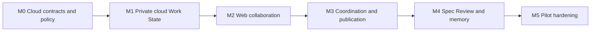

# Intero Cloud-first MVP Implementation Plan

Status: implemented through Phase 5 on `main`; production deployment validation
remains environment-specific

Date: 2026-07-25

Canonical target terminology is **Stand-in** in English and **替身** in Chinese.
Contracts use `stand_in`; paths/slugs use `stand-in`. Historical evidence may
retain literal old names. Active code and persisted identifiers use the
canonical Stand-in vocabulary.

Inputs:

- `docs/brainstorms/2026-07-24-intero-product-requirements.md`
- `docs/ARCHITECTURE.md`
- `docs/adr/0006-cloud-first-web-first-runtime-and-private-by-default-data.md`

## Historical verification record

On 2026-07-24, the repository verified a locally implemented MVP through an
Electron application, `interod`, a Local Stand-in sidecar, SQLCipher, a
local MCP bridge, and local/public synchronization. That implementation included
valuable domain, authorization, conversation, Spec, and UI behavior.

This evidence is historical. The Phases 1–6 implementation now separately
proves direct cloud MCP, the canonical browser product, private-by-default cloud
processing, independent publication policy, onboarding/admin, Project work,
Spec Review, Action Inbox, in-app notification preferences, and search. The
implemented milestones below replace the required daemon, Local Stand-in, and
Electron runtime topology.

## 1. MVP outcome

The cloud-first MVP proves one end-to-end coordination loop:

```text
An already-running Intero deployment exists
→ team administrator enters and validates the Intero deployment URL in /setup
→ administrator creates/joins team, creates first project, invitations, and separate AI Provider
→ exact-email-bound invitation associates the Engineer with the deployment/team without URL entry
→ Engineer explicitly binds a Workspace/project and connects a Coding Agent
→ a semantic checkpoint becomes a user-private Claim
→ the cloud Stand-in maintains private Work State
→ a bound team project's collaboration posture publishes a safe summary
→ Team Pulse shows the authorized projection
→ the Coding Agent requests team context at a branch point
→ Stand-ins coordinate in a visible Thread
→ the Coding Agent receives a bounded structured result
→ a high-impact plan becomes a versioned Spec Review
```

The loop works from the Web without a daemon or Desktop App. Uploading or
processing work data never makes it team-visible by itself.

## 2. Delivery principles

- Build vertical slices before broad feature completeness.
- Treat private-data isolation, processing policy, publication authorization,
  and Capability Grants as acceptance gates.
- Keep everyday privacy low-friction through Private Work and Collaborate with
  Project postures; do not expose four normal-flow toggles or per-event prompts.
- Keep deterministic Claim and Work State reduction ahead of model
  interpretation.
- Make the Web application the complete primary client.
- Make direct authenticated cloud MCP the only required Agent integration path.
- Support an Intero-operated or self-hosted selected team deployment origin
  without exposing an arbitrary URL field to ordinary members.
- Treat the foreground-only Desktop App and content-safe event hooks as optional
  enhancements.
- Include the invocation-driven encrypted outbox without introducing a daemon,
  background observer, or offline Stand-in.
- Preserve provenance, freshness, contradiction, and human correction.
- Do not design the hook event protocol until its follow-up decision is made.
- Keep project management modular and defer A2A Gateway.

## 3. Milestone map



## 4. M0 — Cloud contracts, identity, and policy foundation

### Deliverables

- Establish Web/product API, cloud MCP, Stand-in job, domain, and policy
  module boundaries.
- Implement working `ModelGateway`, `AuthorizationPort`, `RealtimePort`,
  `ObjectStorePort`, `JobRunnerPort`, and `CoordinationTransport` boundaries.
- Implemented adapters are Vercel AI SDK `ModelGateway`, SpiceDB-backed
  authorization, Centrifugo realtime, MinIO object storage with uploads disabled
  by product policy, Graphile Worker plus transactional outbox, and bounded
  Project-internal coordination.
- Preserve additional provider and adapter replacement seams. Temporal and
  general A2A gateway/federation remain deferred.
- Add contract tests for every port and require replacements to pass before
  adoption. Domain policy, canonical Agent events, and Work State must not
  import adapter types.
- Deliver the two-day vertical slice first, then the normalized PostgreSQL,
  durable-job, authorization, realtime, object-storage, health, telemetry, and
  operator foundation completed in Phases 1–3.
- Treat deployment packaging and infrastructure provisioning as outside the
  pilot.
- Add team-administrator Web `/setup` entry and connectivity validation for the
  Intero deployment base URL before team creation/joining, first project, and
  invitation capability.
- Add a separate AI Provider section containing the cloud model endpoint,
  server-only secret key, default model, connection test, rotation/replacement,
  and disable.
- Add one-time per-recipient, exact-email-bound account-activation invitations
  in **Team Settings → Member Management**, with expiry, copy, regenerate,
  revoke, and endpoint/team inheritance without member URL entry.
- Require no SMTP in V1; defer bulk email/CSV, SCIM, and domain auto-join.
- Use activation only for first credential setup. Use Passkey as primary normal
  login and email plus password as fallback; remove product Magic Link.
- Defer password recovery to a future administrator/manual recovery link or
  optional SMTP-backed path.
- Define stable principals independent of authentication providers.
- Add least-privilege, revocable personal/device credentials with separate MCP
  and event-ingress scopes.
- Add explicit user-selected Workspace/project binding without default absolute
  path collection and with minimized repository metadata.
- Model Organization as tenant and Project owner. Model Team membership
  separately with a many-to-many Team/Project association, optional
  primary/display Team, and additional participating Teams.
- Grant V1 Project access when the user belongs to any associated Team; do not
  add individual Project roles or ACLs.
- Allow deployment endpoint and AI Provider settings to be Organization-scoped;
  keep per-recipient email-bound invitations Team-scoped.
- Bind Agent connections, Claims/Work State, Team Pulse, collaboration posture,
  and project conversation to one Project; keep DMs as Team-member
  relationships.
- Define Claims with provenance, freshness, confidence, contradiction, and
  independent storage, processing, reuse, and visibility policy.
- Enforce Workspace-scoped model processing with no public/general-model
  training or cross-customer/Workspace reuse.
- Define 180-day structured-private, 30-day raw-upload, project-life summary,
  withdrawal, and user-private deletion semantics.
- Define Private Work for personal/unbound space and default Collaborate with
  Project for bound team projects as audited domain postures.
- Establish tenant and per-object authorization for user-private, Thread, team,
  project, and organization scopes.
- Add content-safe telemetry defaults.
- Define ticket/workspace-scoped, time-limited, visible, auditable, revocable
  support-case access; team-admin status grants no private-data access.
- Record the optional event endpoint as a deferred contract, not an implemented
  protocol.

### Exit criteria

- A stored object is not readable merely because it belongs to the same
  organization.
- A member of any Team associated with a Project can participate without
  individual Project enrollment, while private raw-data policy still applies.
- Tests independently vary storage, model-processing, Stand-in-reuse, and
  publication permission.
- Project posture and publication record actor, destination, policy version,
  source, and time.
- No application contract requires a daemon, desktop process, local socket, or
  internal Intero UUID from a Coding Agent.
- An invited member reaches the selected deployment and receives MCP connection
  instructions without typing a server URL, then explicitly selects the
  Workspace/project binding.
- Without a valid provider, Setup reports basic collaboration ready but
  Stand-in configuration needed; invitations and human chat work, while
  AI Stand-in, Agent binding, Agent Work State projection, automated
  summaries, and automated Team Pulse remain disabled.
- Telemetry tests exclude messages, prompts, file data, credentials, and private
  Claims by default.

## 5. M1 — Direct cloud MCP and private Work State

### M1.1 Authenticated MCP

- Implement the canonical MCP tools over the selected team deployment's cloud
  endpoint.
- Authenticate the user and bind requests to bounded repository, project, and
  Workstream context.
- Resolve internal identifiers server-side.
- Enforce least-privilege scopes, expiry, revocation, rate limits, and audit.
- Return explicit non-blocking unavailable, unauthenticated, unauthorized, and
  ambiguous-context errors.

Exact credential protocol mechanics remain a follow-up implementation decision;
the product contract requires revocable personal/device identity, separate
scopes, and explicit user-selected binding.

### M1.2 Cloud Stand-in and Work State

- Implement a minimal real Vercel AI SDK `ModelGateway` loop that reads only
  allowed structured Work State and emits safe Stand-in summaries and
  bounded coordination suggestions.
- Reject unauthorized raw content, cross-Organization/Workspace context,
  auto-commit behavior, external action, and general autonomous-Agent behavior.
- Implement deterministic Workstream and Claim reducers before model calls.
- Store every checkpoint as a user-private Claim. Personal/unbound work remains
  private; bound team projects may publish only the safe structured summary
  allowed by their default collaboration posture.
- Permit private cloud model processing of uploaded material; keep
  Stand-in reuse and publication independently enforced.
- Prevent model providers and derived memory from training on or reusing data
  across customers/Workspaces.
- Add authorized Context Builder, prompt compiler, provenance, and run budgets.
- Prevent stored-but-not-reusable data from entering model context.
- Preserve conflicting Claims instead of overwriting them.
- Add private Work State queries through MCP and Web.

### M1.3 Optional Agent adapters

- Implement project-page Connect Agent prompts tailored to Codex, Claude Code,
  and OpenCode. Each prompt lets the Agent configure MCP and project binding
  itself.
- Back onboarding with a short-lived, single-use, project-scoped connection
  ticket that is not presented as a user-managed API key.
- Register the administrator-approved MCP URL inherited from the team-join
  context; do not expose a member-facing URL field.
- Add connection-success reporting, visible status, disconnect/reconnect, and
  revocation that never blocks local coding.
- Preserve optional Desktop one-click MCP configuration for all three supported
  clients using the same endpoint and connection ticket. It writes the relevant
  client configuration and reports success/failure/disconnect without adding a
  daemon or runtime dependency.
- Enable registration only when the team has a successfully tested provider;
  missing, invalid, disabled, or unavailable provider state returns actionable
  administrator setup guidance.
- Add user-level instructions for semantic checkpoint reporting.
- Implement exactly `work_started`, `work_progressed`, `decision_recorded`,
  `dependency_declared`, `blocker_raised`, `review_requested`,
  `work_completed`, `coordination_requested`, `artifact_produced`, and
  `validation_completed`.
- Require bounded safe summary, stable event/idempotency ID, Project, Agent,
  provenance, occurred-at time, and schema version. Plan changes belong only in
  `work_progressed`.
- Route dependency/blocker/review/coordination-conflict signals to bounded
  coordination eligibility and artifact/validation/completion to status and
  safe Team Pulse. Reject raw prompts/files/diffs/terminal/tool logs and
  low-level file/resource touch events.
- Preserve user configuration and store no copied credentials or whole-file
  backups.
- Add the client-owned encrypted outbox contract shared by MCP, Hook, and
  explicit CLI clients without creating persistent local processes.

### Exit criteria

- Codex, Claude Code, and OpenCode each initialize MCP from their tailored
  prompt and call `current_context` and `report_checkpoint` without a daemon,
  Desktop App, internal UUID, or user-managed API key.
- Optional Desktop setup configures each supported client with the same
  endpoint/ticket contract, while Web setup and team operation pass with Desktop
  absent.
- Contract tests accept all and only the ten canonical semantics, require common
  metadata/idempotency, and reject legacy, raw, and low-level touch events.
- A checkpoint in personal/unbound work creates private Work State only; the
  same checkpoint in a bound team project may update the person's authorized
  Team Pulse card, header summary, and active/blocked counts.
- Raw prompts, files, diffs, terminal/tool output, and credentials are absent
  from default ingress and never become team-visible through project posture.
- On unavailable ingress, permitted payloads enter the 10,000-event/50-MiB,
  seven-day encrypted outbox, later flush FIFO with stable IDs and at most three
  short retries, and use the defined eviction/discard/gap-marker behavior.
- An unauthorized repository or ambiguous binding fails closed.
- Service unavailability does not block unrelated Coding Agent work.

## 6. M2 — Web collaboration, identity, and attention

### M2.1 Authentication and authorization

- Implement user authentication, organization membership, stable principals,
  and resource authorization.
- Bind team-join identity to the administrator-approved Intero deployment
  endpoint and team before the separate explicit Workspace/project binding step.
- Keep invitations and basic human collaboration/chat usable without a provider;
  show basic-collaboration and Stand-in-readiness separately.
- Implement user-private object isolation inside an organization account.
- Implement content-minimized routine diagnostics and contextual support-case
  authorization for deliberate developer-intervention requests.
- Add structured Capability Grants and policy-version audit.
- Expose a concise project posture, visibility context, opt-out/refinement,
  audit, and withdrawal path; keep advanced policy axes behind the posture.

### M2.2 Domain and publication

- Implement Workstreams, Claims, resolved Work State, Artifacts, and typed
  relations.
- Implement Private Work for personal/unbound work and default Collaborate with
  Project for explicitly bound team projects.
- Restrict quiet collaboration publication to safe summaries, status,
  dependencies, blockers, and coordination signals.
- Use one transaction for domain changes, Activity Events, and outbox entries.
- Add idempotent jobs and cursor-based realtime repair.
- Keep private and shared search behind the same authorization boundary.
- Enforce 180-day private structured retention, 30-day authorized raw retention,
  project-life summary retention, withdrawal, and user-private deletion.

### M2.3 Conversation platform

- Implement Stand-in Threads, basic persistent same-team 1:1 direct
  messages, Project Rooms, and structured Threads.
- Preserve the same-thread Human-only to Agent-readable transition, visible
  boundary event, and withheld earlier history.
- Treat server-readable and Agent-readable as participant-scoped, not
  team-visible.
- Exclude group DMs, attachments, reactions, DM search, read receipts, rich DM
  Threads, federation, and E2EE promises.
- Add encrypted object storage whose upload completion does not publish.

### M2.4 Complete Web surfaces

- Implement Team Pulse as the default route.
- Implement Team Pulse as one person column per peer, with authorized current
  active-work cards.
- Generate each plain non-interactive column-header summary from active work,
  blockers, recent outcomes, and freshness; show active and blocked counts.
- Keep cards as peer items ordered for reading. **N more** is visual compaction
  only.
- Do not add primary/main/secondary/subordinate/focus/rank task, work-item, or
  Workstream fields and do not infer hierarchy from order.
- Implement Stand-in, Room, Coordination, Spec, Decision, privacy, and
  integration settings.
- Show source, freshness, confidence, contradiction, visibility, and publication
  provenance.
- Keep the experience complete with no Desktop App installed.

### Exit criteria

- A user can sign in, connect an Agent, bind a team project, receive safe
  collaboration updates by default, and opt out, pause, inspect, or withdraw.
- Tenant and object authorization deny unauthorized private data.
- Team Pulse renders only safe state authorized by the bound project's posture.
- Pulse headers have no citations, links, click-through, or state-setting;
  active/blocked counts are correct and **N more** changes presentation only.
- Stand-in Threads sync across clients without becoming team-visible.
- Human-only messages retain their explicit Agent-readable boundary.
- Two isolated users can complete a browser-visible persistent A-B direct-message
  exchange.
- Both isolated Team users can open the same Team Project without Project-level
  membership and observe only that Project's authorized shared state.
- The Web product works while the Desktop App is absent.

## 7. M3 — Stand-in coordination and Action Inbox

### M3.1 Stand-in jobs

- Run event-driven Stand-in work in cloud jobs.
- Automatically open a Project-scoped coordination Thread/request for explicit
  structured blocker, dependency, review, conflict, or coordination signals.
- Carry only safe structured summary/context and candidate next steps; collect
  responses and drive clarification within the Thread.
- Reject cross-Project scope, raw disclosure, external actions, priority
  changes, irreversible commitments, and final human/business decision claims.
  Require responsible-participant confirmation for commitments.
- Serialize one Thread and one Workstream while allowing unrelated Workstreams
  to run concurrently.
- Apply processing and reuse policy before context assembly.
- Add model, tool, step, token, retry, and per-user budgets.
- Disclose stale or unavailable dependencies.

### M3.2 Coordination Protocol

- Implement typed Action Envelopes with human-readable messages.
- Implement status response, ownership declaration, dependency request,
  conflict notice, coordination request, correction, withdrawal, and escalation.
- Enforce Capability Grants and publication policy at command execution.
- Return bounded structured results through cloud MCP.
- Keep automatic internal coordination distinct from the deferred external A2A
  Gateway/federation.

### M3.3 Action Inbox

- Create Action items for human decisions, scope expansion, consequential
  commitments, high-impact contradictions, review requests, and imminent
  blockers. Normal bound-project publication does not create approval prompts.
- Keep ordinary authorized progress in Team Pulse.
- Link every item to its source, authority, and destination scope.

### Exit criteria

- A Coding Agent receives a bounded coordination answer through cloud MCP.
- A structured blocker automatically creates one auditable Project-scoped
  coordination Thread and cannot produce an unconfirmed commitment.
- Every Stand-in action is visible to affected participants and has an
  enforceable grant.
- Scope expansion or unauthorized publication creates an Action Inbox item
  instead of an Agent promise.
- Job retry cannot duplicate messages, actions, publications, or Inbox items.

## 8. M4 — Spec Review, Decisions, and durable memory

### Deliverables

- Implement private Spec candidates and explicit review publication.
- Persist versioned revisions, comments, review states, and Decision Records.
- Distinguish Stand-in impact analysis from human approval.
- Invalidate only confirmations affected by material revisions.
- Add authorized retrieval of Workstreams, Claims, Decisions, Specs, Artifacts,
  and participants.
- Propagate source processing, reuse, and visibility restrictions into derived
  summaries and memory.

### Exit criteria

- A Coding Agent requests review without directly publishing or approving it.
- Private draft content remains private until authorized for review.
- Inline comments bind to the reviewed revision.
- Stand-in analysis never counts as human approval.
- Derived memory never widens source visibility.

## 9. M5 — Cloud pilot hardening

### Reliability

- Exercise Web/API/MCP deployment rollback and compatibility.
- Validate administrator entry/connectivity checking of the Intero deployment
  base URL, team creation/joining, and member invitation inheritance against one
  self-hosted deployment.
- Validate provider secret isolation, connection test, rotation/replacement,
  disable, and AI/Agent gating without blocking invitations or basic chat.
- Add database backup and restore tests.
- Validate job retry, realtime gap repair, and object-scan failure.
- Test visible non-blocking MCP failure and fail-open Hook behavior.
- Test the outbox's 10,000-event/50-MiB cap, seven-day TTL, OS-key-store
  boundary, stable IDs, per-project order metadata, FIFO flush, three short
  retries, eviction priority, secure discard, gap markers, and re-authentication.

### Privacy and security

- Threat-model MCP authentication, tenant isolation, repository binding, token
  theft, private-to-shared transitions, prompt injection, stale grants,
  support-case access, and model-provider boundaries.
- Verify accepted retention/deletion defaults and no-training/no-cross-customer
  reuse. Set backup-deletion timing, legal holds, regions, precise support
  role/legal process, and subprocessor contracts before pilot.
- Add canary tests proving private data does not enter team views, model context,
  logs, diagnostics, or unrelated Stand-in runs.
- Add support-case tests for ticket/workspace scope, time limit, continuous user
  visibility, close/withdraw revocation, audit, and team-admin denial.

### Pilot

- Select one engineering team and one cross-cutting feature.
- Connect only the repositories needed for that feature.
- Use two isolated browser/client contexts for distinct users A and B against
  the same administrator-approved Intero deployment endpoint.
- Capture browser-visible proof of admin-created invitation, matching-email
  acceptance, basic human collaboration, a real persistent A-B direct-message
  exchange, safe shared Team Pulse state with AI configured, and
  privacy/pause/withdrawal propagation to the other client. API-only and
  single-client evidence do not count.
- Run personal/private checkpointing, team-project binding with default safe
  publication, opt-out/withdrawal, one outbox recovery path, Team Pulse, one
  cloud MCP coordination branch, and one Spec Review.
- Collect false publication, missed state, unnecessary Inbox, stale answer,
  unauthorized access, and manual-status-chasing metrics.

### Exit criteria

- The pilot reconstructs why every shared state, ownership action, and review
  request exists.
- Private storage or processing never creates implicit team visibility.
- False or noisy publications are correctable without deleting history.
- Cloud and dependency failures are explicit and useful.
- The team reports less manual status chasing.
- Two isolated sessions show the required cross-client membership,
  collaboration, shared-state, and privacy propagation behavior.

## 9.1 Accepted post-Pilot delivery sequence

Phases 1–6 are implemented on `main`. The sections below record their delivered
scope. Phase 7 is the active implementation target and is not yet complete.

### Phase 4 — onboarding and administration

- Keep registration invite-only with one active Organization per account.
- Deliver **Team Settings → Member Management** for Organization admins, Team
  `member|leader` roles, access revocation, and Project governance.
- Create invitations from admin-entered display name and exact email. Store
  one-time, expiring/revocable email-bound account-activation links with
  `pending|accepted|expired|revoked` lifecycle and copy, regenerate ("resend"),
  and revoke actions.
- Require no SMTP in V1. Admin shares a copied link through their own channel;
  retain SMTP only as later optional deployment configuration.
- Deliver a separate short Accept Invitation surface: context confirmation,
  matching-email first credential setup, then joined Team/accessible Projects
  with Project or Team Pulse entry and a skippable Connect Coding Agent step.
- Use Passkey as primary normal login and email plus password as fallback.
  Activation links are not normal login, and product Magic Link is removed.
- Do not claim password recovery. Defer it to an administrator/manual recovery
  link or optional SMTP-backed path.
- Do not expose deployment endpoint, model keys, governance, invitation
  controls, or admin Settings to the recipient. Seed the initial display name
  and allow later edits in Personal Settings.
- Permit zero or multiple Team Leaders and use Organization admins as fallback.
- Prevent removal or demotion of the last Organization admin.
- Allow Organization admins and the Project primary Team's Leaders to edit
  review policy and PI/Sprint governance.

### Phase 5 — Project work management and Spec Review

- Implement optional Epic → Feature → Work Item hierarchy, with Epic
  roadmap-only, directly executable Features, and one Project Board.
- Implement separate Backlog/current Sprint views and fixed Work Item statuses:
  `todo`, `in_progress`, `ready_for_test`, `done`. Backlog is scheduling state,
  not a status.
- Preserve source Sprint and carryover for unfinished work without automatic
  rescheduling.
- Add the accepted Work Item fields, relations, Coordination Threads,
  comments/replies, and explicit PR/Commit/branch associations.
- Generate Project-level PI/Sprint structure from start date, Sprint count, and
  duration; derive status from Project timezone.
- Implement immutable Project Specs, version-bound inline comments, explicit
  `request_review`, `list_confirmed`, `get_confirmed(specId)`, reviewer
  nominations, and configurable version-specific confirmation policy.
- Let Project-authorized Agents create/update content through MCP with
  provenance/history/revert. Keep manual editing available. Agents are not
  assignees and cannot administer access.

### Phase 6 — Action Inbox, in-app notification preferences, and search

- Route nominated Spec reviews and other targeted actions into Action Inbox.
- Keep unassigned pending-review volume as a compact Team Pulse count.
- Add in-app notification preferences and authorized search only after the
  source objects, visibility, and provenance contracts are stable.
- Keep email, push, native, webhook, and other external notification channels
  outside Phase 6.

### Phase 7 — bounded Stand-in and Agent automation

The executable plan is
[`2026-07-26-001-phase-7-bounded-automation-plan.md`](2026-07-26-001-phase-7-bounded-automation-plan.md).

- Detect authorized structured blocker, dependency, stale or pending review,
  conflict, and coordination signals.
- Create or reuse an idempotent Project-scoped Coordination Thread containing
  safe context, candidate next steps, and explicit human-decision boundaries.
- Let a Stand-in or authorized Agent derive and directly create/update
  execution work only from a confirmed Spec, with source version, provenance,
  immutable history, idempotency, and audited revert.
- Generate authorized cross-Project progress, risk, and decision summaries that
  distinguish facts, model interpretation, and freshness without mutating their
  source Projects.
- Run through durable jobs and the transactional outbox. Route human-required
  failures or decisions through deduplicated Action Inbox items and in-app
  notifications.
- Extend existing activity, Coordination, Action Inbox, notification, search,
  and Stand-in surfaces; do not add an automation dashboard.
- Reject membership/access/visibility changes, priority/ownership changes
  without authorized human action, external provider/GitHub actions,
  raw-content disclosure, irreversible business decisions, and final human
  commitments.

### Post-Pilot acceptance gates

- Invite-only and last-admin invariants pass authorization tests.
- Invitation tests cover exact-email denial, expiry/revocation, copy/regenerate,
  status transitions, no-SMTP operation, recipient-only disclosure, initial
  display name, and skippable Agent onboarding.
- Authentication tests prove activation is single-use and cannot perform normal
  login, Passkey is primary, email/password fallback works, Magic Link is
  absent, and unimplemented password recovery is not falsely offered.
- Agent-created work/Spec content is attributable, versioned, revertible, and
  stops on revocation.
- Optional hierarchy, Board status, actor/time, and Sprint carryover behave as
  specified.
- PI/Sprint generation and timezone status are deterministic.
- Spec comments remain bound to immutable versions; confirmation follows Project
  policy; confirmed lookup does not expose an unconfirmed version.
- Code associations require explicit reports and never infer from branch names.
- Work Item detail uses the established center timeline, right facts/code rail,
  and bottom comment composer.
- Phase 7 detects each authorized signal without admitting unauthorized/raw
  context and does not duplicate Coordination Threads under retry.
- Confirmed-Spec derivation is Project-authorized, idempotent, attributable,
  history-preserving, revertible, and rejects unconfirmed Specs.
- Cross-Project summaries contain only visible Projects and preserve
  fact/interpretation/freshness boundaries.
- Durable retry produces visible terminal failure and deduplicated Inbox/in-app
  attention only when human action is required.
- Authority tests prove that Phase 7 cannot administer access or visibility,
  silently change priority/ownership, invoke external actions, or finalize
  irreversible decisions or human commitments.

## 10. Cross-cutting test matrix

| Area             | Unit                  | Integration             | End-to-end                         |
| ---------------- | --------------------- | ----------------------- | ---------------------------------- |
| Claim resolution | reducer fixtures      | relational persistence  | conflicting completion             |
| Privacy axes     | policy combinations   | context assembly        | stored but not visible             |
| Cloud MCP        | schema and auth       | real Agent handshake    | checkpoint to private Work State   |
| Publication      | posture/grant tests   | audit/withdrawal        | bound project to Team Pulse        |
| Team Pulse       | person-column view    | summary/count policy    | peer cards and visual N-more       |
| Authorization    | object policy         | tenant boundaries       | cross-user denial                  |
| Coordination     | command tests         | job idempotency         | Agent branch to visible result     |
| Conversation     | access transition     | realtime repair         | Human-only to Agent-readable       |
| Spec Review      | revision matching     | storage and review      | private draft to authorized review |
| Availability     | outbox policy         | idempotent FIFO flush   | unavailable then resumed delivery  |
| Data lifecycle   | retention clocks      | delete/withdraw         | 180d/30d/project-life behavior     |
| Support access   | scope/expiry policy   | audit and revocation    | case open, inspect, close          |
| Model data use   | context isolation     | provider boundary       | no training/cross-workspace reuse  |
| Deployment setup | endpoint validation   | invite-origin binding   | member setup without URL entry     |
| Two-user Web     | isolated sessions     | cross-client updates    | A/B visible privacy propagation    |
| Post-Pilot roles | last-admin invariant  | primary-Team governance | invite-only admin Settings         |
| Project work     | state/relations       | history and carryover   | Backlog/current Sprint views       |
| Agent content    | mutation policy       | provenance and revoke   | Agent create, human revert         |
| PI/Sprint        | generated dates       | timezone transitions    | PI and Sprint planning             |
| Spec versions    | review policy         | confirmed lookup        | version comments and nomination    |
| Code references  | explicit association  | adjustment/history      | no branch-name inference           |
| Phase 7 signals  | policy/dedupe         | durable coordination    | safe Thread in existing surfaces   |
| Spec derivation  | confirmed-only policy | history/revert/outbox   | Agent derive and human revert      |
| Cross-Project    | visibility/freshness  | authorized aggregation  | progress/risk/decision summary     |
| Automation guard | authority matrix      | terminal failure/Inbox  | no external or final commitment    |

## 11. Migration and replacement boundaries

- Preserve existing domain, Claim, Capability Grant, conversation, Spec, and UI
  logic where it matches the new requirements.
- Do not treat `interod`, the Local Stand-in, local IPC, SQLCipher, or the
  Electron MCP launcher as target dependencies.
- A future optional Desktop package may add explicitly authorized local Git
  awareness for user-selected repositories. It emits only compact permitted
  branch, commit, and Git-state events to cloud ingress and must not restore a
  local Stand-in, Work State, IPC service, long-lived daemon, or local
  persistent-state database.
- Keep queue, realtime, search, authorization, object storage, model providers,
  and Coding Agent specifics behind ports.
- Preserve historical local implementation tests as historical evidence.
- Require new acceptance before claiming cloud-first implementation.

## 12. Explicitly excluded from this plan

- Designing event-ingress wire mechanics beyond the accepted client/outbox
  contract.
- Productized deployment packages, Docker/install wizards, infrastructure
  workflows, DNS/TLS guidance, tenant automation, and end-user self-hosting
  documentation are outside the pilot.
- Bulk email/CSV invitations, SCIM provisioning, and domain auto-join.
- Project-level individual membership, roles, restricted visibility, and other
  fine-grained Project ACLs beyond Team association.
- Multi-Organization switching, advanced Organization administration, billing,
  enterprise identity, and cross-Team governance beyond the primary-Team
  fallback.
- Live GitHub/GitHub Enterprise synchronization. The later boundary is an
  Organization-installed, selected-repository, read-only GitHub App with webhook
  sync, no personal access token, and no merge/comment writes.
- Detailed AI-provider secret-management mechanics or multi-provider routing.
- An arbitrary deployment URL field in ordinary member Setup; developer endpoint
  overrides remain non-product configuration.
- Required daemon, Local Stand-in, or Desktop runtime.
- Default raw Coding Agent session import.
- Ambient filesystem access or arbitrary shell execution.
- Agent-generated Coding Agent subagents.
- A2A Gateway implementation.
- Full issue-tracker migration.
- Persistent retry daemons, offline Stand-in processing, and general
  offline-first clients.
- In-product feedback forms, issue capture, product analytics dashboards, or
  feedback triage. Pilot feedback goes directly to the product owner outside
  Intero and is not an acceptance dependency.
