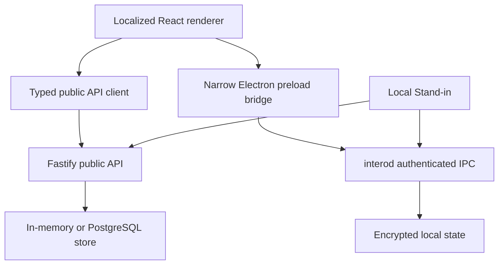
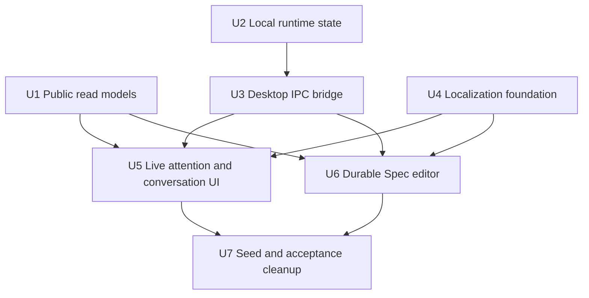
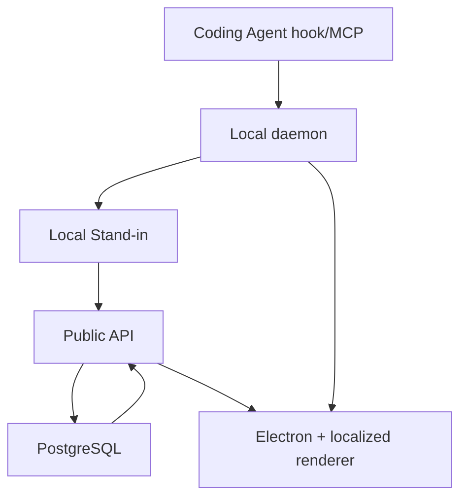

# feat: Make the MVP UI data-driven and localized

## Summary

Replace the desktop demo shell with view models backed by the existing public
API and local privacy daemon, then move all product chrome into a Chinese-first,
English-switchable localization layer. Demo fixtures become opt-in, local-only
settings stay behind Electron IPC, and the acceptance runtime is rebuilt from
empty state plus a real Coding Agent checkpoint.

---

## Problem Frame

The current vertical slice persists Workstreams, Threads, messages,
coordination, and Specs, but several labels, identities, dates, review states,
and runtime settings shown by the desktop are hardcoded. That makes it
impossible for a reviewer to distinguish durable product state from decorative
sample content and undermines the freshness and authority boundaries defined by
the product requirements.

---

## Assumptions

_This plan is part of an already-authorized implementation loop. The items below
are implementation choices inferred from the user's request and are called out
so the final review can challenge them._

- Chinese (`zh-CN`) is the default locale and English (`en-US`) is selectable
  and persisted per desktop profile.
- A development identity is supplied explicitly through runtime configuration
  until the existing Better Auth surface is connected to every desktop request.
- Local Workspace roots and model-egress policy are read and written through
  Electron-to-`interod` IPC; they never enter the public server view model.
- The unfinished attachment control is removed from the composer in this
  iteration instead of presenting an inactive feature as available.
- Existing local demo and acceptance data may be reset because the current
  database is an MVP development instance and the user explicitly requested
  removal of seeded/acceptance decoration.

---

## Requirements

- R4. Authorized Workspaces shown in Settings must come from the local registry,
  keep absolute roots local, and reflect active or revoked state.
- R6. Team Pulse must render the existing concurrent public Workstreams without
  synthesizing owners, statuses, or progress.
- R7. Freshness, confidence, blockers, dependencies, decisions, and
  coordination metadata must come from persisted evidence and typed state.
- R8. Team Pulse remains the default entry; Stand-in, Room,
  Coordination, and Spec surfaces render durable objects with truthful empty
  states.
- R9. Stand-in runtime and freshness indicators must reflect heartbeat
  and local daemon state rather than request loading state.
- R10. Coordination UI must show only stored structured-action facts and must
  not invent resolved or authority-checked labels.
- R12. Public fallback disclosure and model-egress policy must remain separate;
  changing the local policy must affect the running Local Stand-in.
- R15. Spec authoring must restore existing Specs and revisions, persist an
  actual local draft, publish the next durable revision, and render recorded
  review responses without treating Stand-in analysis as approval.
- R16. Team Pulse and Action Inbox must use live counts, identities, dates, and
  navigation targets, with localized empty, loading, error, and stale states.
- The visible desktop product chrome must be localized in `zh-CN` and `en-US`,
  default to Chinese, persist the selection, and format dates/times in the
  selected locale.
- Demo Workstreams and Threads must be seeded only when explicitly enabled;
  normal development startup must expose empty or real pipeline state.

**Origin actors:** A1 (Engineer), A3 (Local Privacy Runtime), A4 (Local
Stand-in), A5 (Public Stand-in), A6 (Teammate or Stand-in),
A7 (Reviewer)

**Origin flows:** F1 (authorized observation and publication), F2 (coding-time
coordination), F3 (one Stand-in with two runtimes), F4 (Spec review), F5
(conflicting evidence)

**Origin acceptance examples:** AE1, AE2, AE4, AE5, AE6, AE7, AE9, AE10, AE12,
AE13

---

## Scope Boundaries

### Deferred for later

- Full A2A Client/Server Gateway, Agent Card publication, and external-agent
  federation.
- Additional project-management providers and deep Jira or Linear parity.
- Local Embedding models and private semantic vector indexes.
- Mature mobile clients and offline-first human chat.
- Voice, video, screen sharing, and huddles.
- Advanced proactive overlap prediction independent of an explicit Coding Agent
  or human coordination request.
- Rich organization analytics, staffing recommendations, and delivery
  forecasting.
- Completing the full attachment picker, upload, scanning, encryption, and
  message-linking flow is deferred; the misleading inactive control is removed.
- Better Auth session propagation into every desktop request is deferred. This
  iteration uses the configured principal while keeping the bootstrap contract
  compatible with a future authenticated principal.
- Creating, revoking, widening, or narrowing Workspace enrollment in the
  desktop is deferred; Settings truthfully reads the daemon-owned registry.

### Outside this product's identity

- A Coding Agent, IDE, or general-purpose Agent execution framework.
- Employee surveillance, productivity scoring, or centralized raw Coding Agent
  session collection.
- A chronological Agent activity feed as the primary collaboration surface.
- A hidden Agent mesh whose coordination or commitments are invisible to
  affected people.
- A system that starts Coding Agent subagents or enforces how technical
  execution proceeds.
- A Stand-in that impersonates a person or makes deadlines,
  architectural approvals, or unrelated commitments without authority.
- A monolithic replacement for every engineering tool.

### Deferred to Follow-Up Work

- Durable per-user locale synchronization across devices may follow after
  authenticated user preferences exist; this iteration stores locale locally.

---

## Context & Research

### Relevant Code and Patterns

- `apps/server-api/src/app.ts` already assembles API-facing read endpoints and
  owns heartbeat freshness; new view models extend that surface.
- `apps/server-api/src/store.ts` and
  `apps/server-api/src/postgres-store.ts` provide matching in-memory and
  PostgreSQL store behavior and must remain contract-compatible.
- `packages/api-contracts/src/index.ts` is the canonical typed API surface;
  generated OpenAPI artifacts follow it.
- `packages/local-ipc/src/index.ts`, `crates/interod/src/rpc.rs`, and
  `crates/interod/src/storage.rs` establish authenticated, framed local RPC and
  encrypted durable state.
- `apps/desktop/src/main/index.ts` and `apps/desktop/src/preload/index.ts`
  already enforce context isolation and are the correct boundary for a narrow
  local runtime bridge.
- `apps/desktop/src/renderer/src/api.ts` and TanStack Query are the existing
  renderer data-access pattern.
- `apps/desktop/src/renderer/src/components/SafeMarkdown.tsx` is the existing
  safe rendering boundary for persisted Spec Markdown.

### Institutional Learnings

- Team Pulse and Action Inbox are the attention center; local/public,
  freshness, privacy, and authority must be explicit rather than implied.
- Stand-in analysis may assist a Spec review but never counts as human
  approval.

### External References

- No external research is required. The relevant API, IPC, React Query, and
  Electron context-isolation patterns are already established in this
  repository; React changes follow the loaded Vercel performance guidance.

---

## Key Technical Decisions

| Decision                                                                          | Rationale                                                                                                                                          |
| --------------------------------------------------------------------------------- | -------------------------------------------------------------------------------------------------------------------------------------------------- |
| Server bootstrap and list endpoints return public identity and review view models | Prevents UUID-to-name and Spec-state reconstruction in React while keeping public data on the public plane.                                        |
| Electron exposes a narrow typed local-runtime bridge                              | Workspace roots and model policy stay on the local private plane and the renderer never receives a generic daemon-call primitive.                  |
| Model policy is durable in `interod` and refreshed by the sidecar                 | A Settings change affects the actual running runtime instead of only changing browser storage.                                                     |
| Localization uses a typed in-repo dictionary and React context                    | The surface is small, avoids a second state system, supports compile-time key parity, and can later be adapted to a translation service.           |
| Domain content is not translated                                                  | Workstream titles, messages, Spec Markdown, and review bodies are user/Agent-authored evidence; only product chrome and enum labels are localized. |
| Demo data is opt-in                                                               | Empty states and real hooks become the default truth, while explicit screenshots/tests can still request deterministic fixtures.                   |

---

## Open Questions

### Resolved During Planning

- **Where should local runtime facts live?** In `interod`, exposed only through
  a narrow Electron bridge; public heartbeat remains a separate availability
  signal.
- **How is current identity selected before full desktop auth wiring?** The API
  uses an explicit configured principal and ensures a corresponding development
  profile; the response contract does not assume the configuration mechanism.
- **Should existing server-generated English content be translated?** No.
  Persisted evidence is rendered verbatim; only UI chrome and typed enum labels
  are localized.
- **What happens to the unimplemented attachment button?** It is removed until
  the complete secure workflow exists.

### Deferred to Implementation

- Exact local draft debounce timing may be tuned during UI tests; the observable
  requirement is recovery after remount/reload without claiming a save before
  storage succeeds.
- The final acceptance checkpoint wording is chosen at execution time so it
  truthfully describes the code and validation that actually ran.

---

## High-Level Technical Design

> _This illustrates the intended approach and is directional guidance for
> review, not implementation specification. The implementing agent should treat
> it as context, not code to reproduce._

Public identity, Workstreams, Threads, Actions, Specs, and reviews flow through
the server. Workspace roots and model policy flow only through local IPC.
Heartbeat reports availability but does not duplicate local policy or paths.

---

## Implementation Units

- U1. **Add public bootstrap, identity, Thread, and Spec read models**

**Goal:** Give the renderer complete public-plane data for identity labels,
Workstreams, conversation participants, Specs, revisions, reviews, and
Action-Inbox routing without client-side fixture knowledge.

**Requirements:** R6, R7, R8, R10, R15, R16; F2, F4; AE4, AE9, AE12

**Dependencies:** None

**Files:**

- Modify: `packages/api-contracts/src/index.ts`
- Modify: `apps/server-api/src/platform-store.ts`
- Modify: `apps/server-api/src/store.ts`
- Modify: `apps/server-api/src/postgres-store.ts`
- Modify: `apps/server-api/src/app.ts`
- Modify: `apps/server-api/src/index.ts`
- Test: `apps/server-api/src/app.test.ts`
- Test: `apps/server-api/src/postgres-store.integration.test.ts`
- Generate: `packages/api-contracts/generated/openapi.json`
- Generate: `packages/api-contracts/generated/openapi.ts`

**Approach:**

- Add a bootstrap response for organization and configured current principal,
  plus public principal summaries used to label owners and message senders.
- Enrich Team Pulse and Thread reads with the public principal summaries needed
  by those views.
- Add a Spec collection endpoint returning each Spec with durable revisions and
  recorded reviews, ordered newest first.
- Do not expose local Workspace paths or private Claims through these contracts.
- Preserve matching behavior between the in-memory and PostgreSQL stores.

**Execution note:** Start with failing request/response tests for each new read
contract, then implement both stores.

**Patterns to follow:**

- Typed parsing and endpoint assembly in `apps/server-api/src/app.ts`
- Store parity in `apps/server-api/src/store.ts` and
  `apps/server-api/src/postgres-store.ts`

**Test scenarios:**

- Happy path: a configured principal, two public Workstreams, and a Thread
  return display names mapped to the correct stable principal IDs.
- Edge case: an unknown auto-created principal returns its persisted placeholder
  name rather than a renderer-generated label.
- Happy path: two Specs return newest first with their revisions and current
  review responses.
- Error path: an unknown Spec detail request remains a typed not-found response.
- Integration: PostgreSQL data remains readable through a fresh store instance.
- Covers AE9: a stored coordination message exposes only persisted structured
  facts; the API does not synthesize authority or deadline claims.
- Covers AE12: the list response associates review validity with the exact
  revision IDs stored by the domain.

**Verification:**

- The renderer can label all visible public identities and reconstruct the
  current Spec/review state using API responses only.

- U2. **Persist local runtime settings and expose bounded daemon status**

**Goal:** Make Workspace and model-egress settings truthful, durable, and
locally scoped.

**Requirements:** R4, R9, R12; F1, F3; AE1, AE3, AE7

**Dependencies:** None

**Files:**

- Modify: `crates/interod/src/storage.rs`
- Modify: `crates/interod/src/workspace.rs`
- Modify: `crates/interod/src/rpc.rs`
- Modify: `apps/local-stand-in/src/runtime.ts`
- Modify: `apps/local-stand-in/src/sidecar.ts`
- Test: `crates/interod/src/storage.rs`
- Test: `crates/interod/src/rpc.rs`
- Test: `apps/local-stand-in/src/runtime.test.ts`
- Test: `apps/local-stand-in/src/sidecar.test.ts`

**Approach:**

- Add durable, validated model-egress settings to the encrypted local store.
- Add bounded RPC reads for daemon health, Workspace registry entries, and
  current policy, plus a single validated model-policy write.
- Keep local absolute roots inside the daemon/desktop boundary.
- Refresh the running Local Stand-in's policy from daemon state so the UI
  controls actual runtime behavior.

**Execution note:** Implement storage and RPC validation tests before exposing
the desktop bridge.

**Patterns to follow:**

- Authenticated dispatch in `crates/interod/src/rpc.rs`
- Additive local schema initialization in `crates/interod/src/storage.rs`
- Heartbeat loop in `apps/local-stand-in/src/sidecar.ts`

**Test scenarios:**

- Happy path: setting each supported model mode persists and survives reopening
  the local database.
- Error path: an unsupported mode is rejected and the prior durable value
  remains unchanged.
- Happy path: Workspace list returns active/revoked metadata from the registry.
- Privacy edge: daemon status returns roots only over authenticated local IPC;
  no public API response gains those fields.
- Integration: the sidecar observes a changed policy on its next refresh and
  updates the active runtime mode without restart.
- Covers AE7: an unavailable local daemon produces an explicit offline result,
  never a fresh-local label.

**Verification:**

- Daemon RPC is the source of truth for Workspace and model policy and the
  sidecar consumes the same durable policy.

- U3. **Expose a narrow Electron local-runtime bridge**

**Goal:** Let the sandboxed renderer read and update only the local runtime facts
needed by Settings.

**Requirements:** R4, R9, R12; F3; AE3, AE7

**Dependencies:** U2

**Files:**

- Modify: `apps/desktop/package.json`
- Modify: `apps/desktop/src/main/index.ts`
- Modify: `apps/desktop/src/preload/index.ts`
- Modify: `apps/desktop/src/renderer/src/vite-env.d.ts`
- Modify: `apps/desktop/src/renderer/src/api.ts`
- Test: `apps/desktop/src/renderer/src/api.test.ts`

**Approach:**

- Register explicit Electron handlers for local status and model-policy change.
- Use `@intero/local-ipc` in the main process; expose no arbitrary method name or
  raw token/socket access to the renderer.
- Normalize connection failures into a typed unavailable state so browser
  preview and daemon outage render truthfully.

**Patterns to follow:**

- Existing context-isolated preload and navigation hardening in
  `apps/desktop/src/main/index.ts`
- Framed authenticated client in `packages/local-ipc/src/index.ts`

**Test scenarios:**

- Happy path: local bridge returns version, Workspace list, encryption state,
  and model policy.
- Error path: a missing daemon descriptor becomes an unavailable status without
  leaking the descriptor path or token.
- Error path: an unsupported setting is rejected before or by the daemon and
  the UI retains the prior confirmed value.
- Browser edge: absence of the preload bridge renders a desktop-required local
  state instead of fabricated Workspace data.

**Verification:**

- Renderer code cannot invoke arbitrary daemon methods, and Settings can render
  both connected and unavailable local states.

- U4. **Create the Chinese-first localization foundation**

**Goal:** Localize all desktop product chrome with a persisted Chinese/English
selection and locale-aware time formatting.

**Requirements:** Localized desktop requirement; R8, R16

**Dependencies:** None

**Files:**

- Create: `apps/desktop/src/renderer/src/i18n/index.tsx`
- Create: `apps/desktop/src/renderer/src/i18n/locales/zh-CN.ts`
- Create: `apps/desktop/src/renderer/src/i18n/locales/en-US.ts`
- Modify: `apps/desktop/src/renderer/src/main.tsx`
- Modify: `packages/ui/src/components.tsx`
- Test: `apps/desktop/src/renderer/src/i18n/index.test.tsx`

**Approach:**

- Use a typed key set whose English dictionary must match the Chinese source
  dictionary.
- Persist locale locally and default missing/invalid values to `zh-CN`.
- Centralize date, time, relative freshness, phase, review-kind, inbox-kind,
  accessibility, and error labels.
- Keep persisted domain content verbatim.

**Patterns to follow:**

- Existing React root providers in `apps/desktop/src/renderer/src/main.tsx`
- Presentational component API in `packages/ui/src/components.tsx`

**Test scenarios:**

- Happy path: no stored preference renders Chinese and formats the current date
  using `zh-CN`.
- Happy path: switching to English updates visible labels and survives remount.
- Edge case: an invalid stored locale falls back to Chinese.
- Static parity: both locale dictionaries implement the same key set.
- Accessibility: translated aria labels remain non-empty in both locales.

**Verification:**

- No visible product-chrome string in the renderer bypasses the localization
  layer, except the Intero brand and persisted user/Agent content.

- U5. **Render live identity, attention, runtime, and conversations**

**Goal:** Remove hardcoded people, dates, quotes, coordination status, and
runtime state from Team Pulse, navigation, Stand-in, Room, Coordination,
and Settings.

**Requirements:** R6, R7, R8, R9, R10, R12, R16; F2, F3, F5; AE4, AE5, AE6,
AE7, AE9, AE10, AE13

**Dependencies:** U1, U3, U4

**Files:**

- Modify: `apps/desktop/src/renderer/src/App.tsx`
- Modify: `apps/desktop/src/renderer/src/api.ts`
- Modify: `apps/desktop/src/renderer/src/views/TeamPulseView.tsx`
- Modify: `apps/desktop/src/renderer/src/views/Stand-inView.tsx`
- Modify: `apps/desktop/src/renderer/src/views/ProjectRoomView.tsx`
- Modify: `apps/desktop/src/renderer/src/views/SettingsView.tsx`
- Modify: `apps/desktop/src/renderer/src/styles.css`
- Test: `apps/desktop/src/renderer/src/App.test.tsx`
- Test: `apps/desktop/src/renderer/src/views/TeamPulseView.test.tsx`
- Test: `apps/desktop/src/renderer/src/views/SettingsView.test.tsx`

**Approach:**

- Load bootstrap once and use stable principal IDs to resolve names and
  initials across navigation, Workstreams, and messages.
- Replace the fixed date with locale formatting and calculate stale labels from
  server timestamps.
- Derive the Stand-in peek from the latest durable Stand-in
  message, or show a truthful empty state.
- Remove the inactive attachment control.
- Render coordination action, sequence, scope, and policy only when they exist
  in stored data; do not label unresolved facts as resolved/checked.
- Route Action Inbox items to their durable Spec or coordination surface when
  their source reference identifies one.
- Render daemon Workspace/model state from the local bridge and server fallback
  freshness from the public API as separate facts.

**Execution note:** Use component tests with explicit API/bridge fixtures before
manual visual QA.

**Patterns to follow:**

- Query keys and mutations in the current desktop views
- Truthful empty/error components in `@intero/ui`

**Test scenarios:**

- Happy path: live principal names replace UUID fixtures in sidebar,
  Workstreams, and messages.
- Empty path: zero Workstreams, Threads, Rooms, and inbox items render localized
  guidance without sample copy or fake counts.
- Freshness path: offline heartbeat with an old projection shows public fallback
  and stale time; a fresh heartbeat shows local connected separately.
- Covers AE5: conflicting state content is rendered from the projection without
  changing it to Done.
- Covers AE6: unchanged activity does not create a UI progress item because the
  view reads projections, not activity events.
- Covers AE9/AE10: coordination display contains the durable message and
  sequence, and never invents a deadline, policy result, or transcript.
- Error path: failed API and local IPC queries expose retry/unavailable copy and
  retain no stale success label.
- i18n path: every tested empty, loading, error, and populated state renders in
  both locales.

**Verification:**

- Every visible identity, count, timestamp, runtime fact, Workstream, inbox
  item, and message is traceable to a current API/IPC response or is explicitly
  labeled as an empty/unavailable state.

- U6. **Make Spec authoring and review durable**

**Goal:** Replace the fixed sample Spec and simulated autosave/review panel with
durable Spec data and a recoverable local draft.

**Requirements:** R15, R16; F4; AE12

**Dependencies:** U1, U4

**Files:**

- Modify: `apps/desktop/src/renderer/src/api.ts`
- Modify: `apps/desktop/src/renderer/src/views/SpecReviewView.tsx`
- Modify: `apps/desktop/src/renderer/src/styles.css`
- Test: `apps/desktop/src/renderer/src/views/SpecReviewView.test.tsx`
- Test: `apps/desktop/src/renderer/src/components/SafeMarkdown.test.tsx`

**Approach:**

- Render a localized empty state with an explicit new-draft action when no Spec
  exists.
- Restore the newest durable Spec and its current revision; allow switching
  between existing Specs and a new local draft.
- Persist title and Markdown locally under a versioned per-Spec draft key and
  only claim autosave after storage succeeds.
- Publish new Specs and next revisions using the current configured human
  principal; invalidate/retain reviews through existing domain rules.
- Render actual review responses by revision and visually distinguish
  Stand-in analysis from human acknowledgement/approval.

**Execution note:** Start with reload/remount draft recovery and next-revision
tests, then implement UI behavior.

**Patterns to follow:**

- Version and invalidation logic in
  `packages/stand-in-core/src/spec-review.ts`
- Safe Markdown boundary in
  `apps/desktop/src/renderer/src/components/SafeMarkdown.tsx`

**Test scenarios:**

- Empty path: no server Specs shows a new-draft action and no fabricated title,
  reviewers, or analysis.
- Happy path: an existing revision loads its exact title/Markdown and recorded
  reviews.
- Draft path: edited title/Markdown survive remount and show saved only after
  local storage contains the draft.
- Publish path: an existing Spec publishes the next revision number based on
  durable revisions, clears the matching local draft, and refetches server
  state.
- Error path: publish failure keeps the local draft and shows localized retry
  state.
- Covers AE12: only reviews valid for the current revision render as current;
  invalidated reviews remain visibly historical.
- Authority path: Stand-in impact analysis never renders as human
  approval.

**Verification:**

- Reloading the view never returns to sample content and never loses an
  acknowledged local draft; published revisions and review state survive API
  reload.

- U7. **Make demo data explicit and rebuild the acceptance runtime**

**Goal:** Ensure normal startup is free of demo decoration and deliver a running
Chinese-first instance populated only through real product entry points.

**Requirements:** R2, R3, R4, R6, R16; F1; AE1, AE2, AE4, AE6

**Dependencies:** U5, U6

**Files:**

- Modify: `apps/server-api/src/index.ts`
- Modify: `README.md`
- Modify: `turbo.json`
- Test: `apps/server-api/src/app.test.ts`
- Test: `apps/server-api/src/postgres-store.integration.test.ts`

**Approach:**

- Seed demo Workstreams and Threads only when an explicit environment flag is
  true.
- Document the difference between empty development, explicit demo, and real
  hook/checkpoint acceptance modes.
- Reset the named local development data, enroll this repository in the running
  daemon, and submit a real semantic checkpoint through the supported
  integration path.
- Validate Chinese default, English switch, empty/error states, live Workstream,
  Stand-in freshness, Settings data, Spec draft/publish/reload, and
  Action Inbox navigation in the running application.

**Test scenarios:**

- Happy path: server startup without the flag creates no sample projection or
  Thread.
- Explicit demo path: enabling the flag still creates deterministic fixtures
  for visual development.
- Covers AE1: before enrollment, a checkpoint collects no public state and the
  local runtime reports the missing enrollment boundary.
- Covers AE2: after enrollment, a real Coding Agent checkpoint creates a Claim,
  Workstream projection, and localized Team Pulse row without a raw transcript.
- Covers AE6: repeated non-semantic activity does not add a new public progress
  row.
- Restart path: after API and desktop restart, durable public state, local
  Workspace, model policy, and Spec revision remain visible.

**Verification:**

- The handed-off runtime starts in Chinese, can switch to English, contains no
  default fixtures, and every populated acceptance item is attributable to a
  real API, daemon, or integration event.

---

## System-Wide Impact

- **Interaction graph:** API response contracts affect desktop queries and
  generated OpenAPI; daemon RPC affects Electron main/preload and sidecar policy
  refresh; localization affects every renderer view and shared UI labels.
- **Error propagation:** Public API failures become localized query errors;
  daemon connection failures become an explicit desktop-unavailable state;
  failed setting writes retain the last confirmed policy; failed Spec publishes
  retain the local draft.
- **State lifecycle risks:** Demo reset is restricted to the named local compose
  volumes; Spec drafts are keyed and cleared only after confirmed publish;
  runtime policy is durable before the sidecar adopts it.
- **API surface parity:** In-memory/PostgreSQL stores and generated OpenAPI must
  match. Browser preview lacks local IPC by design and must disclose that
  limitation.
- **Integration coverage:** The final acceptance run crosses hook/MCP, daemon,
  sidecar, API, database, and renderer; unit tests alone cannot prove the
  privacy and freshness handoff.
- **Unchanged invariants:** Local paths do not enter public state; raw Agent
  sessions are not collected; capability policy remains code-enforced; human
  approval remains distinct from Stand-in analysis; Intero does not
  control Coding Agent execution.

---

## Risks & Dependencies

| Risk                                                             | Mitigation                                                                                                               |
| ---------------------------------------------------------------- | ------------------------------------------------------------------------------------------------------------------------ |
| Local paths accidentally enter public bootstrap responses        | Separate contracts and tests; local status is available only through Electron IPC.                                       |
| The UI claims a policy change before the sidecar uses it         | Persist in daemon first, refresh the running sidecar, and render only the confirmed daemon response.                     |
| Localized strings drift or English keys go missing               | Typed dictionary parity and tests for both locales across major states.                                                  |
| Existing acceptance fixtures mask empty-state failures           | Default seeding off, reset the named local data, test empty state before submitting the real checkpoint.                 |
| Spec draft overwrites a newer server revision                    | Key drafts by Spec/revision context, show the durable base revision, and publish using freshly refetched revision state. |
| Bootstrap identity is mistaken for complete authentication       | Keep the configuration mechanism explicit in documentation and do not weaken existing authorization boundaries.          |
| Broad cross-layer changes regress the established vertical slice | Land by dependency unit, run TypeScript/Rust/integration/build gates, then perform two finding-driven review passes.     |

---

## Documentation / Operational Notes

- `README.md` must document Chinese/English switching, explicit demo mode,
  configured development identity, local daemon startup, and real-checkpoint
  acceptance.
- Reset only the Compose project volumes named by this repository and the
  temporary daemon acceptance directory; do not touch unrelated Docker or user
  data.
- The final handoff must state the exact runtime boundary verified: automated
  tests, local Electron/browser UI, public API, daemon IPC, and real checkpoint.

---

## Sources & References

- **Origin document:** [docs/brainstorms/2026-07-24-intero-product-requirements.md](../brainstorms/2026-07-24-intero-product-requirements.md)
- Architecture: [docs/ARCHITECTURE.md](../ARCHITECTURE.md)
- Existing MVP plan: [docs/plans/2026-07-24-intero-mvp-implementation-plan.md](2026-07-24-intero-mvp-implementation-plan.md)
- Public API: [apps/server-api/src/app.ts](../../apps/server-api/src/app.ts)
- Local daemon RPC: [crates/interod/src/rpc.rs](../../crates/interod/src/rpc.rs)
- Desktop shell: [apps/desktop/src/renderer/src/App.tsx](../../apps/desktop/src/renderer/src/App.tsx)
