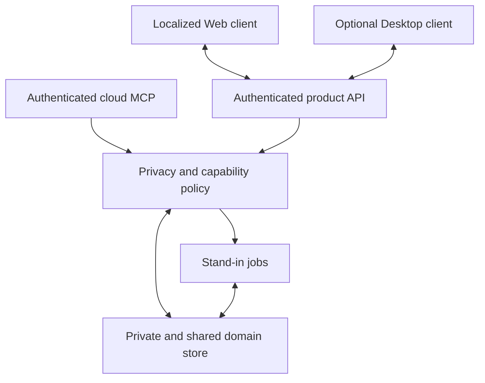

# Make the cloud-first UI data-driven and localized

Canonical UI terminology is **Stand-in** in English and **替身** in Chinese.
Product chrome, navigation, empty/error states, and future surfaces must use
those labels. Contract identifiers use `stand_in`; paths/slugs use `stand-in`.
The active renderer and domain-facing UI use the canonical renamed contract.

## Summary

Deliver a complete Chinese-first, English-switchable Web experience backed by
authenticated cloud data. The UI distinguishes user-private Work State from
published team state and never infers visibility from upload or storage.

The existing Electron UI and its local daemon bridge are historical
implementation evidence. The Desktop App may reuse the Web product's view
models and localization as an optional client, but browser and Coding Agent
flows must remain complete when it is absent.

## Problem Frame

The earlier vertical slice made the desktop renderer depend on both a public API
and local daemon IPC. Several labels, identities, dates, review states, and
runtime facts were hardcoded. That prevented reviewers from distinguishing
durable product state from sample content and coupled privacy settings to a
required local runtime.

The cloud-first product needs:

- truthful authenticated Web data;
- explicit private, participant, team, project, and organization scope;
- a simple project posture that hides normal-flow policy complexity;
- provenance and publication origin in every shared view;
- localized empty, loading, error, stale, private, and published states;
- no required Desktop App, daemon, or Electron IPC.

## Assumptions

- Chinese (`zh-CN`) is the default locale and English (`en-US`) is selectable.
- Locale may remain client-local until authenticated preference sync is
  implemented.
- Domain content is rendered verbatim; only product chrome and typed enum labels
  are localized.
- The Web API supplies authenticated principal identity. A configured
  development principal is not a production authentication substitute.
- Private Work State, project posture, advanced policy, and publication audit are
  cloud domain data protected by authorization.
- Model processing is Workspace-scoped with no public/general-model training or
  cross-customer/Workspace reuse.
- Client-local Spec drafts are convenience state. Published revisions are cloud
  domain state.
- Demo fixtures are opt-in and visually distinguishable from real product data.
- The optional Desktop App may add foreground-only, explicitly opted-in context
  enhancement, but no core Web screen depends on it.

## Requirements

- R4. Integration and repository/project binding status comes from authenticated
  cloud contracts and does not expose unnecessary absolute local paths.
- R6-R7. Private and published Workstreams render from durable Claims and never
  synthesize owners, progress, confidence, or resolution.
- R8-R9. The Web provides the complete Team Pulse, Stand-in, Room,
  Coordination, Spec, Decision, and Settings experience.
- R10-R11. Coordination renders only stored messages, Action Envelopes,
  authority, and policy facts.
- R12-R13. The UI presents a low-friction project posture, not four everyday
  controls: personal/unbound is Private Work; a bound team project defaults to
  Collaborate with Project with a clear private/paused opt-out and audit.
- R12-R13. Concisely expose 180-day private structured retention, 30-day raw
  retention, project-life summary retention, withdrawal, and private-data
  deletion where relevant.
- R12-R13. A deliberately opened developer-intervention support case shows its
  ticket/workspace scope, expiry, audit, and close/withdraw revocation
  continuously without an extra consent modal; team-admin status grants no
  private access.
- R15. Spec authoring restores durable revisions, preserves recoverable drafts,
  and distinguishes private candidates from published review revisions.
- R16. Team Pulse is one person column per peer. Its header shows plain,
  non-interactive Stand-in summary text derived from authorized active work,
  blockers, recent outcomes, and freshness, plus active and blocked counts.
  Peer active-work cards have no primary/secondary/focus/rank semantics; **N
  more** is visual compaction only.
- R16. Action Inbox retains actionable navigation, provenance, and visibility;
  Pulse header text has no citations, links, click-through, or state-setting.
- Product chrome is complete in `zh-CN` and `en-US`.
- Normal startup contains no sample Workstreams, Threads, or Specs.
- Browser acceptance requires no Desktop App or local IPC.

## Accepted post-Pilot UX sequence

Phase 3 infrastructure, Phase 4 onboarding/admin and Settings, and Phase 5
Project work/Spec Review are implemented. Phase 6 Action Inbox,
notifications/search and Phase 7 deeper Agent automation remain future scope.

### Phase 4 onboarding

- Put invitation creation in **Team Settings → Member Management**.
- Admin enters display name and exact email. Show
  pending/accepted/expired/revoked state with copy, regenerate ("resend"), and
  revoke actions.
- V1 copy-link requires no SMTP; the admin shares through their own channel.
- Use a distinct compact **Accept Invitation** surface, not administrator/Test
  Setup: Organization/Team/name/email confirmation and Accept; matching-email
  login/registration; then joined Team/access Projects with direct Project/Team
  Pulse entry and skippable Connect Coding Agent.
- Deny email mismatch. Do not disclose deployment endpoint, model keys,
  governance, invitations, or admin Settings. Seed the display name and allow
  later editing under Personal Settings.

### Phase 5 work and Spec Review

- Reuse the existing visual system. Do not create a separate admin/dashboard
  language.
- Work Item detail keeps activity/coordination in the center timeline,
  facts/context/relations/code in the right rail, and comment composition at the
  bottom.
- Backlog and current Sprint are two views of one Project work surface. Epic is
  roadmap-only; Feature may be directly executed without Work Items.
- Team-level Spec Review shows all accessible Specs with a Project filter;
  Project pages deep-link with the filter.
- Keep unassigned pending review as a compact Team Pulse count. Only nominated
  reviewers receive targeted Action Inbox entries.
- Manual creation/editing remains available, while Agent-created content is
  clearly attributed and exposes history/revert and disconnect/revoke status.

### Phase 6-7 extension

Action Inbox, notifications, and search enter the established attention
surfaces before deeper Agent automation. Every new ability preserves visibility,
provenance, privacy, authority, and no-Desktop dependency.

## Scope Boundaries

### Deferred for later

- Detailed Git/lifecycle event endpoint status and diagnostics.
- Durable cross-device locale synchronization.
- Backup-deletion timing, legal holds, precise support-role/legal process,
  subprocessor contracts, and region settings.
- Full attachment picker, scanning, encryption, and message-linking flow.
- Full A2A, mobile, offline-first chat, voice, video, and huddles.
- SMTP invitation delivery, Spec diff/re-anchoring/branch UI, Team-wide Boards,
  and live GitHub synchronization.

### Outside this product's identity

- A UI that treats all cloud data as team-visible.
- A browser that requires Electron, a daemon, or local IPC.
- Fake progress percentages, confidence-as-completion, or invented authority.
- A Stand-in analysis styled as human approval.
- A default Agent activity feed or raw transcript viewer.

## Context and historical implementation

The repository already contains useful patterns:

- typed API contracts and generated clients;
- TanStack Query data access;
- safe Markdown rendering;
- localization dictionaries and locale-aware formatting;
- Team Pulse, Stand-in, Coordination, Spec, and Settings views;
- optional demo fixtures and durable domain stores.

The earlier plan's daemon settings source, Electron preload bridge, Local/Public
runtime indicator, and daemon-enrollment acceptance path are superseded by
ADR-0006. The canonical renderer/browser path now validates the Web-first
target; retained local-runtime code and tests are historical evidence only.

## Key technical decisions

| Decision                            | Direction                                                                                                 |
| ----------------------------------- | --------------------------------------------------------------------------------------------------------- |
| Web is the primary complete client  | Every core view and setting works in a normal authenticated browser session.                              |
| Cloud contracts carry privacy state | View models include scope, provenance, freshness, and permitted actions without leaking private evidence. |
| Storage is not visibility           | UI copy and controls never use “uploaded,” “synced,” or “server” as a synonym for “shared.”               |
| Project posture hides policy detail | Personal/unbound stays private; bound team projects collaborate silently with clear opt-out and audit.    |
| Policy axes stay enforced           | Upload, processing, reuse, and publication remain distinct in authorization and audit, not daily toggles. |
| Desktop is optional                 | Foreground-only opted-in enhancement is additive and never blocks Web routes.                             |
| Localization is shared              | Typed dictionaries cover Web and optional Desktop product chrome.                                         |
| Demo data is opt-in                 | Empty and real cloud state remain the normal product truth.                                               |

## Open Questions

### Resolved by ADR-0006

- Private work data may be stored and processed in Intero cloud.
- User-private is an authorization scope, not a local deployment location.
- The Web is primary and the Desktop App is optional.
- Direct cloud MCP is independent of any UI process.
- Team project binding enables safe collaboration summaries by default;
  personal/unbound work remains private.
- The invocation-driven bounded outbox provides best-effort offline delivery
  without a daemon.
- Structured private data retains 180 days, raw uploads 30 days by default, and
  published summaries for project lifetime; users can delete private data.
- Support-case intervention is scoped, time-limited, visible, auditable, and
  revocable without granting ambient team-admin access.
- Cloud model use is Workspace-scoped with no public/general-model training or
  cross-customer/Workspace reuse.

### Deferred decisions

- Backup-deletion timing, legal holds, region, precise support-role/legal
  process, and subprocessor selection/contracts.
- Browser installation and credential UX for MCP integrations.

## High-level technical design

Web and optional Desktop use the same authorized view-model semantics. Device
preferences and drafts may be local conveniences; identity, Work State,
visibility, publication, Threads, Specs, reviews, and audit are cloud domain
facts.

## Implementation Units

### U1. Add authenticated cloud view models

**Goal:** Give the UI complete principal, private Workstream, published
Workstream, Thread, Spec, review, Action Inbox, policy, and publication-audit
data without fixture knowledge.

**Approach:**

- Return the authenticated current principal and authorized organization state.
- Return private and shared view models through separate explicit fields or
  contracts.
- Include provenance, freshness, confidence, contradiction, scope, and permitted
  actions.
- Include applicable lifecycle metadata and the non-sensitive status of any
  active support-case authorization.
- Never include private evidence in a shared response merely to explain a
  projection.
- Preserve matching behavior between in-memory and durable stores during
  migration.

**Acceptance:**

- One user's private Claim is absent from another user's bootstrap and search.
- Team Pulse receives only authorized current active-work cards and summary
  inputs.
- Published state outside the Pulse header may link to a privacy-safe provenance
  summary and publication actor or rule; the header summary itself never does.
- Spec review validity binds to exact revision IDs.

### U2. Add cloud privacy and publication settings

**Goal:** Make privacy understandable through a durable project posture while
retaining independent enforcement and audit underneath.

**Approach:**

- Default personal/unbound work to Private Work.
- After explicit team-project binding, default to Collaborate with Project and
  quietly publish only safe summaries, status, dependencies, blockers, and
  coordination signals.
- Present concise current activity and visibility plus a project-level
  private/paused opt-out or refinement path; do not prompt per event.
- Keep advanced policy axes in the authorized cloud domain, not browser storage.
- Show effective user and organization policy, including which layer narrowed a
  choice.
- Show audit, withdrawal, user-private deletion, and the simple 180-day/30-day/
  project-life retention context without overloading normal flow.
- When a user opens/escalates a developer-intervention support case, show its
  ticket/workspace scope, time limit, audit, and close/withdraw revocation
  continuously with no second consent prompt.

**Acceptance:**

- Binding a team project enables safe summaries without exposing private
  evidence or raw content.
- Switching to private/paused stops future quiet publication without per-event
  prompts.
- An unauthorized widening request is rejected and the prior state remains.
- Every posture change and publication is attributable and versioned.
- Team admins cannot see private user data without a qualifying support case.
- Model-use copy never implies publication and states no public/general-model
  training or cross-customer/Workspace reuse.

### U3. Make the Web product complete without Desktop

**Goal:** Provide all core collaboration, privacy, and integration-management
surfaces in an authenticated browser.

**Approach:**

- Implement Team Pulse, Stand-in, Rooms, Coordination, Action Inbox,
  Specs, Decisions, provenance, and Settings as Web routes.
- Render Team Pulse as one person column per peer with plain header summary,
  active/blocked counts, peer cards, and visual-only **N more** disclosure.
- Do not render or request a primary/main/secondary/subordinate/focus/rank field
  for Team Pulse work.
- Expose MCP connection instructions and status without requiring Desktop.
- Render optional foreground Desktop enhancement state only when available.
- Normalize API failures into explicit unavailable or stale states.
- Show non-sensitive outbox delivery-gap/freshness context when present; do not
  expose queued payload contents or keys.

**Acceptance:**

- A fresh browser session can connect an Agent, bind a team project, observe
  safe collaboration summaries, opt out/pause, inspect audit, withdraw, and
  review a Spec.
- Closing or uninstalling Desktop changes no core Web capability.
- No browser state claims a daemon or local Stand-in is connected.

### U4. Create the Chinese-first localization foundation

**Goal:** Localize all product chrome with persisted Chinese/English selection
and locale-aware time formatting.

**Approach:**

- Use a typed key set with dictionary parity.
- Centralize date, time, freshness, Claim source, privacy scope, processing,
  reuse, publication, review, inbox, accessibility, and error labels.
- Keep user- and Agent-authored evidence verbatim.

**Acceptance:**

- Chinese is the default and English survives remount.
- Both dictionaries cover empty, loading, error, stale, private, published,
  withdrawn, and unavailable states.
- Accessibility labels remain non-empty.

### U5. Render live attention, conversations, and provenance

**Goal:** Remove hardcoded people, dates, quotes, coordination status, runtime
state, and privacy state.

**Approach:**

- Resolve identities from stable principal IDs.
- Calculate stale labels from server timestamps.
- Render only stored Action Envelope and authority facts.
- Route Action Inbox items to their durable source.
- Keep personal/unbound Work State outside Team Pulse; show safe bound-project
  collaboration state inside Team Pulse.
- Keep Pulse summary text non-interactive and free of citations, links,
  click-through, or state controls. Card order is for reading and conveys no
  work rank.
- Show publication posture and actor without leaking private evidence.

**Acceptance:**

- Empty state contains no demo copy or fake counts.
- Conflicting state is not rewritten as Done.
- Personal, unbound, private, and paused work does not appear in team views.
- Each Pulse column shows the correct active/blocked counts; **N more** changes
  only visual expansion and never task state or hierarchy.
- Failed API queries retain no stale success or shared label.

### U6. Make Spec authoring and review durable

**Goal:** Replace sample Specs with durable private candidates, explicit review
publication, and recoverable drafts.

**Approach:**

- Restore durable Specs and revisions.
- Keep client-local drafts versioned and recoverable.
- Publish a review only through an authorized mutation.
- Render Stand-in analysis separately from human review states.
- Preserve source privacy on derived summaries and comments.

**Acceptance:**

- A private draft is invisible to reviewers before publication.
- Publish failure preserves the draft.
- Reviews remain attached to the exact revision.
- Stand-in analysis never renders as approval.

### U7. Make demo data explicit and run cloud-first acceptance

**Goal:** Deliver a Chinese-first Web instance populated only through real cloud
product entry points.

**Approach:**

- Seed fixtures only under an explicit demo flag.
- Start from empty authorized cloud state.
- Connect a real supported Agent directly to cloud MCP.
- Submit a personal/unbound checkpoint and verify no Team Pulse publication.
- Bind a team project and verify safe summary publication without a per-event
  prompt, then switch private/paused and verify future publication stops.
- Exercise unavailable ingress and verify only non-sensitive outbox
  gap/freshness context reaches the UI after resumed delivery.
- Run Stand-in coordination and private-to-published Spec Review.
- Repeat the core flow with Desktop absent.

**Acceptance:**

- Default startup contains no sample content.
- A personal/unbound MCP checkpoint creates private Work State only.
- A bound team project quietly creates safe Team Pulse state and never exposes
  raw prompts, files, diffs, terminal output, or tool payloads.
- Outbox resume remains best-effort, non-blocking, stable-ID idempotent, and
  daemon-free.
- Restart preserves domain and policy state.
- The Web flow remains complete without Desktop.

## System-wide impact

- API contracts affect every client and generated contract.
- Privacy metadata affects queries, caches, search, realtime subscriptions,
  Stand-in context, and audit.
- Project posture and publication are domain mutations, not UI-only flags.
- Outbox details remain client-owned; only gap/freshness markers enter cloud
  view models.
- Localization affects every visible state and policy explanation.
- Optional Desktop status is additive and cannot become an authorization source.

## Risks and dependencies

| Risk                                           | Mitigation                                                             |
| ---------------------------------------------- | ---------------------------------------------------------------------- |
| Private data leaks through a shared view model | Separate contracts, authorization tests, and canary evidence.          |
| Upload copy implies publication                | Use distinct terms and state transitions everywhere.                   |
| UI claims a policy change before enforcement   | Render only confirmed server responses and effective policy.           |
| Published provenance leaks private evidence    | Return a privacy-safe source summary and authorized audit reference.   |
| Four policy axes create cognitive overload     | Expose project posture and concise visibility; keep axes underneath.   |
| Collaboration publishes raw content            | Contract tests allow only safe summaries for bound-project posture.    |
| Outbox leaks queued payloads or keys           | UI receives only non-sensitive gap/freshness markers.                  |
| Support authorization becomes ambient          | Show ticket/workspace scope, expiry, audit, and case-close revocation. |
| Model processing is confused with publication  | State Workspace scope and no-training/no-cross-workspace reuse.        |
| Browser integration UX depends on Desktop      | Make Web/CLI setup the acceptance path; test with Desktop absent.      |
| Localization drifts                            | Typed dictionary parity and state-coverage tests.                      |
| Demo fixtures mask empty-state failures        | Default seeding off and acceptance from empty state.                   |

## Documentation and operational notes

- README and architecture must use Web-first and private-by-default terminology.
- Historical Electron/daemon acceptance remains labeled as historical.
- Final handoff must state which boundary was verified: document consistency,
  automated contracts, browser UI, cloud API, real MCP, publication, and pilot.
- Event-ingress wire schemas and transport mechanics remain unresolved; the
  accepted scoped-credential, non-blocking, and outbox behavior does not.

## Sources and references

- Product requirements:
  [2026-07-24-intero-product-requirements.md](../brainstorms/2026-07-24-intero-product-requirements.md)
- Architecture: [ARCHITECTURE.md](../ARCHITECTURE.md)
- Cloud-first ADR:
  [ADR-0006](../adr/0006-cloud-first-web-first-runtime-and-private-by-default-data.md)
- MVP plan:
  [2026-07-24-intero-mvp-implementation-plan.md](2026-07-24-intero-mvp-implementation-plan.md)
