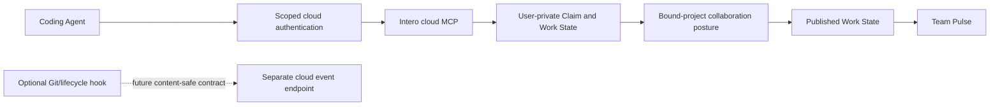

# Safe cloud Coding Agent integration

Canonical product/domain terminology is **Stand-in** in English and **替身** in
Chinese. Documented MCP identifiers use `stand_in`; paths/slugs use `stand-in`.
Active MCP, domain, schema, configuration, and UI identifiers use this canonical
contract.

## Outcome

Provide one cloud-first, direct MCP path from Codex, Claude Code, and OpenCode to
the member's selected Intero team deployment:

The Agent can call Intero without knowing internal UUIDs and without a daemon,
Desktop App, local socket, or Electron launcher. A semantic checkpoint reaches
user-private Work State. Personal/unbound work stays private; an explicitly
bound team project quietly publishes only safe structured collaboration signals.

The Web and CLI paths support install, diagnose, repair, and uninstall. The
optional Desktop App is foreground-only context enhancement and is never a
management or access dependency.

For the pilot, an already-running Intero deployment exists. A team administrator
enters and validates its base URL in Web
`/setup`, then creates or joins the team context, creates the first project, and
enables per-recipient invitations. A separate AI Provider section collects the
cloud model endpoint, server-only API key, and default model. In **Team Settings
→ Member Management**, the administrator enters a display name and exact email,
then copies the one-time, expiring/revocable account-activation link. The
matching-email recipient uses it for first credential setup and inherits the
approved Intero endpoint/team and connection instructions; they do not type the
server URL. The link is not normal login. Passkey is primary login, email plus
password is fallback, Magic Link is absent, password recovery is future, and
SMTP is not required.

## Assumptions

- Canonical Agent events, Work State, and domain policy are adapter-independent.
- Implemented ports/adapters are Vercel AI SDK `ModelGateway`; SpiceDB-backed
  `AuthorizationPort`; Centrifugo-backed `RealtimePort`; MinIO-backed
  `ObjectStorePort` with uploads disabled by product policy; Graphile-backed
  durable `JobRunnerPort` and transactional outbox; and Project-internal bounded
  `CoordinationTransport`.
- Ports remain replaceable and contract-tested. Additional providers, Temporal,
  and general A2A gateway/federation remain deferred.
- The model loop uses only allowed structured Work State for safe Stand-in
  summaries and bounded coordination suggestions; it cannot use unauthorized
  raw data, cross Organization/Workspace, auto-commit, or act as a general
  autonomous Agent.
- Direct authenticated cloud MCP is the only required integration.
- Pilot onboarding supports tailored Codex, Claude Code, and OpenCode prompts
  only; generic MCP clients are not promised.
- Each member inherits one administrator-approved Intero deployment endpoint and
  Team through a per-recipient exact-email invitation before explicitly binding
  a Workspace/Project.
- V1 membership in any Team associated with a Project grants access; Agent
  connection and Work State remain bound to Project identity independently of
  Team. Cross-Team Projects aggregate participating-Team context.
- Each Team belongs to one implicitly/simple-named Organization created during
  first Setup. Organization is the quiet tenant boundary; deployment/provider
  settings may be Organization-scoped, while per-recipient invitations remain
  Team-scoped.
- Team and Project are many-to-many; a Project may have one primary/display Team
  and additional participating Teams.
- Same-Team 1:1 direct messages are participant-visible and independent of
  Project binding. Group DMs, attachments, reactions, DM search, read receipts,
  rich DM Threads, federation, and E2EE promises are outside the pilot.
- Basic human collaboration remains available without a provider, but Agent
  binding and all Stand-in/AI-derived Work State and coordination features
  require a valid configured provider.
- Automatic observation is optional; semantic checkpoints are sufficient for
  the first cloud vertical slice.
- Every checkpoint is stored as a private Claim. Publication follows the
  personal/unbound Private Work or bound-team Collaborate with Project posture.
- Internal Workspace and Workstream UUIDs remain absent from Agent tool schemas.
- The service resolves bounded repository/project context and fails closed when
  context is unauthorized or ambiguous.
- The managed installer edits only Intero-owned nodes or marked blocks and never
  copies a complete user config.
- Codex native trust remains a user decision when a supported integration
  surface requires it.
- MVP uses least-privilege, revocable personal/device credentials with separate
  MCP and event scopes and explicit user-selected Workspace/project binding.
- Exact credential protocol mechanics and event wire schemas remain follow-up
  implementation decisions.
- Productized deployment packages, Docker/install wizards, infrastructure
  workflows, DNS/TLS guidance, tenant provisioning automation, and end-user
  self-hosting documentation are outside the pilot.
- Detailed provider secret-management mechanics and multi-provider routing are
  outside the pilot. The pilot has one administrator-configured endpoint,
  server-only key, default model, connection test, rotation/replacement, and
  disable.

## Non-goals

- A required Desktop App or device relay.
- Default transcript, prompt, response, tool payload, terminal log, file-content,
  or credential ingestion.
- Treating cloud upload or model processing as team publication.
- Inferring completion from process exit or idle lifecycle events.
- Designing event wire schemas or OAuth mechanics beyond the accepted scoped
  credential and outbox product contract.
- Designing deployment packaging, infrastructure provisioning, DNS/TLS
  guidance, or tenant automation.
- An arbitrary server URL field in ordinary member Setup. Developer endpoint
  overrides remain non-product configuration.
- A signed Desktop distribution or production Desktop supervision.
- Starting Coding Agent subagents or controlling technical execution.

## Accepted post-Pilot Agent sequence

Phases 1–6 are implemented, including onboarding/admin, Project work/Spec
Review, Action Inbox, in-app notification preferences, and search. Phase 7
bounded Stand-in and Agent automation is the active implementation target and
is not yet complete. External notification channels remain future scope.

Phase 4 replaced the reusable Pilot join-link default with per-recipient
invitations created in **Team Settings → Member Management**. Admin supplies
display name and exact email; Intero creates a one-time,
expiring/revocable email-bound account-activation link with
`pending|accepted|expired|revoked` state and copy, regenerate ("resend"), and
revoke actions. SMTP is not required. The matching-email recipient uses it only
for first credential setup in a short non-admin flow and may skip Connect Coding
Agent; the surface exposes no endpoint, model secret, governance, invitation, or
admin configuration. Passkey is primary normal login, email plus password is
fallback, product Magic Link is absent, and password recovery remains future
administrator/manual-link or optional SMTP work.

With Project access, MCP exposes explicit content contracts for authorized
Project management and Specs:

- create/update Feature and Work Item content;
- create immutable Spec versions, `request_review`, `list_confirmed`, and
  `get_confirmed(specId)`;
- add human/Agent comments and replies with provenance;
- attach explicitly reported PR, Commit, or branch references without
  branch-name inference.

These operations remain separate from the ten canonical checkpoint semantics.
Every mutation records actor/time/provenance/history/revert. Agents are never
assignees and cannot mutate Organization/Team membership, roles, Project-Team
associations, or visibility. Disconnect/revoke stops future Project access
without blocking local coding.

Phase 7 now builds on those proven foundations. Authorized structured blocker,
dependency, stale or pending review, conflict, and coordination signals may
start an idempotent Project-scoped Coordination Thread with safe context and
candidate steps. A Stand-in or authorized Agent may derive and directly
create/update execution work only from a confirmed Spec, recording source
version, actor, provenance, immutable history, and audited revert. Authorized
cross-Project progress/risk/decision summaries include only visible Projects
and preserve fact, interpretation, and freshness.

All automation uses durable jobs and the transactional outbox. Results and
required human decisions use existing Project activity, Coordination, Action
Inbox, in-app notification, search, and Stand-in surfaces rather than a new
dashboard. Agents cannot change membership/access/visibility, alter priority or
ownership without authorized human action, invoke external provider/GitHub
actions, disclose raw content, or make an irreversible business decision or
final human commitment.

## Unit 1 — Authenticated cloud MCP and context binding

### Changes

- Expose the canonical Stand-in tools on an authenticated cloud MCP
  endpoint at the selected team deployment origin.
- Resolve the deployment origin for members from the authenticated one-time
  invite association, not from a member-supplied URL. Keep explicit
  Workspace/project binding separate.
- Create a least-privilege, revocable personal/device MCP credential scope
  distinct from Web sessions and event senders.
- Resolve authenticated principal and explicit user-selected Workspace/project
  binding server-side while minimizing repository/remote metadata and collecting
  no absolute path by default.
- Reject expired, revoked, cross-user, cross-tenant, unauthorized, or ambiguous
  context.
- Record content-safe audit data for authentication, tool name, policy version,
  result class, and timing without logging private tool payloads.
- Do not require or accept a local daemon connection descriptor.

### Follow-up implementation detail

- Choose issuance and transport mechanics without weakening revocation,
  personal/device scope, separate MCP/event authority, or the rule that expired
  and revoked credentials require re-authentication with no automatic recovery.

### Acceptance

- Each supported Agent completes MCP initialization and tool listing against
  cloud Intero.
- `current_context` and `report_checkpoint` work without internal UUIDs.
- A token for one user, organization, or scope cannot reach another.
- Ambiguous repository binding returns an explicit error rather than selecting
  by timestamp.
- Desktop absence has no effect on MCP.

## Unit 2 — Private-by-default checkpoints and bounded results

### Changes

- Implement exactly `work_started`, `work_progressed`, `decision_recorded`,
  `dependency_declared`, `blocker_raised`, `review_requested`,
  `work_completed`, `coordination_requested`, `artifact_produced`, and
  `validation_completed`.
- Require bounded safe summary, stable client event/idempotency ID, Project,
  authenticated Agent, provenance, occurred-at time, and schema version. Plan
  changes belong only in `work_progressed`.
- Parse bounded typed arguments and reject unknown or forbidden content shapes.
- Store each report as a user-private sourced Claim.
- Run deterministic Work State reduction before optional model interpretation.
- For explicit structured blocker, dependency, review, conflict, or coordination
  signals, allow automatic creation of a Project-scoped internal coordination
  Thread/request with safe context and candidate next steps, response
  collection, and clarification.
- Reject raw disclosure, cross-Project scope, external actions, priority changes,
  irreversible commitments, and final decision claims; commitments require
  responsible-participant confirmation. This is not general A2A federation.
- Permit cloud model processing and Stand-in reuse for private summaries.
  Keep the underlying policy axes independently enforced behind the simple
  project posture.
- Limit model use to the authorized Workspace with no public/general-model
  training or cross-customer/Workspace reuse.
- Apply 180-day retention to structured private Work State/Claims and 30-day
  default retention to explicitly authorized raw uploads.
- Return bounded team context only when the authenticated Agent and user are
  authorized for it.
- Prevent private evidence or complete coordination transcripts from leaking
  through tool results.
- Reject raw prompts/files/diffs/terminal/tool logs and low-level file/resource
  touch events. Route dependency/blocker/review/coordination-conflict signals to
  bounded coordination and artifact/validation/completion to status and safe
  Team Pulse.

### Acceptance

- Canary credentials and forbidden content do not appear in events, logs,
  diagnostics, audit summaries, or shared state.
- A personal/unbound checkpoint updates private Work State with no Team Pulse
  item.
- A bound team project updates the person's Team Pulse column with an authorized
  peer active-work card, plain Stand-in header summary, and active/blocked
  counts without per-event approval; raw prompts, files, diffs, terminal/tool
  output never become team-visible through that posture.
- The Pulse header is plain non-interactive text with no citations, links,
  click-through, or state-setting. Card order and **N more** are presentation
  only; no primary/secondary/focus field or rank is inferred.
- Duplicate delivery does not duplicate Claims, publications, or Pulse cards.
- A completion report with conflicting evidence remains contradictory rather
  than overwriting state.
- A blocker may automatically open one auditable Project-scoped coordination
  Thread but cannot create an external action or unconfirmed commitment.
- Contract fixtures accept all and only the ten canonical semantics, enforce
  common metadata/idempotency, keep plan changes in `work_progressed`, and reject
  raw, legacy, and low-level touch events.
- Model/provider canaries prove no cross-customer/Workspace reuse or training
  path, and retention fixtures distinguish structured from authorized raw data.

## Unit 3 — Reversible cloud MCP registration

### Changes

- Install only Intero-owned JSON nodes, TOML blocks, instruction blocks/files, or
  equivalent supported configuration.
- From a bound project page, generate a copy-ready one-time **Connect Agent**
  prompt tailored to Codex, Claude Code, or OpenCode. It includes the
  team-derived Intero endpoint and a short-lived, single-use, project-scoped
  connection ticket.
- The pasted prompt lets the Agent write its own MCP configuration, bind the
  project, and report success. Users never generate, copy, or manage a personal
  API key.
- Store only Intero-owned configuration identity and non-secret diagnostic
  state; do not copy ticket or credential values into installer backups.
- Preserve optional Desktop one-click configuration for the same three clients.
  It uses the same endpoint/ticket, writes the relevant MCP configuration, and
  reports success/failure/disconnect without becoming runtime infrastructure.
- Record only Intero-owned node identity, installed-value hash, ownership marker,
  and non-secret diagnostic state.
- On upgrade, replace the prior Intero node safely. On uninstall, remove only an
  unchanged Intero-owned node and report conflicts.
- Respect vendor-specific configuration roots and symlink boundaries.
- Provide `install`, `status`, `repair`, and `uninstall` through Web-guided
  instructions and a CLI. Optional Desktop may invoke the same bounded
  operations.
- Report staged diagnostics such as `not_detected`, `not_installed`,
  `credential_required`, `config_written`, `pending_trust`, `unauthorized`,
  `healthy`, or `needs_repair`.

### Acceptance

- Install, reinstall, user edit, repair, conflict, token revocation, and
  uninstall preserve unrelated user configuration.
- Fake credentials in existing Agent configs never appear in Intero state,
  diagnostics, or backups.
- Each Agent CLI parses and lists the remote Intero MCP registration.
- Web/CLI installation succeeds with Desktop absent.
- Diagnostics distinguish configuration presence, authentication, MCP
  handshake, tool authorization, and publication behavior.

## Unit 4 — Web-first integration management

### Changes

- Add Web Settings for connection instructions, credential issuance or linking,
  scoped status, revocation, and repair guidance using session-backed
  authentication.
- Add administrator entry and connectivity validation for the Intero deployment
  base URL before team creation/joining, first-project creation, and invitations.
- Add a distinct AI Provider section containing the model provider endpoint,
  server-only API key, default model, connection test, rotation/replacement, and
  disable. Never label this endpoint as the Intero server or MCP endpoint.
- Add one-time per-recipient, exact-email-bound account-activation invitations
  with expiry, copy, regenerate, revoke, and approved endpoint/team inheritance
  before the separate Workspace/Project binding step. V1 requires no SMTP.
- Use activation only for first credential setup. Normal login uses Passkey
  primarily or email/password as fallback; Magic Link and password recovery are
  absent.
- Defer bulk email/CSV, SCIM, and domain auto-join.
- Show separate status for MCP configuration, authentication, repository
  binding, Agent trust, tool handshake, and last content-safe checkpoint.
- Show Agent connection success on the bound project page and provide disconnect
  and reconnect. Revocation invalidates Intero access without blocking local
  coding.
- Explain the current Private Work or Collaborate with Project posture, concise
  visibility, opt-out/pause, audit, and withdrawal without exposing four daily
  toggles.
- Provide complete English and Simplified Chinese states.
- Keep management complete in Web/CLI. Desktop may enhance context only while
  open in the foreground after opt-in.

### Acceptance

- After valid AI-provider setup, a user can connect and revoke each supported
  Agent from the Web-guided path.
- An invited member completes Web and Agent setup without entering a server URL.
- Without a valid AI provider, the invited member can use basic human
  collaboration/chat, while Agent setup remains disabled with actionable
  administrator status.
- Revocation takes effect without requiring Desktop or access to the original
  machine.
- Settings never displays secret credential values.
- The AI Provider section never returns the provider key and supports connection
  test, rotation/replacement, disable, and actionable unavailable status.
- Personal/unbound and private/paused checkpoints are not labeled as team
  publication.

## Unit 5 — Content-safe event ingress and offline outbox

Git and Coding Agent lifecycle hooks may report compact, content-safe events to
a separate authenticated cloud event endpoint. The event credential cannot call
Stand-in coordination tools. Closed event schemas, size/frequency limits,
transport authentication mechanics, and installation details require a
follow-up reviewed specification.

The accepted client contract is:

- Per-user outbox maximum: 10,000 events or 50 MiB; maximum age: seven days.
- Queue only schema-permitted payloads. Raw content requires explicit
  per-project raw-upload authorization.
- Encrypt with an OS-provided credential/key store; keys and payloads never sync.
- Stable client IDs and per-project order metadata; cloud ingestion idempotent.
- On each MCP/Hook/CLI invocation, attempt FIFO delivery with at most three
  short bounded-exponential-backoff retries; later invocations resume.
- No daemon, continuous process, background observation, or Desktop dependency.
- Evict oldest non-terminal events first on capacity/TTL, preserve
  `work_completed`, `blocker_raised`, and `decision_recorded` where possible,
  and record a non-sensitive gap.
- Missing/reset keys, revoked authorization, or disallowed payloads cause secure
  discard with no recovery/export promise.
- Expired/revoked credentials stop delivery and require re-authentication.
- Delivery is best-effort and never blocks coding or Git commits.

### Acceptance gate

- No production hook registration ships before the contract and security review.
- MCP-only operation remains a supported complete integration.
- Any future hook failure cannot block Git or Coding Agent work.

## Unit 6 — Real-Agent cloud acceptance

### Sequence

1. Start from one already-running Intero deployment and open administrator
   `/setup`.
2. Enter the Intero deployment base URL, validate connectivity, and create or
   join the team context plus first project.
3. Create an exact-email-bound invitation for user B, copy the link, and verify
   pending/accepted/expired/revoked behavior, matching-email enforcement,
   regenerate, revoke, and single-use activation. Accept it in a second browser
   context, set up the first credential, inherit Web/connection instructions
   without member URL entry, then prove the activation link cannot log in again
   and normal login uses Passkey or email/password fallback.
4. Associate the Project with Teams A and B, then verify members of either Team
   can open it without individual Project membership while Agent connection state
   remains Project-bound.
5. Before configuring AI, verify both users can use basic human collaboration
   and chat while Stand-in and Agent setup show actionable provider
   configuration status.
6. In the separate AI Provider section, configure and test the model endpoint,
   server-only key, and default model.
7. Explicitly bind a bounded test Workspace/project, then register Codex, Claude
   Code, and OpenCode through their tailored Connect Agent prompts.
8. Validate MCP initialization, tool listing, authentication, and
   `current_context`.
9. Run a real Agent call to `report_checkpoint`.
10. Verify personal/unbound work produces one private Claim and zero Team Pulse
    updates.
11. Bind a team project and verify its peer card, person-column summary,
    active/blocked counts, and visual-only **N more** behavior, then opt
    out/pause and verify future publication stops.
12. Verify unavailable ingress queues permitted payloads and a later invocation
    flushes FIFO with stable-ID idempotency and no coding/Git blockage.
13. Verify cap, TTL, eviction priority, key loss, revoked authorization,
    credential expiry, secure discard, and gap markers.
14. Verify cross-user denial and minimized repository binding.
15. Repeat the core flow with Desktop not installed.
16. Exercise reinstall and uninstall in an isolated config root with credential
    canaries.
17. Use two isolated browser/client contexts for distinct users A and B against
    the same approved Intero endpoint. Capture browser-visible reusable-link
    join, a persistent A-B direct-message exchange, safe shared Team Pulse, and
    privacy/pause/withdrawal propagation to the other context.

### Gates

- Markdown and contract consistency checks.
- Unit and integration tests for authentication, privacy axes, Claim reduction,
  publication, tenant isolation, and installer ownership.
- Real Connect Agent prompt and MCP handshakes for Codex, Claude Code, and
  OpenCode.
- Optional Desktop one-click setup for all three clients, plus proof that Web
  prompts and team operation work with Desktop absent.
- Administrator endpoint-entry/connectivity validation and per-recipient
  invitation acceptance against an approved deployment, with no member-entered
  URL and no SMTP dependency.
- Two isolated user sessions with browser-visible cross-client evidence;
  API-only or single-client proof is insufficient.
- At least one personal/private checkpoint and one default bound-project safe
  publication.
- No unresolved high-severity authentication, tenant-isolation, credential,
  private-data, or publication finding.

## Risks and fallbacks

- **Credential theft or over-broad scope:** short-lived or revocable scoped
  credentials, least privilege, visible sessions, and audit.
- **Repository ambiguity:** fail closed and require explicit binding.
- **Deployment-origin confusion:** validate the administrator-entered Intero
  endpoint, derive it from invite association for members, show it read-only
  where useful, and never conflate it with the AI provider endpoint or
  Workspace/project binding.
- **Service unavailable:** return explicit MCP failure, queue only permitted
  payloads, and resume best-effort delivery on later invocations.
- **Outbox data exposure:** enforce schema/raw authorization, OS-key-store
  encryption, local-only keys/payloads, secure discard, and gap markers.
- **Private-to-shared leak:** safe-summary allowlist, bound-project posture,
  destination authorization, canary tests, opt-out, withdrawal, and audit.
- **Model/data-use leak:** enforce Workspace-scoped contexts, provider contracts,
  and no-training/no-cross-customer canaries.
- **Config conflict:** stop and identify the Intero-owned node; never overwrite
  unrelated user edits.
- **Vendor MCP drift:** mark diagnostics `needs_repair` and preserve user config.
- **Event wire drift:** keep schemas closed and review transport details without
  weakening the accepted client/outbox contract.
- **Desktop coupling returns:** test installation, MCP, checkpointing,
  publication, and Web management with Desktop absent.

## Plan review record

### Required integration properties

- Content-safe checkpoint schemas and forbidden-field canaries.
- UUID-free Agent tools.
- Reversible managed configuration with no whole-file backups.
- Native Agent trust decisions.
- Explicit distinction between configuration, authentication, handshake,
  ingestion, private Work State, and publication.
