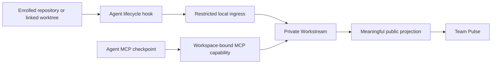

# Safe automatic Coding Agent integration

## Outcome

Turn the existing adapter kernel into one runnable MVP path for Codex, Claude
Code, and OpenCode:



The user can install, diagnose, repair, and uninstall the integrations from
Settings. A Coding Agent session in an enrolled Workspace creates a private
Workstream automatically, and the Agent can use MCP without knowing Intero
UUIDs. A semantic checkpoint reaches Team Pulse. No prompt, response, complete
tool input/output, terminal output, file content, or credential becomes a work
event or installer backup.

This is a development MVP acceptance boundary, not a signed/notarized desktop
distribution.

## Inputs and current evidence

- Product requirements F1 and R2-R4 define the automatic observation,
  checkpoint, privacy, and Workspace boundaries.
- The existing hook bridge, canonical-event reducer, Local Representative,
  Workstream storage, public projection, and desktop Settings shell are
  reusable.
- Current local versions are Codex `0.146.0-alpha.3.1`, Claude Code `2.1.214`,
  and OpenCode `1.17.4`.
- Repository review found that the installer is test-only, MCP requires
  undiscoverable UUIDs, linked worktrees do not resolve, Codex/Claude instruction
  files are not auto-loaded, and the OpenCode plugin uses the wrong event shape.
- Contract review confirmed that `Stop` is a turn boundary rather than a session
  end, OpenCode `tool.execute.after` is a dedicated plugin hook, and Codex hook
  trust remains a native user decision.
- Security review identified three release blockers in the existing design:
  raw content-bearing hook events, a shared daemon administrator token, and
  whole-file backups of global Agent configuration.

## Assumptions

- Automatic observation is intentionally limited to content-free session
  lifecycle events in this MVP. Material intent, validation, blocker, and
  completion updates come through explicit, Workspace-bound MCP checkpoints.
- Codex user hooks require a one-time native trust approval. Intero reports
  `pending_trust` and does not write Codex's private trust hash.
- The managed installer edits only Intero-owned nodes or marked blocks and
  removes only those nodes. It never copies an entire user configuration file
  into `~/.intero`.
- The daemon derives repository identity. A sibling directory is authorized
  only when it is a linked worktree whose canonical Git common directory equals
  that of an enrolled root. A same-remote ordinary clone is not authorized.
- MCP context binds to the newest active same-source Agent session in the
  current enrolled Workspace. Explicit internal UUIDs are not exposed to the
  Agent. Concurrent same-source sessions in one Workspace must remain distinct
  through their vendor session IDs.
- The current local daemon connection descriptor is embedded in the managed
  registration. Moving the Intero data directory requires a repair/reinstall.

## Non-goals

- Raw transcript, prompt, response, tool payload, terminal log, or file-content
  ingestion.
- Inferring completion from `Stop`, `session.idle`, or a process exit.
- Automatic authorization of ordinary clones, arbitrary parent directories,
  symlink aliases, or repositories that only share a remote URL.
- Signed desktop packaging, daemon auto-update, notarization, or production
  process supervision.
- Full retention/purge UX, Windows named-pipe hardening, or automatic semantic
  interpretation of edits and test output.

## Unit 1 — Capability-separated local ingress and Workspace identity

### Changes

- Generate separate administrator, hook-ingress, MCP, and sidecar descriptors
  with independent tokens and least-privilege method allowlists. Managed Agent
  registrations receive only the hook or MCP descriptor path; no shared
  descriptor contains all capabilities.
- Authorize each JSON-RPC method against an explicit capability matrix:
  - hook ingress: resolve an enrolled context and submit a closed lifecycle
    event only;
  - MCP: resolve its bound context and invoke Representative MCP operations
    only;
  - sidecar: dequeue/complete Representative work and persist reduced state;
  - administrator/Desktop: Workspace and settings management.
- Replace prefix-based Representative dispatch for Agent callers with
  method-specific parsing and a closed lifecycle-event schema.
- Derive canonical Git common-directory identity during enrollment and context
  resolution. Match enrolled roots and legitimate linked worktrees only.
- Add durable lookup for the latest active integration session by
  Workspace/source.

### Primary files

- `crates/interod/src/main.rs`
- `crates/interod/src/rpc.rs`
- `crates/interod/src/workspace.rs`
- `crates/interod/src/storage.rs`
- `packages/local-ipc/src/index.ts`

### Acceptance

- Hook and MCP capabilities are denied for Workspace enrollment, file reads,
  event listing, model settings, and sidecar dequeue.
- Tests construct clients from only their issued descriptor. This separates
  Intero components and limits accidental/cross-component authority; it does not
  claim to sandbox an already-compromised same-UID process that can read the
  user's home directory.
- An enrolled root and a real sibling linked worktree resolve to one Workspace;
  an ordinary clone and a forged `.git` pointer fail closed.
- Unregistered directories create no session, queue item, event, or public
  projection.

## Unit 2 — Content-safe adapters and UUID-free MCP

### Changes

- Register lifecycle-only automatic events whose vendor payload contracts do
  not contain prompt, response, or tool content:
  - Codex: `SessionStart`, `SessionEnd`;
  - Claude Code: `SessionStart`, `SessionEnd`;
  - OpenCode: `session.created`, `session.idle`, and `session.deleted`, with
    correct nested session identifiers.
- Do not register `UserPromptSubmit`, `Stop`, `PreToolUse`, `PostToolUse`, or
  content-bearing generic events in the automatic hook path.
- Parse only bounded lifecycle fields from a maximum 64 KiB payload, discard
  the source object immediately, produce no successful stdout, and fail open
  without echoing errors or paths. Reject unknown lifecycle event names instead
  of forwarding them.
- Generate stable idempotency from source, vendor session ID, event name, and
  vendor event/call ID when available.
- Start MCP with source and working-directory binding. Add
  `representative.current_context`, remove Workspace/Workstream UUIDs from the
  public tool schemas, and resolve them internally.
- Keep explicit MCP checkpoints as Claims. Add normalized forbidden-key and
  secret-pattern checks, tighter summary/evidence limits, and never publish raw
  checkpoint content without the existing Representative projection policy.

### Primary files

- `apps/mcp-stdio/src/index.ts`
- `apps/mcp-stdio/src/hook.ts`
- `apps/mcp-stdio/src/tools.ts`
- `packages/integrations/src/index.ts`
- `packages/domain/src/events.ts`
- `apps/local-representative/src/runtime.ts`
- `packages/representative-core/src/public-projection.ts`

### Acceptance

- Vendor fixtures containing canaries in forbidden fields produce zero canary
  matches in events, queues, logs, diagnostics, and integration state.
- The Agent can call `current_context` and `report_checkpoint` without internal
  UUIDs.
- Session start creates a visible active Workstream; idle does not claim
  completion; an explicit completion checkpoint does.
- Duplicate lifecycle delivery does not duplicate a Workstream or projection.

## Unit 3 — Reversible current-version installation

### Changes

- Replace whole-file backups with managed JSON nodes, TOML blocks, instruction
  blocks/files, and plugin files. Record only Intero-owned node identity,
  installed-value hash, and ownership marker. No original config value is
  copied into Intero state.
- On upgrade, remove the previous Intero node before adding the new one. On
  uninstall, remove only an unchanged Intero-owned node; report conflicts
  rather than restoring a stale global file.
- Respect `CODEX_HOME`, `CLAUDE_CONFIG_DIR`, and `OPENCODE_CONFIG_DIR`.
- Install auto-loaded user instructions:
  - Codex: a managed block in `AGENTS.md`;
  - Claude Code: `rules/intero.md`;
  - OpenCode: `intero.md` referenced by `instructions`.
- Register each MCP server with source, cwd, and connection descriptor
  arguments. Generate the OpenCode plugin against the `1.17.4` event contract
  with a short fail-open child-process timeout.
- Add an `intero-mcp integration install|status|repair|uninstall` CLI for one
  adapter or all adapters.
- Report staged diagnostics:
  `not_detected`, `not_installed`, `config_written`, `pending_trust`,
  `blocked_by_policy`, `healthy`, or `needs_repair`.

### Primary files

- `packages/integrations/src/index.ts`
- `packages/integrations/src/installer.ts`
- `packages/integrations/src/*.test.ts`
- `apps/mcp-stdio/src/index.ts`
- `apps/mcp-stdio/package.json`

### Acceptance

- Install, reinstall with a changed executable/descriptor, user edit, repair,
  conflict, and uninstall all preserve unrelated user configuration.
- A fake credential in an existing Agent config remains only in the original
  file and never appears under `~/.intero`.
- Codex reports pending trust rather than silently bypassing it.
- Each Agent CLI parses and lists the Intero MCP registration.

## Unit 4 — Desktop Settings control surface

### Changes

- Add narrow Electron Main IPC for status, preview, install/repair, and
  uninstall. The renderer may pass only an adapter enum and action; Main derives
  home/config roots, executable, and connection path. Mutations require a
  renderer-visible preview followed by a direct user click.
- Reject subframes and non-application senders, serialize mutations, and expose
  no config contents or credentials.
- Add three integration cards with detected version, lifecycle/MCP status,
  privacy disclosure, Codex trust guidance, and install/repair/uninstall
  actions.
- Add complete English and Simplified Chinese strings and truthful
  loading/success/error states.

### Primary files

- `apps/desktop/src/main/index.ts`
- `apps/desktop/src/preload/index.ts`
- `apps/desktop/src/renderer/src/vite-env.d.ts`
- `apps/desktop/src/renderer/src/views/SettingsView.tsx`
- `apps/desktop/src/renderer/src/i18n.ts`
- `apps/desktop/src/renderer/src/styles.css`

### Acceptance

- Settings installs and removes all three integrations without accepting
  arbitrary paths or commands from the renderer.
- Restarting the desktop preserves and accurately diagnoses state.
- Chinese and English render complete integration status and action text.

## Unit 5 — Real-Agent vertical acceptance

### Sequence

1. Build the daemon, sidecar, MCP bridge, and desktop.
2. Start the standard development stack with one stable connection descriptor.
3. Enroll the Intero repository, then install all three integrations through
   the shipped management surface.
4. Validate CLI configuration parsing and MCP initialize/list-tools for Codex,
   Claude Code, and OpenCode.
5. Run a real Codex session with native hook trust bypassed only for this
   controlled smoke test, and direct it to call the Intero checkpoint MCP tool.
6. Verify one lifecycle event, one automatically created Workstream, one
   UUID-free checkpoint Claim, and its Team Pulse projection.
7. Verify an unregistered directory and a same-remote clone create no state.
8. Exercise reinstall and uninstall in an isolated home with a fake credential
   canary.

### Gates

```bash
corepack pnpm format:check
corepack pnpm lint
corepack pnpm test
corepack pnpm build
cargo fmt --all --check
cargo clippy --workspace --all-targets -- -D warnings
cargo test --workspace
```

The implementation may merge only after two plan reviews, at least two code
review/fix passes, no unresolved P0-P2 findings, and the real Codex vertical
smoke. Claude Code and OpenCode require real config/MCP handshake proof; their
model-backed sessions are optional if authentication or cost would make the
acceptance non-deterministic.

## Risks and fallbacks

- **Vendor hook drift:** fail open, mark diagnostics `needs_repair`, and preserve
  MCP-only operation.
- **Codex hook trust:** show `pending_trust`; never modify private trust state.
- **Concurrent session ambiguity:** bind by vendor session ID; if the MCP
  process cannot provide it, return an explicit ambiguous-context error rather
  than choosing another session.
- **Config conflicts:** stop and surface the exact Intero-owned node that
  conflicts; do not overwrite or restore a whole file.
- **Daemon unavailable:** hooks exit silently and Agents continue normally.
- **Public noise:** session lifecycle changes private state; only first active
  Workstream and explicit organizational checkpoints create public
  projections.

## Plan review record

### Review 1 — contract and product flow

- Replaced inert Codex/Claude instruction files with real user-level loading
  surfaces.
- Removed `Stop` and tool/prompt hooks from automatic lifecycle semantics.
- Corrected OpenCode nested session IDs and dedicated hook/event boundaries.
- Made UUID-free MCP context and a real Agent call part of the exit criteria.
- Distinguished configuration presence, MCP handshake, hook trust, event
  ingestion, and UI projection as separate evidence.

### Review 2 — security and feasibility

- Rejected whole-file configuration backups and stale-file restoration.
- Split local RPC roles into separate descriptors and explicit method
  allowlists, while documenting the same-UID sandbox boundary honestly.
- Limited hook input to known, content-free lifecycle contracts and 64 KiB.
- Required linked-worktree common-directory proof instead of remote or path
  heuristics.
- Added preview/user-gesture constraints to Electron mutations and fail-closed
  conflict handling to the installer.
- Deferred signed packaging, production supervision, retention UX, and automatic
  semantic inference so the vertical MVP remains testable in this repository.
