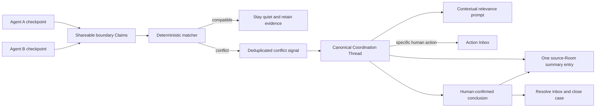

# R1/R2 coordination-kernel implementation plan

## Outcome

Prove one production-shaped collaboration loop:

```text
two authorized Agent Work States
→ one explainable compatibility decision
→ zero noise for the compatible control
→ one bounded coordination branch for the conflict
→ one silently refreshed source-Room entry
→ one human-confirmed closure
```

This plan implements R1 and R2 from the
[product roadmap](../PRODUCT_ROADMAP.md). It does not implement Capability
Health, generic semantic work discovery, or an adaptive workflow-mode engine.

It proves the Work State conflict and low-noise coordination slice of the
[Intero Golden Case](../GOLDEN_CASE.md). The full Golden Case additionally
requires Team-room `@Intero` behavior, automatic single-Project and
cross-Project scope routing, the ambiguous-scope branch, and the complete
human-readable browser flow. Those requirements are not implied by the local
R1/R2 implementation evidence alone.

## Implementation status — 2026-07-31

The production-shaped R1/R2 path is implemented in the current change set:

- `stand_in.report_checkpoint` accepts tightly bounded, explicitly
  project-visible `sharedBoundaries`;
- distinct `PilotSharedBoundaryClaim` records retain owner, binding, Work
  State, checkpoint, freshness, revision, supersession, and withdrawal
  provenance;
- a deterministic matcher classifies compatible, potential-conflict, and
  insufficient-evidence pairs without allowing model output to create a
  conflict;
- PostgreSQL migration `0037_r1_r2_coordination_kernel.sql` persists Claims,
  multi-source case provenance, contextual relevance, canonical Thread links,
  and the `work_state_conflict` signal under tenant RLS;
- one `CoordinationKernel` materializes a canonical child Thread and one
  structured `coordination_summary` message in the authorized source Room;
- Room summary refresh updates the same message revision without advancing the
  Room sequence;
- passive relevance is locally contextual, dismissible, mutable, and
  revisit-able without creating Action Inbox work;
- proposing a conclusion creates the explicit confirmation action, while only
  the responsible participant may confirm and close the specialized child
  branch;
- generic parent-message conclusion is rejected for managed coordination
  branches, preserving the single Room summary.

Local evidence completed:

- matcher coverage for normalization, compatible control, conflict, unknown,
  same-owner, superseded, withdrawn, and stale Claims;
- an MCP evaluation pair with two validated Agent bindings proves zero control
  noise, one conflict case, replay safety, one canonical Thread, one Room
  summary, in-place refresh, responsible-participant confirmation, and
  relevance dismissal/revisit;
- a clean disposable PostgreSQL database migrated from `0000` through `0037`;
- normalized PostgreSQL persistence, multi-source provenance, signal
  uniqueness, RLS, structured message metadata, in-place summary revision, and
  idempotent child-branch closure passed integration tests;
- repository TypeScript, Prettier, unit/API tests, production builds, and all
  locally runnable PostgreSQL/worker integration suites passed.

The roadmap gates remain evidence-gated rather than marked proven. Still
required before calling R1/R2 exited:

- browser acceptance for the control, conflict, relevance, and confirmation
  experience;
- a separately recorded real-provider canary through the durable deployed
  worker path;
- target-environment migration and release validation.

## Starting code reality

At plan creation, Intero already had useful parts of the loop:

- `stand_in.report_checkpoint` accepts structured semantic Work State through
  the real MCP path.
- `PilotStandInJobHandler` publishes a privacy-safe Team Pulse projection.
- project automation can deduplicate explicit blocker, dependency, stale
  review, unresolved coordination, and carryover signals.
- `PilotCoordinationThread` supports open, needs-confirmation, and resolved
  states.
- canonical conversations already support `kind: "coordination"`,
  `parentThreadId`, realtime `message_updated`, and concluding a branch back to
  its parent.
- Action Inbox already supports deduplication, resolution, preferences, and
  browser delivery.

The starting path did **not** yet prove R1 or R2:

- Stand-in evaluation sees one checkpoint at a time and cannot compare two
  active Work States.
- the automation detector reacts mainly to explicit event kinds and project
  records; it does not detect incompatible assumptions on a shared boundary.
- coordination records are adapted into conversation-shaped UI data rather
  than linked to one canonical conversation Thread.
- automation currently conflates a relevant participant with a person who
  needs an Action Inbox item.
- a generic branched conversation posts a new conclusion message into its
  parent; R2 requires one source-Room summary entry that is revised in place.

## Implementation principles

### 1. Explicit shared boundary before general semantic inference

R1 should not begin by asking a model to compare arbitrary natural-language
summaries. Coding Agents should be able to report a small, deliberately
project-visible shared-boundary declaration. A deterministic matcher decides
the control/conflict pair. A model may write the safe explanation after the
match.

This separates:

- private Work State;
- an explicit shareable coordination Claim;
- a deterministic compatibility result;
- an optional model interpretation;
- a human-confirmed conclusion.

### 2. A conflict has multiple sources

Do not force a two-party conflict into the current singular
`workStateId/sourceRef` shape. Preserve both Work States, both boundary Claims,
their owners, freshness, and provenance. Legacy single-source blocker paths may
continue to use their existing fields during migration.

### 3. One canonical discussion Thread

The actual temporary discussion must be a canonical `ConversationThread` with
`kind: "coordination"` and `parentThreadId` pointing to the source Room.
Coordination metadata may remain a separate record, but it must link to that
Thread instead of being synthesized into a second conversation model.

### 4. Relevance is not action

Keep three separate sets:

- participants who may enter the bounded discussion;
- people for whom the discussion is contextually relevant;
- people who currently owe a decision, review, confirmation, or commitment.

Only the third set creates Action Inbox work.

## Candidate shareable boundary contract

Add an optional, backward-compatible field to the checkpoint tool. The exact
names must be settled in the domain contract before migration, but R1 needs
semantics equivalent to:

```ts
sharedBoundaries: Array<{
  key: string;
  kind: "api" | "schema" | "permission" | "module" | "release" | "other";
  relation: "changing" | "depending_on" | "validating";
  assumption: string;
  change: "additive" | "compatible" | "breaking" | "unknown";
  preserves: string[];
}>;
```

Constraints:

- the field is explicitly project-visible;
- values are short semantic identifiers or statements, never prompts, files,
  diffs, terminal output, logs, or secrets;
- Agent instructions explain that omission is valid;
- server validation applies tight size and item limits;
- source Agent, owner, Project, Work State, checkpoint event, and observation
  time remain attached;
- withdrawal or superseding Work State makes prior Claims inactive.

Do not reuse `PilotPrivateClaim` as project-visible input. Persist a distinct
shareable record such as `PilotSharedBoundaryClaim`.

## R1 — Coordination kernel

### R1.1 — Build the evaluation pair first

Create one clean disposable Project, source Room, Alex, Priya, and two real
Agent bindings.

Use one shared key, for example `api:retry-config/field-name`.

Control:

- Alex reports a compatible transition to `retryAfterMs` while preserving
  `retryDelayMs`.
- Priya reports a dependency on `retryDelayMs`.
- result: `compatible`; no signal, Thread, relevance prompt, or Inbox item.

Conflict:

- Alex reports a breaking removal of `retryDelayMs` in favor of
  `retryAfterMs`.
- Priya reports a dependency on `retryDelayMs`.
- result: one `work_state_conflict` signal and one Coordination Thread.

The fixture may create people, Projects, Rooms, and Agent bindings. It must not
seed automation signals, Coordination records, summary entries, or Inbox
items.

### R1.2 — Persist shareable boundary Claims

On successful Stand-in processing:

1. validate and normalize explicit boundary keys;
2. persist active project-visible Claims with provenance;
3. supersede prior Claims from the same Work State and boundary;
4. emit a privacy-safe `work_state.shared_boundaries_changed` outbox event.

Use a project-serialized durable job. Keep a bounded reconciliation scan so a
lost queue notification cannot lose detection.

### R1.3 — Add a deterministic matcher

For every changed Claim:

1. load active Claims for the same Project and normalized boundary key;
2. exclude the same owner and withdrawn or stale Work State;
3. compare a producer change with consumer assumptions;
4. classify `compatible`, `potential_conflict`, or `insufficient_evidence`;
5. create product work only for `potential_conflict`.

Minimum R1 rule:

- `compatible` or `additive` stays quiet when the consumer assumption appears
  in `preserves`;
- `breaking` conflicts when an active consumer depends on an assumption that
  is not preserved;
- `unknown` is retained as evidence but does not automatically open a Thread.

The match result must cite the exact boundary and both Claims. Model output may
turn that result into concise `safeContext` and candidate questions, but cannot
upgrade `insufficient_evidence` to a product conflict.

### R1.4 — Make conflict identity multi-source and idempotent

Add:

- a dedicated automation kind such as `work_state_conflict`;
- `coordination_sources` linking the case to both Work States and Claims;
- a stable dedupe key derived from Project, normalized boundary, sorted source
  Work State IDs, and the matched Claim revisions;
- an explicit link from the coordination case to its canonical conversation
  Thread.

Serialize detection per Project and use a database uniqueness constraint for
the dedupe key. Replaying either checkpoint, worker job, or outbox event must
reuse the same active case.

### R1.5 — Validate through the real chain

Required coverage:

- matcher unit tests for control, conflict, unknown, superseded, withdrawn, and
  stale Claims;
- PostgreSQL integration tests for provenance, tenant isolation, multi-source
  persistence, and uniqueness;
- worker tests for replay, retry, outbox reconciliation, and per-Project
  serialization;
- API/MCP tests that submit both checkpoints through
  `stand_in.report_checkpoint`;
- browser acceptance showing the clean control and conflict outcomes;
- a separately recorded real-provider canary after deterministic CI passes.

## R2 — Low-noise collaboration

### R2.1 — Materialize one canonical Coordination Thread

When R1 creates a conflict case:

1. resolve the authorized source Room for the Project and evaluation scenario;
2. create or reuse one canonical conversation with
   `kind: "coordination"`, `projectId`, and `parentThreadId`;
3. add only authorized affected participants;
4. link the coordination case to the conversation Thread;
5. stop adapting the same case into a second synthetic Thread payload.

Do not automatically widen Room or Project visibility.

### R2.2 — Add one source-Room summary entry

Create one first-class Room entry linked to the coordination case. Prefer a
semantic message kind such as `coordination_summary` rather than a Markdown
prefix that the UI must guess.

The entry should carry:

- linked Coordination Thread ID;
- status: open, waiting, needs-action, or resolved;
- short situation;
- affected boundary and people;
- current conclusion or unresolved question;
- whether anyone owes an action;
- freshness and source count.

Creation may advance the Room sequence once. Refresh must update the same
message ID and revision, emit `conversation.changed` with
`reason: "message_updated"`, and leave Room sequence, unread state, ordering,
and ordinary notification delivery unchanged.

The existing realtime in-place message repair is the implementation primitive,
but expose a coordination-summary-specific store method instead of treating a
durable summary as a generic streaming message.

### R2.3 — Refresh quietly and safely

Debounce a durable summary job by Coordination Thread ID when authorized branch
state changes.

The parent-Room summary has a broader audience than the temporary discussion.
Generate it only from:

- the original shareable conflict Claims;
- project-safe coordination state;
- explicit human actions;
- the confirmed conclusion.

Do not summarize arbitrary private Agent state or disclose details merely
because they appeared inside the smaller branch.

### R2.4 — Show contextual relevance

Persist a relevance reason per authorized affected principal, with dismissed
and muted state. The Web client shows the prompt only when:

- that principal is currently viewing the source Room;
- the summary entry is visible;
- the relevance record is active and not dismissed or muted.

The prompt explains the shared boundary or dependency and offers open, dismiss,
mute, and revisit. It does not create unread state, browser notification, or
Action Inbox work.

Presence is not required for R2. “Currently viewing” can be local client state;
the server only needs the durable relevance and authorization facts.

### R2.5 — Route only required action

Change automation so opening a conflict does not automatically create Inbox
items for all target or relevant people.

Create or update one deduplicated Action Inbox item only when the case records
an explicit action requirement, such as:

- confirm the selected compatibility window;
- review an identified contract choice;
- accept a stated risk;
- choose a responsible person;
- confirm the final conclusion.

Resolve that item transactionally when the required action completes.

### R2.6 — Close into the same Room entry

For canonical coordination branches, closure must:

1. require a human-confirmed conclusion;
2. mark the coordination case resolved;
3. mark the canonical branch concluded;
4. replace the existing Room summary with the final structured result;
5. resolve the matching Action Inbox item;
6. emit auditable and idempotent events.

Keep the existing “append a conclusion to the parent” behavior for generic
human-created branches. Coordination closure uses the specialized in-place
summary path so the source Room does not receive a second result message.

## End-to-end flow



## Delivery order

Implement and review in these slices:

1. evaluation fixture and matcher contract;
2. shareable Claim persistence and event-driven matcher;
3. multi-source signal and case identity;
4. canonical Coordination Thread linkage;
5. source-Room summary creation and silent revision;
6. relevance prompt and durable dismiss/mute state;
7. explicit Action Inbox requirement and transactional closure;
8. full control/conflict browser evaluation and real-provider canary.

Do not begin summary generation or relevance UI before the R1 control case can
stay quiet. Otherwise R2 will optimize the presentation of an unproven
detection mechanism.

## Hard gates

- no raw private activity crosses the shareable Claim boundary;
- one control run and three replays create zero coordination noise;
- one conflict run and three replays create exactly one active signal, case,
  conversation Thread, Room summary, and at most one required Inbox item;
- summary refresh does not change Room sequence or unread count;
- passive relevance never creates Action Inbox work;
- the final conclusion is human-confirmed and visible consistently from the
  Room and Coordination Thread;
- tenant isolation, participant visibility, provenance, idempotency, and
  human-authority failures are release blockers.

## Deferred

- arbitrary natural-language conflict discovery;
- automatic participant addition outside existing authorization;
- cross-Project conflict detection;
- automatic Bug, Spec, Feature, or Work Item mutation;
- workflow-stage inference or policy adaptation;
- Capability Health and capability graphs;
- replacing external project, code, CI, or test systems.
