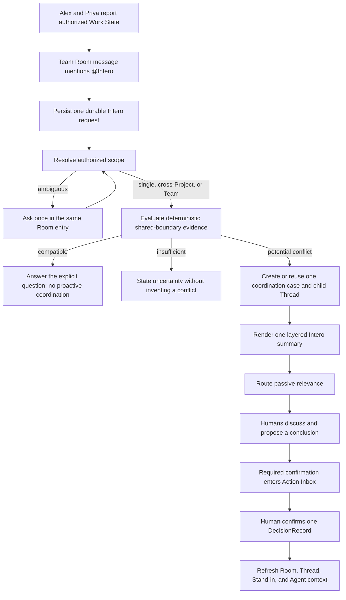

# Golden Case delivery plan

## Outcome

Deliver the canonical [Intero Golden Case](../GOLDEN_CASE.md) as one
production-shaped, repeatable path:

```text
authorized Work State from two Projects
→ natural conversation in one Team Room
→ one visible @Intero identity
→ correctable cross-Project scope
→ deterministic conflict evidence
→ one prepared temporary discussion
→ one plain-language Room entry refreshed in place
→ one human-confirmed decision
→ one bounded result returned to authorized work surfaces
```

This plan turns the existing R1/R2 coordination kernel into the complete
Team-room product experience. It deliberately delivers vertical slices: every
stage must produce something a user can see, understand, and test before the
next layer is justified.

## What this plan does not do

This plan does not introduce:

- a separate user-visible Agent for every Project;
- a generic multi-Agent orchestration framework;
- autonomous priority, staffing, schedule, approval, or release decisions;
- full Capability Health or repository-wide capability reconstruction;
- private prompt, source file, diff, terminal, or conversation collection;
- a replacement for every external chat, Git, CI, test, or project-management
  system.

Projects remain internal state, evidence, and authorization scopes. People in
a shared Room interact with one Agent named `Intero`.

## Current implementation reality

The current R1/R2 change set is an enabling slice, not proof of the Golden
Case. Treat the following as working-tree evidence until it is committed,
deployed, and canaried.

| Capability                    | Current reality                                                                                         | Golden Case gap                                                                                              |
| ----------------------------- | ------------------------------------------------------------------------------------------------------- | ------------------------------------------------------------------------------------------------------------ |
| Explicit shareable Work State | `stand_in.report_checkpoint` accepts bounded shared-boundary Claims                                     | The fixed fixture must span `Auth Platform` and `Mobile App` in one Team Room                                |
| Conflict classification       | The deterministic matcher distinguishes compatible, potential-conflict, and insufficient-evidence pairs | `matchSharedBoundaryClaims` rejects Claims from different Projects                                           |
| Coordination identity         | A stable multi-source coordination record and dedupe key exist                                          | The record and unique identity are anchored to one required `projectId`                                      |
| Temporary discussion          | The kernel creates one canonical child `ConversationThread`                                             | It discovers a source Room by matching one Project instead of using the triggering Team Room                 |
| Room summary                  | One `coordination_summary` message is refreshed in place                                                | The first human participant is currently used as sender instead of Intero                                    |
| Relevance and action          | Passive relevance is separate from confirmation-only Action Inbox work                                  | The Golden browser flow and Team-room relevance prompt are not yet proven                                    |
| Shared Agent identity         | Principal contracts already allow `kind: "service"`                                                     | No stable Intero service principal is provisioned or offered by the mention picker                           |
| Chat ingress                  | Messages persist exact `mentionedPrincipalIds`                                                          | Mentioning Intero does not enqueue or run a shared-Agent turn                                                |
| Scope routing                 | Rooms can carry `teamId` and Projects carry participating Team IDs                                      | There is no single/cross-Project/Team/ambiguous resolution record or correction path                         |
| Human-readable brief          | The summary retains deterministic conflict context and source count                                     | It does not yet separate plain-language impact, exact facts, model interpretation, and human decision        |
| Human authority               | Coordination confirmation and `DecisionRecord` already exist                                            | Confirmation does not yet create one structured cross-Project result and expose it back to authorized Agents |
| End-to-end proof              | Existing tests cover the coordination kernel and an earlier collaboration chain                         | There is no fixed Alex/Priya Team-room Golden Case covering every comparison branch                          |

The implementation must extend these useful parts instead of building a
parallel conversation, coordination, or Inbox model.

## Product and architecture decisions

### 1. Intero is one Room-visible service identity

Provision a deterministic service principal for each Agent-readable shared
Room. Its user-facing name is always `Intero`; its internal Room-local identity
keeps authorization narrower than one organization-wide super-principal.

- `Intero` appears in the mention picker for `agent_readable` shared Rooms.
- It is not a personal Stand-in and never impersonates a human participant.
- Intero-authored replies, child-discussion context, and Room summaries use the
  service principal as `senderId`.
- A human-only encrypted Room cannot invoke server-side Intero until a human
  explicitly changes the Room access mode.
- Provisioning and retries resolve to the same principal rather than creating
  duplicate bot identities.

This is an internal authorization decision, not a second concept users need to
learn. Users only see `@Intero`.

### 2. A mentioned Room message becomes one durable Intero request

Persist the human message first. If its exact `mentionedPrincipalIds` includes
that Room's Intero principal, create one durable request keyed by the source
message ID and enqueue an outbox event containing identifiers only.

Introduce a small `PilotInteroRequest` record with semantics equivalent to:

```ts
type PilotInteroRequest = {
  id: string;
  organizationId: string;
  teamId: string;
  sourceRoomThreadId: string;
  sourceMessageId: string;
  requestedByPrincipalId: string;
  status: "pending" | "needs_scope" | "coordinating" | "answered" | "failed";
  scopeRevision: number;
  responseMessageId?: string;
  coordinationThreadId?: string;
};
```

The durable worker reloads the authorized Room, message, Projects, Claims, and
participants. Raw message bodies do not belong in queue payloads or logs.
Replaying the API request, outbox event, or worker job must update the same
request and response artifacts.

### 3. Scope resolution is explicit, correctable, and cannot grant access

Use one domain result shared by deterministic routing, the UI, persistence, and
tests:

```ts
type InteroScopeResolution =
  | {
      kind: "single_project";
      teamId: string;
      projectIds: [string];
      evidence: ScopeEvidence[];
    }
  | {
      kind: "cross_project";
      teamId: string;
      projectIds: [string, ...string[]];
      evidence: ScopeEvidence[];
    }
  | {
      kind: "team";
      teamId: string;
      projectIds: string[];
      evidence: ScopeEvidence[];
    }
  | {
      kind: "ambiguous";
      teamId: string;
      candidates: ScopeCandidate[];
      question: string;
    };
```

Candidate Projects must first pass deterministic eligibility checks:

1. they participate in the source Room's Team;
2. the requesting human and Intero can access the required shared context;
3. evidence comes from the Room, explicitly linked objects, exact Project or
   boundary identifiers, participants, or authorized shared Work State;
4. inaccessible candidates are removed before any model ranking;
5. model output may rank or explain eligible candidates but can never add a
   Project or reveal the existence of inaccessible context.

When evidence is insufficient, Intero asks one short clarification in the same
Room entry. A human correction increments `scopeRevision` and recomputes the
same request; it must not create a new discussion, summary, or Inbox item.

### 4. Cross-Project coordination has a Team scope and Project membership

Individual shared-boundary Claims remain Project-scoped. A coordination case
may reference several of those Projects when an authorized Team Room connects
them.

Add:

- `teamId` and `scopeKind` to the coordination case;
- a `pilot_coordination_projects` membership table linking one case to all
  participating Projects;
- source Room and source message provenance;
- an identity fingerprint based on Team, sorted Project IDs, normalized
  boundary, source Work States, and Claim revisions.

Keep the existing singular `projectId` temporarily as a compatibility anchor
for old R1/R2 records, but do not treat it as the access truth for a
cross-Project case. Authorization must validate the source Room and every
referenced Project membership.

Do not merely remove the matcher's same-Project guard. Add an explicitly scoped
evaluation entry point that accepts only the already authorized candidate
Claims. It may compare Claims across the allowed Project set; the existing
single-Project path remains a strict subset.

Migration rule:

- if migration `0037_r1_r2_coordination_kernel.sql` has not been applied in any
  shared environment, extend it and regenerate its metadata before landing;
- if it has been applied anywhere, leave it immutable and add a forward-only
  migration;
- backfill existing coordination records into the membership table before
  switching reads or authorization;
- keep dual-read compatibility until the backfill and target canary pass.

### 5. The triggering Team Room is authoritative

Chat-triggered coordination receives `sourceRoomThreadId` and
`sourceMessageId` from the durable request. It must not search for a convenient
Project Room.

For an unprompted high-confidence conflict, Intero may select only an
Agent-readable Team Room that:

- represents the Team shared by all participating Projects;
- is visible to every included participant;
- has a deterministic product-designated coordination role;
- has not already received an entry for the same conflict fingerprint.

If no such Room exists, retain the conflict as authorized internal state and do
not guess a public destination.

### 6. One message is both the bot response and the quiet summary

For the Golden path, Intero must not post a chat reply and then add a second
status card. The one Intero-authored `coordination_summary` entry is:

- the answer to the `@Intero` mention;
- the entrance to the temporary discussion;
- the scope correction surface;
- the silently refreshed progress summary;
- the final resolved result.

Repeated evidence updates this message through `message_updated` without
advancing the Room sequence or notifying everyone again. A proactive conflict
uses the same artifact, so retry and prompted/proactive races converge.

### 7. Human-facing output has three explicit layers

Store structure first and render prose second:

```ts
type CoordinationBrief = {
  headline: string;
  whatChanged: string;
  whyItMatters: string;
  needsFromYou: string;
  scope: { kind: string; projectIds: string[] };
  facts: Array<{ label: string; value: string; sourceRef: string }>;
  interpretations: Array<{ statement: string; confidence: string }>;
  options: Array<{ id: string; label: string; tradeoff: string }>;
  humanDecision?: {
    outcome: string;
    decidedBy: string[];
    confirmedAt: string;
  };
  freshnessAt: string;
};
```

The first layer should answer, in the user's language:

1. What happened?
2. Why does it matter?
3. Does anyone need to act now?

Exact identifiers, Claim statements, validation evidence, freshness, and source
references remain one disclosure level deeper. Model-written prose must not
blend facts, interpretations, or human decisions. If the provider fails, a
deterministic plain-language fallback still opens a usable discussion.

### 8. Intero proposes; humans commit

The temporary discussion may produce options and a proposed conclusion.
Priority, owner, schedule, approval, compatibility window, and external
commitments remain unconfirmed until the responsible human acts.

On confirmation:

1. close the existing Action Inbox item idempotently;
2. create one `DecisionRecord` using the coordination Thread as
   `sourceThreadId` and both Projects plus the boundary as `affectedScopes`;
3. store the structured human decision on the coordination brief;
4. refresh the same Room message to its resolved state;
5. expose the confirmed decision as bounded current context to authorized
   personal Stand-ins and Coding Agents on their next context read;
6. never rewrite private Work State or claim that an implementation changed
   until new evidence reports that change.

The result is a shared, reviewable decision—not an Agent silently editing
project reality.

### 9. Bot initiative follows an attention budget

- An explicit `@Intero` mention receives one response, including a short scope
  clarification when needed.
- A compatible control with no mention creates zero proactive artifacts.
- A deterministic, fresh, authorized, high-confidence conflict may create one
  proactive summary/discussion entry.
- Insufficient evidence remains quiet unless a human explicitly asks Intero.
- Passive relevance produces a local invitation, not an Inbox item.
- Only a required human decision, review, confirmation, or commitment enters
  Action Inbox.

## Target flow



## Delivery slices

### G0 — Freeze the fixture and protect the migration boundary

**User-visible result:** none; this is the shortest necessary safety step.

Implement the fixed `Intero Lab`, `#engineering`, Alex, Priya, `Auth Platform`,
`Mobile App`, and `retryDelayMs` fixture as reusable test builders. Record
whether migration `0037` is unapplied or already shared before changing its
shape.

Deliver:

- a Golden Case fixture factory that seeds people, Team, Projects, Room,
  bindings, and Claims—but never seeds the expected conflict artifacts;
- stable test IDs only inside the fixture;
- baseline assertions proving the current single-Project kernel still works;
- a migration decision recorded in this plan's implementation status when work
  begins.

Exit evidence:

- control and conflict inputs can be created repeatedly from clean state;
- no test depends on an existing developer database;
- the migration route is explicitly safe for the environments that exist.

### G1 — Make `@Intero` real in one shared Room

**User-visible result:** a person can mention Intero and receive one reply from
Intero—not from a human or personal Stand-in.

Deliver:

- deterministic Room-local Intero service-principal provisioning;
- Intero in the Room mention picker and mention rendering;
- durable `PilotInteroRequest` persistence and outbox processing;
- one idempotent Intero-authored response for a simple single-Project Room;
- an explicit unsupported-access response or disabled affordance for
  human-only encrypted Rooms.

Do not add scope inference or coordination creation beyond the Room's explicit
single Project in this slice.

Exit evidence:

- message sender and mention target are the Intero service principal;
- API replay and worker retry retain one request and one response;
- personal Stand-in mention behavior remains unchanged;
- unauthorized principals cannot invoke or read the Intero turn.

### G2 — Resolve and correct Team-room scope

**User-visible result:** the same `@Intero` interaction displays a correctable
scope: single Project, cross-Project, Team, or ambiguous.

Deliver:

- the shared `InteroScopeResolution` domain contract;
- deterministic candidate collection from Team membership, explicit Project
  and boundary references, participants, and authorized Work State;
- optional provider-assisted ranking only after the authorization filter;
- one short ambiguous-scope question in the existing Intero entry;
- correction controls that revise the same request and message;
- audit evidence explaining why each Project was included without exposing
  inaccessible candidates.

Exit evidence:

- table-driven tests distinguish all four scope kinds;
- the Golden fixture resolves to `Auth Platform` + `Mobile App`;
- an ambiguous variant creates no Coordination Thread or Inbox item;
- correction increments one revision and creates no duplicate artifact;
- permission tests prove scope inference never widens visibility.

### G3 — Connect cross-Project scope to the coordination kernel

**User-visible result:** Alex's Team-room question opens one real temporary
discussion for the cross-Project conflict; the compatible control stays quiet.

Deliver:

- Team/cross-Project coordination persistence and Project membership;
- authorized scoped evaluation of Claims from both Projects;
- source Room and source message passed directly into materialization;
- Intero as sender for the child context and Room summary;
- one dedupe fingerprint shared by prompted and proactive paths;
- the existing same-Project path retained as a subset;
- the exact compatible, conflict, insufficient-evidence, stale, correction,
  withdrawal, and replay branches.

Exit evidence:

- the control produces no proactive Room message, Thread, relevance prompt, or
  Inbox item;
- the conflict produces one case, one child Thread, and one Room entry;
- both source Claims, Work States, Projects, people, and the boundary are
  reviewable;
- a prompted/proactive race converges on the same artifacts;
- no eligible Team Room means no guessed public destination.

### G4 — Make the discussion immediately understandable

**User-visible result:** a person can understand the conflict and enter a
prepared discussion without translating Agent jargon.

Deliver:

- structured `CoordinationBrief` metadata on the canonical summary;
- a compact first layer for what changed, why it matters, and who must act;
- progressive disclosure for exact identifiers, current sources, evidence,
  confidence, and options;
- explicit visual separation of facts, Intero interpretation, and human
  decision;
- provider-generated prose constrained by the structured evidence;
- deterministic fallback copy and locale-aware rendering;
- passive relevance invitation on the temporary-discussion entrance for an
  affected person currently viewing the Room.

Exit evidence:

- Alex and Priya can each answer the three first-layer questions from the Room
  entry alone;
- exact `retryDelayMs`, source Projects, freshness, and validation evidence are
  available without crowding the first layer;
- dismissing or muting relevance does not create or resolve project work;
- provider failure does not block the discussion or change conflict identity.

### G5 — Confirm once and return one shared result

**User-visible result:** the humans choose a compatibility window, confirm it
once, and see the same resolved result everywhere they are authorized to see
it.

Deliver:

- structured conclusion proposal and responsible-human selection;
- one deduplicated Action Inbox item only when confirmation is required;
- human confirmation creating one `DecisionRecord`;
- one in-place final Room summary and idempotent child-Thread closure;
- the confirmed decision in bounded Stand-in/current-context reads for both
  Projects;
- no false claim that either codebase changed before subsequent Work State
  proves it.

Exit evidence:

- unauthorized or non-responsible principals cannot confirm;
- replay creates one Decision, closes one action, and refreshes one summary;
- Room, Thread, Inbox, Decision, Work State context, personal Stand-ins, and
  Coding Agent context carry compatible outcomes;
- human authority fields are traceable to the confirming principals.

### G6 — Prove every comparison branch in the browser

**User-visible result:** the product behavior is credible beyond the happy
path.

Add `tests/e2e/golden-case.spec.ts` and run the fixed fixture through:

1. compatible quiet control;
2. prompted cross-Project conflict;
3. ambiguous scope;
4. scope correction;
5. restricted-context isolation;
6. API, outbox, and worker replay;
7. one unprompted high-confidence conflict;
8. relevance dismissal/mute/revisit;
9. human confirmation and closure.

Capture product evidence under `output/playwright/golden-case/`. Assertions
must check absent artifacts as carefully as present ones.

Exit evidence:

- the full [Golden Case acceptance matrix](../GOLDEN_CASE.md#acceptance-matrix)
  passes as Alex and Priya;
- the compact entry remains one message throughout its revisions;
- there are zero privacy-boundary leaks and zero semantic duplicates;
- screenshots are evidence of asserted states, not substitutes for assertions.

### G7 — Prove provider, worker, and release reality

**User-visible result:** the same case works outside the local deterministic
fixture through the product's real runtime path.

Deliver in order:

1. repository TypeScript, format, unit/API, integration, build, and browser
   gates;
2. a configured real-provider canary for scope explanation and human-readable
   prose, with deterministic evidence still controlling conflict identity;
3. a deployed durable-worker canary for outbox retry and realtime updates;
4. target-environment migration, RLS, authorization, and rollback checks;
5. one documented run of the Golden Case from clean fixture to confirmed
   result.

The gate is not complete when only local browser mocks pass.

## Expected code ownership

| Area                       | Primary files or modules                                                                              | Responsibility                                                                                       |
| -------------------------- | ----------------------------------------------------------------------------------------------------- | ---------------------------------------------------------------------------------------------------- |
| Domain contracts           | `packages/domain/src/pilot.ts`, `conversations.ts`, `platform.ts`, `specs.ts`                         | Intero request, scope resolution, cross-Project case, layered brief, confirmed result                |
| Deterministic coordination | `packages/stand-in-core/src/shared-boundary.ts` plus a focused scope module                           | Authorized scope evaluation, compatibility/conflict logic, initiative policy                         |
| API contracts              | `packages/api-contracts/src/index.ts`                                                                 | Mention, request, correction, brief, and response shapes                                             |
| Persistence                | `apps/server-api/src/database/schema.ts`, migration, normalized/PostgreSQL stores                     | Request idempotency, case membership, provenance, RLS, backfill                                      |
| Application services       | `apps/server-api/src/app.ts`, `coordination-kernel.ts`, focused Intero request/scope services         | Message ingress, source-Room flow, materialization, confirmation, Decision creation                  |
| Durable work               | `apps/server-worker/src/index.ts` and job tests                                                       | Intero request processing, retry, provider fallback, realtime refresh                                |
| Web experience             | `apps/web/src/views/CommunicationsView.tsx`, `CoordinationView.tsx`, pilot adapters/API, locale files | Mention Intero, scope correction, one summary entry, progressive disclosure, relevance, confirmation |
| End-to-end proof           | `tests/e2e/golden-case.spec.ts`, existing collaboration canary                                        | Fixed browser case, negative branches, real-provider extension                                       |

Create focused modules when a responsibility becomes independently testable;
do not turn `CommunicationsView.tsx`, `app.ts`, or the worker entrypoint into the
scope engine.

## Test and evidence map

| Golden dimension  | Deterministic/API proof                                     | Browser/runtime proof                                       |
| ----------------- | ----------------------------------------------------------- | ----------------------------------------------------------- |
| Agent model       | service-principal provisioning and authorization tests      | only `@Intero` is required in the Team Room                 |
| Scope routing     | table-driven single/cross/Team/ambiguous/correction tests   | visible correctable scope on one entry                      |
| Detection         | scoped Claim matcher and multi-source persistence tests     | correct boundary, people, and Projects in the discussion    |
| Low noise         | absence assertions for compatible and insufficient evidence | no proactive artifacts in the control                       |
| Bot behavior      | request/proactive dedupe and initiative-policy tests        | explicit answer and at most one proactive entry             |
| Comprehension     | brief-schema and deterministic-fallback tests               | first-layer user comprehension check                        |
| Evidence          | provenance, freshness, and source authorization tests       | exact detail available on disclosure                        |
| Authority         | confirmation and Decision invariants                        | consequential fields remain pending until a human confirms  |
| Attention routing | relevance/Inbox separation tests                            | invitation stays local; confirmation creates one Inbox item |
| Privacy           | Room/Project/RLS denial matrix                              | Alex and Priya cannot reveal unauthorized candidate context |
| Consistency       | idempotent close and current-context tests                  | all visible surfaces show one compatible outcome            |
| Recovery          | correction/replay/withdrawal/provider-fallback tests        | one message, Thread, action, and Decision after retries     |

## Validation commands

Run focused tests during each slice, then the full gates before G7 exits:

```sh
pnpm lint
pnpm format:check
pnpm test:ts
pnpm build
pnpm test:e2e:collaboration
pnpm exec playwright test tests/e2e/golden-case.spec.ts
```

Run PostgreSQL, worker, RLS, and migration integration suites against a clean
disposable database using the repository's existing integration-test setup.
The exact target-environment commands must be recorded with the deployment
evidence; a local database pass is not release proof.

## Stop/go questions after each slice

The project is exploratory, so implementation evidence must be allowed to
change the product design.

- **After G1:** Is mentioning one shared Intero more natural than invoking a
  Project-specific tool or form?
- **After G2:** Do people understand and trust the correctable scope, or does
  it create more routing work than it removes?
- **After G3:** Does automatic conflict discovery catch something teammates
  genuinely would have missed while the control remains quiet?
- **After G4:** Can people understand the summary immediately, without a second
  person translating Agent language?
- **After G5:** Does confirmation and backflow reduce coordination work, or
  merely add another record to maintain?
- **After G6/G7:** Does the behavior survive negative cases and the real
  provider/worker path without leaks, duplicates, or notification fatigue?

If a slice fails its question, improve or narrow that slice before adding
Capability Health or broader project-management features.

## Completion definition

This plan is complete only when the main Golden path and all required
comparison branches run from clean state through the real product surfaces,
the compatible control remains quiet, one visible Intero coordinates the
cross-Project conflict, humans retain consequential authority, and every
authorized surface receives one consistent confirmed result.
